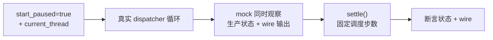

# 附录：如何测试异步状态机

第 19 章的准入 deadline、熔断冷却窗口、退避序列，还有全书各处的 debounce、重连、取消
——这些都是**时序逻辑**。时序逻辑是测试的老大难：如果测试真的 `sleep(30s)` 去等一个
冷却窗口，你会得到又慢又 flaky 的测试套件（真实时钟受调度、负载、CI 抖动影响）。
Grok Build 的答案是 **tokio 虚拟时间**，而且用得极系统——`start_paused` 在全仓有 100+
处、遍布 20+ 个文件，是一套方法论，不是零星技巧。

**核心机制：暂停时钟、手动推进。** `#[tokio::test(start_paused = true)]` 让测试里的
tokio 时钟从 0 起、**不自动流动**；测试用 `tokio::time::advance(d)` 手动把它往前拨。
于是"冷却 30 秒后进半开"这种逻辑在测试里**瞬间**发生、且**完全确定**——时间由测试
掌控，不再由 CI 的心情掌控。这正是第 19 章那个可注入 `Clock`（生产 `SystemClock` /
测试 `MockClock`）存在的理由：把"现在几点"做成一个可替换的依赖，时序逻辑才测得了。

一个工作实例胜过千言。MCP 服务器崩溃后按 1s/4s/16s 指数退避重连，对应的测试把时钟
**精确推进到 t=1s、t=5s、t=21s**（第一次重试在 1s、第二次在 1+4=5s、第三次在
5+16=21s），用 `pause` + `advance(21s)` 完成，全程不睡一秒真实时间
（crates/codegen/xai-grok-shell/src/session/mcp_restart.rs:824）。一个本来要跑 21 秒、
还可能因时序抖动偶发失败的测试，变成毫秒级、每次都一样。

**但虚拟时间只解决了一半——另一半是"让任务真的跑起来"。** 更完整的 E2E 测试用一套
固定配方（crates/codegen/xai-grok-shell/src/session/mcp_dispatcher_e2e_tests.rs:20）：

- `start_paused = true` + `flavor = "current_thread"`：单线程 + 暂停时钟，消除并行与真实
  时间两个不确定源；
- **真实的 dispatcher 循环**（不是 mock 掉被测逻辑），只 mock 传输层；
- 一个 mock **同时观察生产状态和 wire 输出**——既验内部状态机对，也验发出去的字节对；
- **明确的 `settle()` 调度步数**。

`settle()` 是这套配方里最容易被忽略、也最能说明问题的一环。`tokio::time::advance` 把
时钟拨快后，被唤醒的工作会跨好几个 `spawn_local` 任务、一个 `yield_now` 推进一步；
`settle()` 就是 `for _ in 0..8 { yield_now().await }`——用**固定次数**的显式让步把这些
任务排空，而 `yield_now` **不推进** paused 时钟
（crates/codegen/xai-grok-shell/src/session/mcp_dispatcher_e2e_tests.rs:209）。它把"异步
任务图跑到稳定态"这件本来靠 sleep 撞运气的事，变成一个可数、确定的步数。为什么是 8？
注释直说：够让崩溃后的重启任务链走完。

把这套方法收束成一句：

> 时序逻辑之所以难测，是因为它把正确性绑在了"真实时间"这个不可控的依赖上。把时间
> （`Clock`）和调度（`settle`）都变成测试能掌控的显式输入，时序逻辑就获得了和纯函数
> 一样的确定性——它不再是"跑几次看运气"，而是"给定时间推进序列，输出唯一确定"。

这也是为什么第 19 章那些机制值得信任：它们的冷却、退避、租约过期，不是"应该能工作"，
而是有一批在虚拟时间里逐毫秒断言过的测试兜底。**能被确定性测试的时序逻辑，才是可信的
时序逻辑。**
