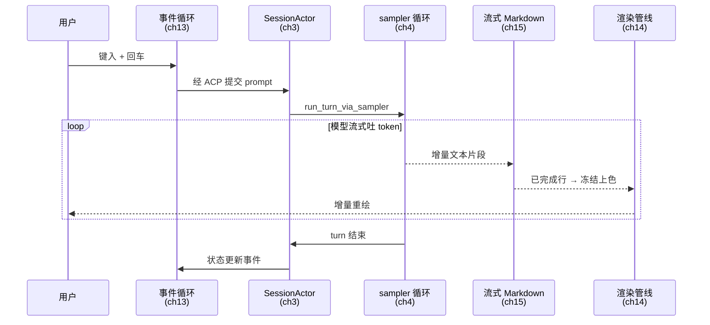
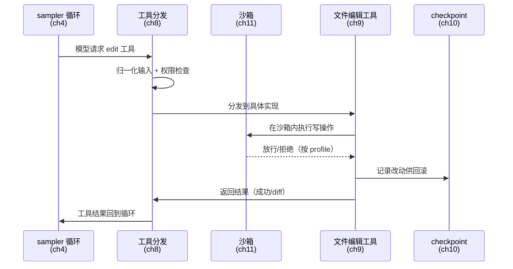

# 附录：端到端追踪

> **本附录的作用**：全书 18 章各自解剖一个子系统，但一个真实的用户动作会**横穿
> 多个子系统**。本附录挑两个最典型的动作，把它们从触发到完成、一站一站串起来，
> 让你看到那些在单章里看不见的**跨章接缝**。每条追踪都标注它经过哪些章，你可以
> 把它当作"把全书重新装回一台运行的机器"的说明书。

追踪的价值在于**接缝**。单看第 3 章你知道会话引擎怎么调度、单看第 8 章你知道工具
怎么分发，但只有把它们串起来，你才看得清"一次工具调用的结果如何从 sampler 穿过
tool dispatch、再穿过沙箱、最后回到循环"——以及每一处交接背后的设计决策。

---

## 追踪一：从键入 prompt 到看见流式回复

**用户动作**：在 TUI 里输入一句话、按下回车，然后看着 agent 的回复一个字一个字
地流出来。

**穿过的子系统**：第 13 章（事件循环）→ 第 3 章（会话引擎）→ 第 4 章（agentic
循环）→ 第 15 章（流式 Markdown）→ 第 14 章（增量渲染）。

**第 1 站 · 事件循环接住输入（第 13 章）。** 一切从 TUI 的事件循环开始。它是一个
`tokio::select!` 驱动的**薄**循环，只做 IO plumbing——把键盘事件、终端 resize、
以及来自 agent 的状态更新分派出去，自己不掺业务逻辑
（crates/codegen/xai-grok-pager/src/app/event_loop.rs）。用户按下回车，循环把这条
prompt 经 ACP 消息面交给会话层。**接缝的设计意图**：循环之所以刻意保持"薄"，是
为了让 UI 的响应性与 agent 的计算彻底解耦——agent 再忙，画面依然能滚动、能取消
（详见第 13 章）。

**第 2 站 · 会话引擎调度（第 3 章）。** prompt 抵达 `SessionActor`——全书的结构
枢纽。会话状态被抽成一个 actor，靠消息传递而非共享锁协作
（crates/codegen/xai-chat-state/src/lib.rs）。SessionActor 收到 prompt 后，启动一个
新的 turn。**接缝的设计意图**：actor 化让"UI 线程"与"agent 计算"之间只有消息、
没有共享可变状态，这是前一站"薄循环"能成立的另一半原因（详见第 3 章）。

**第 3 站 · agentic 循环驱动采样（第 4 章）。** turn 的心脏是
`run_turn_via_sampler`（crates/codegen/xai-grok-shell/src/session/acp_session_impl/sampler_turn.rs:860）。
它把对话历史发给模型，模型以流式返回 token。这一站是"思考→工具→观察"循环的
起点——本次追踪里模型只是纯文本回复（工具调用见追踪二）。**接缝的设计意图**：
sampler 把"和模型说话"这件事收敛成一个统一入口，无论下游是文本还是工具调用，
上游的循环结构不变（详见第 4 章）。

**第 4 站 · 流式 Markdown 边流边渲（第 15 章）。** 模型吐出的 token 不是等全部
到齐才显示，而是**边到边渲**。流式 Markdown 渲染器按行提交：一行完成就冻结它、
用 syntect 上色，未完成的尾行保留待续（crates/codegen/xai-grok-markdown/src/lib.rs）。
**接缝的设计意图**：这里的"冻结已完成行"是性能与正确性的关键——已冻结的行不再
重新解析，避免了每来一个 token 就重排整段的开销（详见第 15 章）。

**第 5 站 · 增量渲染落到屏幕（第 14 章）。** 冻结、上色后的内容进入渲染管线，
只重绘**变化的部分**而非整屏（crates/codegen/xai-grok-pager-render）。用户于是
看到文字平滑地一行行流出。**接缝的设计意图**：增量渲染与上一站的"行级冻结"
配合，构成了"流式体验"的完整链条——冻结决定了什么不必再算，增量渲染决定了什么
不必再画（详见第 14 章）。

**这条追踪揭示了什么。** 一次"看着回复流出来"的平滑体验，是**五个子系统协同
压低延迟**的结果：薄循环让 UI 不被阻塞、actor 让状态不被争抢、sampler 统一了
模型交互、行冻结让解析不重复、增量渲染让绘制不重复。**流畅不是某一处的功劳，
而是每一处交接都拒绝了不必要的重复工作。**

---

## 追踪二：agent 编辑一个文件

**用户动作**：agent 在推进任务时决定"我要改 `src/foo.rs` 的某一段"。这背后是
一次完整的工具调用往返。

**穿过的子系统**：第 4 章（循环决定调用工具）→ 第 8 章（工具分发）→ 第 11 章
（沙箱）→ 第 9 章（文件编辑）→ 第 10 章（checkpoint）→ 第 4 章（结果回到循环）。

**第 1 站 · 循环决定调用工具（第 4 章）。** 模型在 sampler 循环里不再吐文本，
而是发出一次结构化的**工具调用**请求（"用 edit 工具改这个文件"）。循环把它路由
到工具层。**接缝的设计意图**：文本回复与工具调用在 sampler 眼里是同一种"模型
输出"的两个分支——这个统一，让 agent 能在一个 turn 里自由地穿插思考与行动
（详见第 4 章）。

**第 2 站 · 工具分发与归一化（第 8 章）。** 工具调用先经过两层抽象：统一的
`Tool` 契约，和把 typed 输入投影成 canonical 输入的归一化层
（crates/codegen/xai-grok-tools/src/lib.rs）。这一站还负责权限检查——这个操作要不
要用户批准？**接缝的设计意图**：归一层的存在，让"从 codex/opencode 移植来的工具"
和"原生工具"在分发层看起来完全一样（详见第 8、12 章），这是 Grok Build 能"拿来
主义"的结构前提。

**第 3 站 · 沙箱兜底（第 11 章）。** 真正的写操作发生在 OS 级沙箱内，沙箱在启动
时一次性生效（crates/codegen/xai-grok-sandbox/src/lib.rs）。写到工作区内放行、
写到区外按 profile 决定拒绝与否。**接缝的设计意图**：沙箱是**能力边界的最后
一道兜底**——即便上层权限检查被绕过、即便工具实现有 bug，沙箱仍在 OS 层拦截越界
写入。但要注意它的边界：默认 `workspace` profile 并不限制读取整个文件系统
（第 11 章对此有严肃的更正与说明），沙箱兜的是"越界写"，不是"任意读"。

**第 4 站 · 文件编辑落盘（第 9 章）。** edit 工具执行实际的文本替换，含 hunk 级
的改动归因——它能区分"这段改动是 agent 做的"还是"用户手动做的"
（crates/codegen/xai-hunk-tracker/src/lib.rs）。**接缝的设计意图**：hunk 归因不是
为了好看，而是为了让后续的 diff 展示、冲突处理能分清责任方（详见第 9 章）。

**第 5 站 · checkpoint 记录改动（第 10 章）。** 改动落盘的同时，被记入 checkpoint
体系，底层是高性能 CoW worktree（crates/codegen/xai-fast-worktree/src/lib.rs）。
这让 agent 的每一步改动都**可回滚**。**接缝的设计意图**：checkpoint 是 agent 敢于
"大胆行动"的安全网——因为任何一步都能撤销，agent 与用户都能容忍它试错
（详见第 10 章）。

**第 6 站 · 结果回到循环（第 4 章）。** 工具执行的结果（成功、或一段 diff）经工具
分发层原路返回 sampler 循环，作为"观察"喂回模型，模型据此决定下一步。循环闭合。
**接缝的设计意图**：这个"结果回喂"正是 agentic loop 区别于一次性补全的本质——
agent 能看见自己行动的后果，并据此调整（详见第 4 章）。

**这条追踪揭示了什么。** 一次看似简单的"改文件"，实际穿过了**归一化、权限、沙箱、
归因、checkpoint** 五道关卡才落盘，再原路返回。每一道关卡对应一种"出错的可能"：
输入格式不一（归一化）、越权（权限+沙箱）、责任不清（归因）、无法撤销（checkpoint）。
**agent 的"能力"是一层层"边界"围出来的——每加一分行动力，就相应加一道约束。**
这正是全书反复出现、并在第 18 章收束的主题：能力与边界，永远成对出现。

---

## 如何用这两条追踪

- **验证你的理解**：读完某一部后，回到这里，看你能否不看注解、自己把对应的站点
  讲清楚。讲不清的那一站，就是你该回去精读的那一章。
- **定位一个真实问题**：当你在源码里调试一个真实现象（"为什么流式卡顿""为什么这个
  编辑没生效"），用追踪定位它落在哪一站，再翻到对应章节深挖。
- **迁移到你自己的 agent**：这两条路径是终端 AI 编程代理的**通用骨架**。你在设计
  自己的 agent 时，同样要回答每一站的问题——只是实现会不同。
