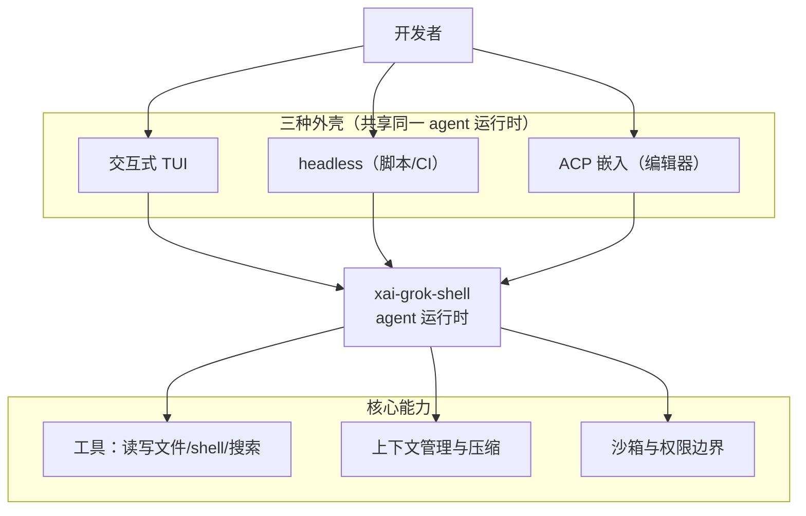

# 第 1 章：AI 编程代理的时代与 Grok Build 是什么

> **定位**：本章是全书的开篇导论——不分析任何一处实现细节，而是回答三个"进门"
> 问题：我们身处怎样的 AI 编程代理时代、Grok Build 在其中是什么、以及这本书打算
> 怎么带你读它的源码。前置依赖：无。适用场景：你打算系统地读懂一个真实的终端
> AI 编程代理是如何构建的，需要先建立时代坐标、项目全貌与本书的阅读方法。读完
> 本章，你会拿到一张贯穿全书的地图和一套读源码的纪律。

## 1.1 为什么这很重要：一个正在成形的软件品类

2025 到 2026 年，"AI 编程代理"（AI coding agent）从一个演示概念，迅速凝固成一个
真实的软件品类。它的形态在众多产品的收敛中逐渐清晰：**一个跑在终端里的、能自主
多步行动的智能体**——你用自然语言描述目标，它自己读代码、改文件、跑命令、查资料，
在一个"思考→调用工具→观察结果→再思考"的循环里推进，直到任务完成或需要你拍板。

这个品类里已经站着一批名字：Anthropic 的 Claude Code、OpenAI 的 codex、社区的
opencode 与 aider、以及 Cursor 这类把 agent 嵌进编辑器的产品。它们形态各异，却
共享一组**惊人一致的骨架**：

- **终端原生**：主战场是命令行，而非图形界面。因为开发者的工作流本就在终端里，
  而终端天然适合流式输出与脚本化。
- **agentic loop**：核心是一个自驱动的循环——模型决定调用哪个工具，运行时执行
  并把结果喂回模型，如此往复。这是"代理"区别于"补全"的本质。
- **工具调用**：读文件、写文件、跑 shell、搜索、抓网页……模型的每一次"行动"都
  是一次结构化的工具调用。工具的设计质量，直接决定 agent 的能力上限。
- **权限与安全边界**：agent 能改你的文件、跑任意命令，因此每个产品都要回答"什么
  操作需要你批准、什么可以自动放行、越界了怎么办"。
- **上下文管理**：对话会越来越长而模型窗口有限，于是每个 agent 都要解决"如何在
  不丢关键信息的前提下压缩历史"。

这些共享骨架意味着：**读懂其中一个足够严肃的实现，你就掌握了理解整个品类的钥匙。**
但真正能拿来"读懂"的严肃实现并不多——不少产品闭源。所幸有几个例外完整开源，
Grok Build 是其中之一：它不是教学玩具，而是 SpaceXAI（xAI 旗下的工程组织，其
monorepo 与版权署名都用此名）真实发布的产品的源码快照。这正是它值得逐行细读的
理由——你读到的每个决策都经受过真实生产的检验，而非为讲解而简化。本书要做的，
就是带你把这份源码从头读到尾，看清一个投入生产的 agent 的每一个设计决策，以及
每一处权衡的代价。（另一个同样开源、同样投入生产的实现是 OpenAI 的 codex——本书
会把它请来当参照系，见 1.5。）

## 1.2 Grok Build 是什么

先给一个准确的定义，用它自己的话：

> **Grok Build** 是 SpaceXAI 的终端 AI 编程代理。它以全屏 TUI 运行，能理解你的
> 代码库、编辑文件、执行 shell 命令、搜索网络、管理长时任务——可交互使用、可
> headless 地用于脚本与 CI，也可经 Agent Client Protocol（ACP）嵌入编辑器。
> （README.md:13-17）

拆开看，它的能力面有三层：

**核心能力**（README.md:13-16）：理解代码库、编辑文件、执行 shell、搜索网络、
管理长任务。其中"编辑文件/执行 shell/搜索"这几项直接对应第三部（工具系统），而
"理解代码库/管理长任务"更多落在第二部（会话引擎、上下文压缩、持久化）——本章
1.4 的地图会把每一项指到确切的章节。

**三种运行形态**（README.md:14-17）——这是理解 Grok Build 架构的第一把钥匙：

1. **交互式 TUI**：默认形态，一个全屏终端界面（对应第四部 TUI）。
2. **headless**：无界面，供脚本与 CI 调用（同一个 agent 运行时，去掉 UI）。
3. **ACP 嵌入**：经 Agent Client Protocol 把 agent 嵌进编辑器，作为后端。

关键在于，这三种形态**共享同一个 agent 运行时**——它们只是同一个核心的三层不同
"外壳"。命令行产出的二进制叫 `xai-grok-pager`，官方安装包把它改名为 `grok`
（README.md:81-82）。而这个二进制的 composition root（组装根）在
`crates/codegen/xai-grok-pager-bin`，agent 运行时与三种入口则都在
`crates/codegen/xai-grok-shell`（README.md:99、101）。三种模式的分发逻辑就在
shell 的入口处：`run_leader`（单机 leader，多客户端经 Unix socket + ACP 接入）、
`run_stdio_agent`（stdio 上的 ACP agent，供编辑器嵌入）、`run_headless`（无界面
脚本模式）。这个"一个核心、三层外壳"的结构，是第 3 章（会话引擎）与第 7 章
（leader-follower）的起点。

**扩展面**（README.md:91-93）：沙箱、MCP、skills、plugins、hooks——这些是第五部
（扩展生态与治理）的主题，让 Grok Build 从一个封闭产品变成一个可扩展平台。

## 1.3 来龙去脉：一份从 monorepo 投影出的开源快照

要读懂 Grok Build 的源码，得先知道这份源码**从哪来**——这直接影响你该如何看待
仓库里的某些文件。

Grok Build 不是一个独立开发的开源项目，而是**从 xAI 的 SpaceXAI monorepo 定期
同步投影**出来的快照（README.md:31-32："synced periodically from the SpaceXAI
monorepo"）。也就是说，真正的开发发生在 xAI 内部那个庞大的单一仓库里，这个开源
仓库是它的一个切片镜像，周期性地更新。

为了让这份镜像可追溯，仓库根有一个 `SOURCE_REV` 文件，记录它对应的 monorepo
完整 commit SHA（README.md:34-35）。在写作本书的快照里，这个值是
`2ec0f0c8488842da03a71eeee3c61154957ca919`（SOURCE_REV 文件），而开源仓库自身
的发布 commit 是 `c68e39f`（"Publish harness and TUI open-source"）。**本书所有
"版本演化说明"以这两个坐标为基准**——当你读到与本书描述不符的代码时，第一件事
就是核对你手上的 `SOURCE_REV` 与发布 commit 是否与本书一致。

这个"投影"身份还解释了仓库里两个容易困惑的地方：

- **根 `Cargo.toml` 是生成物、只读**（README.md:108-111，且文件首行自己写着
  "Auto-generated workspace root"）。它由 monorepo 的 Bazel 构建规则生成——这是
  第 2 章要展开的核心洞察。你不该手改它。
- **不接受外部贡献**（README.md:124-125）。因为开发在内部 monorepo 进行，这个
  镜像仓库不是协作入口。它是给你**读**的，不是给你提 PR 的——这恰好成全了本书的
  定位：一本"读"的书。

许可上，一方代码采用 Apache-2.0（README.md:129-130），第三方与 vendored 代码
保留各自原许可（README.md:132 起）。这意味着你可以放心地在自己的项目里借鉴其
一方代码的设计与实现。

## 1.4 架构鸟瞰：全书的一张地图

Grok Build 有约 75 个第一方 crate（第 2 章会精确解释这个数字）。面对这样的体量，
最怕一头扎进细节而失去方向感。所以在钻进任何子系统之前，先用一节做**鸟瞰**——
给每个子系统一句话定位和一个锚点，并指明它在哪一章展开。你可以把这一节当作全书
的目录地图，随时回来对照。

**第二部·代理运行时**——agent 的"大脑与心跳"：

- **会话引擎（第 3 章）**：会话状态被抽成独立的 actor，靠消息传递协作，把锁的
  竞争降到最低（crates/codegen/xai-chat-state/src/lib.rs:1-14）。这是整个运行时
  的骨架。
- **agentic 循环（第 4 章）**：turn loop 由 sampler 驱动，`run_turn_via_sampler`
  是那个"思考→工具→观察"循环的心脏
  （crates/codegen/xai-grok-shell/src/session/acp_session_impl/sampler_turn.rs:860）。
- **上下文压缩（第 5 章）**：手动 `/compact`、自动阈值触发、失败恢复，解决"对话
  越长、窗口越挤"的普遍难题（crates/codegen/xai-grok-shell/src/session/compaction.rs:1）。
- **持久化（第 6 章）**：会话落盘与 StorageMode，底层是对 SQLite 日志模式的
  取舍（crates/codegen/xai-grok-shell/src/session/persistence.rs:1、
  crates/codegen/xai-sqlite-journal/src/lib.rs:1-13）。
- **leader-follower（第 7 章）**：单机单 leader、多客户端经 Unix socket 接入的
  架构，解决"多个窗口连同一个 agent"（`xai-grok-shell` 的 `leader` 模块，入口分发
  见 crates/codegen/xai-grok-pager-bin/src/main.rs:38）。

**第三部·工具系统**——agent 的"手":

- **两层工具抽象（第 8 章）**：统一的 `Tool` 契约 + 各具体实现的注册表
  （crates/codegen/xai-grok-tools/src/lib.rs:1、
  crates/codegen/xai-grok-tools-api/src/lib.rs:1-5）。
- **文件编辑（第 9 章）**：agent 最高频的动作，含 hunk 级归因追踪
  （crates/codegen/xai-hunk-tracker/src/lib.rs:1-11）。
- **checkpoint 与 worktree（第 10 章）**：让 agent 的改动可回滚、可隔离的
  "时间旅行"能力，底层是高性能 CoW worktree
  （crates/codegen/xai-fast-worktree/src/lib.rs:1-10）。
- **沙箱（第 11 章）**：基于 nono 的 OS 级沙箱，在启动时一次性生效
  （crates/codegen/xai-grok-sandbox/src/lib.rs:8-18）——agent 安全的最后一道兜底。
- **拿来主义与归一层（第 12 章）**：把 typed 工具输入投影成 canonical 输入的
  归一化层，以及对 codex/opencode 的 in-tree 移植（`xai-grok-tools` 的
  `normalization` 模块、README.md:136-139）。

**第四部·TUI**——agent 的"脸":

- **事件循环（第 13 章）**：一个 `tokio::select!` 驱动的**薄**循环，只做 IO
  plumbing、不掺业务（crates/codegen/xai-grok-pager/src/app/event_loop.rs:1-7）。
- **渲染管线（第 14 章）**：render/glyphs/syntax/theme 的增量渲染
  （`xai-grok-pager-render` crate）。
- **流式 Markdown（第 15 章）**：边流边渲、checkpoint 冻结已完成部分、syntect
  上色（crates/codegen/xai-grok-markdown/src/lib.rs:1-11）。
- **终端工程学（第 16 章）**：inline scrollback 与 resize 引擎，一层对 ratatui
  的内联渲染 fork（`xai-ratatui-inline`、`xai-ratatui-textarea`）。

**第五部·扩展生态与治理**——agent 的"边界与成长":

- **MCP、Hooks 与插件（第 17 章）**：接入外部工具、拦截生命周期、市场分发
  （crates/codegen/xai-grok-mcp/src/lib.rs:1-27、`xai-grok-hooks`、
  `xai-grok-plugin-marketplace`）。
- **治理与记忆（第 18 章）**：企业级签名配置治理，与跨会话的 markdown 记忆系统
  （crates/codegen/xai-grok-memory/src/lib.rs:1-24，`--experimental-memory` 门控）。

贯穿这四个部分的，是一条统一的消息面协议：**ACP（Agent Client Protocol）**。
leader 与客户端之间、以及编辑器嵌入的通信都走 ACP，其客户端/网关/通道实现在
`crates/codegen/xai-acp-lib`（crates/codegen/xai-acp-lib/src/lib.rs:1-30），上层
依赖 crates.io 的 `agent-client-protocol` 0.10.4（Cargo.toml:92）。ACP 是把"一个核心、三层外壳"
黏合起来的那层胶水，你会在第 3、7、13 章反复遇到它。

技术选型的基调也一并交代，方便你带着预期读后续各章：语言是 Rust，工具链由
`rust-toolchain.toml` 钉死（README.md:58-59）；异步运行时是 tokio（full 特性，
Cargo.toml:241）；TUI 基于 ratatui 0.29 与 crossterm，外加自研的内联渲染 fork
层（Cargo.toml:200）；存储用 SQLite（`xai-sqlite-journal`）。这套选型本身就是
一份"如何用 Rust 构建一个复杂交互式系统"的样本。

## 1.5 本书的方法：一根主轴，两个参照系

市面上讲 AI agent 的材料，多半停在"它能做什么"的演示层。本书要往下一层，讲
"它**怎么**做到、以及为什么这么做而不那么做"。为此，本书采用一种明确的方法论。

**以 Grok Build 为主轴。** 全书 18 章顺着 Grok Build 的源码展开。需要说清楚：选它
当主轴，**不是因为它比 codex 更优**——两者同样开源、同样投入生产，各有所长。选它
只是因为一本书需要一根连贯的叙述主线，而 Grok Build 恰好是一份**自洽、可追溯到
单一 `SOURCE_REV` 的完整快照**，适合被从头到尾、一处不漏地讲清楚。主轴是**叙述
锚点**，不是"优胜者"；参照系（下面的 codex）则负责随时提醒你：主轴上的某个选择，
究竟是品类的必然，还是一个团队的偏好。

**以 codex 与 opencode 为参照系。** 单看一个实现，你分不清哪些设计是"这个品类的
必然"、哪些是"这个团队的选择"。所以几乎每一章都有一个"**同一问题，codex 怎么
做**"的小节：把 Grok Build 的某个决策，和 OpenAI codex（同样开源）的对应实现
并置。这种对照能立刻照出设计空间——当两家选择相同，那多半是品类的收敛解；当两家
分道，差异背后就藏着各自的权衡与假设。（codex 的事实以其开源仓库为准，本书统一
标注"基于 openai/codex 2026 年年中 main 分支"，因其迭代很快。）

举个第 2 章会展开的悬念：你可能以为"把代码拆成上百个 crate"是 Grok Build 的独特
工程品味——但一比 codex 就会发现事情没那么简单（谜底留给第 2 章）。**没有参照系，
你会把共性误认成个性，把个性误认成真理。**

**一条贯穿全书的纪律：以实现为准，注释仅为线索。** 源码里的文档注释会撒谎——不是
恶意，而是代码演化了、注释没跟上。本书在第 18 章末尾的 `codebase-graph` 一节会
展示一个真实的样本：某个 crate 的注释宣称"从 mmap 零拷贝解析"，而实现其实是普通
的 `fs::read`。每当本书给出一处
`file:line` 引用，都意味着作者去那一行**读了实际的代码**，而非誊抄它的注释。这也
是本书希望传递给你的读源码习惯。

## 1.6 如何读这本书

**阅读路径。** 全书按依赖顺序编排，但你不必线性读完：

- **想快速建立全局观**：读第一部（第 1-2 章）+ 每章的"定位"blockquote 与"设计
  要点回顾"，一天可通览骨架。
- **关心 agent 内核**：第一部 → 第二部（第 3-7 章）→ 第 8 章，聚焦"大脑与心跳"。
- **关心工具与安全**：第一部 → 第三部（第 8-12 章）→ 第 18 章治理，聚焦"手与
  边界"。
- **关心终端 UI 工程**：第一部 → 第四部（第 13-16 章），聚焦"脸"。

**阅读标记。** 每章开头有 `> **定位**` blockquote，帮你 30 秒判断这一章是否此刻
与你相关；每章结尾有"设计要点回顾"清单，把该章所有关键结论连同 `file:line` 索引
成一页，便于回查与速览；对活跃维护的软件，每章末有"版本演化说明"，声明分析所据
的版本基准。所有形如 `crates/...:行号` 的引用都指向仓库里的真实代码，你可以、也
被鼓励亲自去核对。

**跟着跑。** 若你想边读边验证：安装可用官方脚本（README.md:45-49），或从源码
构建 `cargo run -p xai-grok-pager-bin`（README.md:75-79，需 Rust、DotSlash、
protoc 等前置，见 README.md:56-73）；产品自带的用户指南在
`crates/codegen/xai-grok-pager/docs/user-guide/`（README.md:90-93）。本书的章节
编排大体可映射到 README 的 Repository layout 表（README.md:95-106）——那张表是
crate 到职责的官方索引，本书是它的深度展开。

## 1.7 同一问题，codex 怎么做（定位对照）

作为方法论的第一次示范，把镜头拉到 codex，看两个"同类项"如何定位自己。

codex 与 Grok Build 是高度可比的一对：都是一线 AI 实验室（OpenAI / xAI）出品的
**终端 AI 编程代理**，都用 **Rust** 写成，都完整开源，也都把"agent 运行时"与
"多种前端形态"分离。它们连协议思路都相近——codex 用独立的 `protocol` crate 定义
其 SQ/EQ（Submission Queue / Event Queue）消息面，Grok 用 ACP 统一消息面，两者都
把"通信协议"提炼成了一等公民（详见第 3、4 章）。

定位层面的差异更多是**取向**而非本质：Grok Build 明确把自己标榜为"从 monorepo
投影的快照、不接受外部贡献"的产品镜像；codex 则以一个更常规的开源项目形态运作，
接受社区参与。这个差异会一路渗透到工程结构——它正是第 2 章"Bazel 生成清单 vs
纯手写 workspace"那一节的伏笔。

一句话收束本章的方法论：**Grok Build 与 codex 像两位解同一道题的高手，本书让你
同时看两人的解法，于是你学到的不是某一个答案，而是这道题的解空间本身。**（codex
相关事实基于 openai/codex 2026 年年中 main 分支。）

## 1.8 设计要点回顾

- AI 编程代理已成形为一个软件品类，共享骨架：终端原生、agentic loop、工具调用、
  权限边界、上下文管理 → 1.1
- Grok Build 是 SpaceXAI 的终端 AI 编程代理，命令名 `grok`、二进制
  `xai-grok-pager`；三形态（交互 TUI / headless / ACP 嵌入）共享同一 agent 运行时
  → 1.2（README.md:13-17、81-82、99、101）
- composition root 在 `xai-grok-pager-bin`、运行时与三入口在 `xai-grok-shell`
  → 1.2（README.md:99、101）
- 来龙去脉：从 SpaceXAI monorepo 定期投影的开源快照；`SOURCE_REV`=2ec0f0c…、发布
  commit c68e39f；根 Cargo.toml 是 Bazel 生成的只读物；不接受外部贡献；一方代码
  Apache-2.0 → 1.3（README.md:31-35、108-111、124-130、SOURCE_REV）
- 架构鸟瞰：18 章分五部，各子系统一句话定位 + 锚点 + 指路；ACP 是黏合三层外壳的
  消息面（agent-client-protocol 0.10.4）→ 1.4（xai-acp-lib、Cargo.toml:92/200/241）
- 本书方法：以 Grok Build 为主轴、codex/opencode 为参照系；每章"同一问题 codex
  怎么做"照出设计空间；纪律是"以实现为准、注释仅为线索"→ 1.5
- 阅读路径分四条（全局/内核/工具安全/UI），阅读标记（定位 blockquote / 设计要点
  回顾 / 版本演化说明），可跟着 `cargo run -p xai-grok-pager-bin` 边读边验 → 1.6
- codex 定位对照：同为一线实验室的 Rust 终端 agent、都分离运行时与前端、都把协议
  提炼为独立一等公民；差异在"产品镜像 vs 常规开源项目"的取向 → 1.7

---

### 版本演化说明

> 本章及全书的分析基准有两个坐标：开源仓库发布 commit `c68e39f`（2026 年 7 月），
> 及其 `SOURCE_REV` 指向的 monorepo 快照 `2ec0f0c8488842da03a71eeee3c61154957ca919`。
> 由于本仓库是从内部 monorepo 定期投影的，README 与 crate 结构会随同步更新；本章
> 引用的 README 行号以该快照为准。开始阅读时，请先核对你检出的 `SOURCE_REV` 与
> 发布 commit 是否与此一致——这是判断后续所有章节是否仍然适用的第一步。
