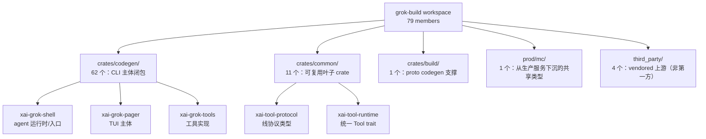

# 第 2 章：75 个 crate 的工程哲学

> **定位**：本章是全书的"工程地图"——不深入任何子系统的实现，只回答一个结构性
> 问题：xAI 为什么把一个终端 agent 拆成 75 个第一方 crate？这种极致的 crate 化
> 拆分背后是什么工程哲学，读者又该如何用这张地图导航后续各章。前置依赖：无（本章
> 是 Part 1 全景的一部分，建议与第 1 章连读）。适用场景：你在设计一个中大型 Rust
> 项目的 workspace 结构，或想在读实现细节前先建立整体坐标系。

## 2.1 为什么这很重要

翻开 Grok Build 的根 `Cargo.toml`，第一眼看到的不是代码，而是一份**长达 79 行的
成员清单**（Cargo.toml:5-84）。一个"终端里的 AI 编程助手"——概念上似乎就是"读
用户输入、调模型、跑工具、画界面"四件事——却被拆成了近八十个独立编译单元。这是
偶然的失控，还是刻意的设计？

答案是后者，而且是一种可以学习的设计。crate 边界在 Rust 里不是随意的目录划分，
它是**编译的最小单元、依赖的最小节点、也是 API 稳定性的最小承诺面**。你把代码切
在哪里，就决定了什么东西能并行编译、什么改动会触发谁重新编译、以及哪些类型可以
被"任何人"安全依赖而不背上一身传递依赖。一个 79 成员的 workspace，本质上是一份
用 crate 边界写就的架构宣言。

读懂这份宣言，是读懂全书的前提。后续 16 章会逐个钻进子系统——会话引擎（第 3 章）、
工具系统（第 8 章）、TUI 渲染（第 13-16 章）、扩展生态与治理（第 17-18 章）。但
在钻进去之前，你需要一张地图：这些子系统各自住在哪个 crate、彼此如何依赖、哪些是
"纯数据"的叶子、哪些是"接线"的宿主。本章就是这张地图。更重要的是，它揭示的拆分
哲学本身就是一份可迁移的工程经验：**当一个 crate 开始承担太多职责时，如何系统性
地把它拆薄，而不失控。**

## 2.2 一个数字的巧合：79 − 4 = 75

先厘清"75"这个数字的来历，因为它本身就是地图的比例尺。

根 `Cargo.toml` 的 `[workspace] members` 共列出 **79 个成员**（Cargo.toml:5-84）。
但其中末尾四个属于 `third_party/`：

```toml
    "third_party/dagre_rust",
    "third_party/graphlib_rust",
    "third_party/mermaid-to-svg",
    "third_party/ordered_hashmap",
```
（Cargo.toml:81-84）

这四个是 **vendored（内嵌）的上游依赖**——一整套把 Mermaid 图渲染成 SVG 的
Rust 栈（README.md 的 Repository layout 一节有说明）。它们不是 xAI 写的业务代码，
而是被复制进仓库、随主项目一起编译的第三方库。把它们从 79 里剔除，剩下的 **75 个
才是第一方 crate**——正好对上本章的标题。

这个数字不是为了凑标题。它标定了一件事：Grok Build 的工程复杂度，有 75 个可以
独立命名、独立编译、独立推理的模块。地图上有 75 个地标。接下来要做的，是给它们
分区。

## 2.3 第一层分区：四个顶层目录

crate 化的第一层结构，直接写在目录布局里。仓库根下的 `crates/`、`prod/`、
`third_party/` 三个目录，加上 `crates/` 内部的二级划分，构成了四个职责区间：



- **`crates/codegen/`（62 个，主体）**：这是 CLI 的整个 crate 闭包——从
  composition-root 二进制（`xai-grok-pager-bin`），到 agent 运行时与三种入口
  （`xai-grok-shell`，承载 leader/stdio/headless），到 TUI 主体（`xai-grok-pager`，
  crates/codegen/xai-grok-pager/src/lib.rs:1）、工具实现（`xai-grok-tools`，
  crates/codegen/xai-grok-tools/src/lib.rs:1）、宿主抽象
  （`xai-grok-workspace`，管 FS/VCS/权限/checkpoint，
  crates/codegen/xai-grok-workspace/src/lib.rs:1）。全书大部分章节的主角都住在这里。
- **`crates/common/`（11 个）**：被闭包反复复用的小型**叶子 crate**。典型如
  `xai-tool-runtime`（统一的 `Tool` trait 之家，
  crates/common/xai-tool-runtime/src/lib.rs:1）、`xai-grok-compaction`（transport
  无关的压缩引擎，crates/common/xai-grok-compaction/src/lib.rs:1）。这些 crate 的
  共同特征是**通用、少 I/O、被很多人依赖**。
- **`crates/build/`（1 个）**：`xai-proto-build`，为 proto 代码生成提供构建期支撑。
- **`prod/mc/`（1 个）**：`cli-chat-proxy-types`（Cargo.toml:80），从 xAI 生产服务
  侧下沉进来的共享类型 crate。它的存在本身就透露了一个信息——这个开源仓库并非孤立
  项目，而是从一个更大的 monorepo 投影出来的（下一节详述）。

单看目录已经能读出一条组织逻辑：**按"距离核心的远近 + 复用范围"分层**。codegen 是
产品闭包，common 是被复用的基础设施，build/prod/third_party 各管一类边缘职责。

## 2.4 命名即文档：三套正交的命名维度

Grok Build 的 crate 命名不是随手起的，它叠加了**三套正交的命名维度**，读者只看
crate 名就能推断出它的层次、归属与 I/O 纯度。这本身就是"地图能成立"的前提。

**维度一：`xai-` vs `xai-grok-` 前缀 —— 复用范围。** 带 `grok` 的
（`xai-grok-shell`、`xai-grok-pager`、`xai-grok-tools`）属于 grok 产品闭包；不带
`grok` 的（`xai-tool-protocol`、`xai-tool-runtime`、`xai-circuit-breaker`、
`xai-tracing`）是更通用、可被其他 xAI 产品复用的基础设施——而它们恰好几乎都落在
`crates/common/`。**前缀与目录归属高度一致**，两个信号互相印证。

**维度二：`codegen/` 目录 —— 这是全章最值得点出的"意外"。** 直觉会以为
`codegen/` 装的是"生成的代码"，其实不然。根 `Cargo.toml` 的第一行写着：

```toml
# Auto-generated workspace root. Prefer editing per-crate Cargo.toml files.
```
（Cargo.toml:1）

结合 README 的说明——本仓库"periodically synced from the SpaceXAI monorepo"、并用
一个 `SOURCE_REV` 记录 monorepo 的 commit SHA——真相浮出水面：`codegen/` 里的
crate，其 **`Cargo.toml` 清单是由 monorepo 的 Bazel BUILD 文件自动生成的**。也就是
说，Bazel 才是真正的构建源，Cargo workspace 只是它在开源世界里的一层投影。这解释了
为什么维护 79 个 `Cargo.toml` 不会压垮团队——**人根本不手写这些清单**。

**维度三：`-types` / `-api` / `-core` / `-base` 后缀 —— I/O 纯度与职责切面。**
后缀标记了一个 crate 在"数据—逻辑—接线"谱系上的位置：`-types` 是纯数据，`-core`
是核心逻辑，`-base` 是被抽出的基础模块，`-api` 是对外接口面。下一节会看到，正是
`-types` 这个后缀，承载了整个 workspace 最核心的一条设计哲学。

## 2.5 依赖倒置：把纯数据切成独立 crate

如果说 75 个 crate 里藏着一条最值得学习的哲学，那就是**类型 crate 与实现 crate 的
系统性分离**。`crates/` 下有五个遵循此设计的 `*-types` crate：`xai-grok-config-types`、
`xai-grok-sampling-types`、`xai-grok-workspace-types`、`xai-hooks-plugins-types`、
`xai-tool-types`（`prod/mc/cli-chat-proxy-types` 是第六个同类，因来自生产服务侧、
在 2.3 已单列，此处不计）。它们的 `lib.rs` 顶部文档注释，几乎是把"为什么要这样拆"
直接写成了教科书。

先看 `xai-grok-sampling-types`：

```rust
//! Pure data types for the xAI sampling / chat-completion API layer.
//!
//! （……此处略去一段对话/请求/流式类型清单的说明……）
//!
//! It intentionally contains **no I/O** (no HTTP clients,
//! no file system access) so it can be depended on by downstream crates
//! (e.g., `xai-chat-state`) without pulling in the full `xai-grok-shell`.
```
（crates/codegen/xai-grok-sampling-types/src/lib.rs:1-7，中段类型清单已略）

再看 `xai-grok-workspace-types`，动机说得更远：

```rust
//! This crate is intentionally pure-data and depends on nothing more than
//! `base64`, `serde`, `serde_json`, `thiserror`, and `chrono`. There is
//! no tokio, no async-trait, no I/O. This makes it cheap to depend on
//! from anywhere -- including the eventual WASM browser SDK.
```
（crates/codegen/xai-grok-workspace-types/src/lib.rs:3-6）

第三个 `xai-hooks-plugins-types` 把最后一块拼图补齐了——它明确说自己是
dependency-free（只依赖 serde），好让 `xai-grok-shell` 与 `xai-grok-pager` 都能
依赖而不引入领域逻辑，并强调"从领域类型到 DTO（Data Transfer Object，数据传输
对象，即只承载数据、不含行为的线格式类型）的转换住在 shell 里，不在这儿"
（crates/codegen/xai-hooks-plugins-types/src/lib.rs:4-9）。

把三条注释并读，拆分的三个动机全齐了：

1. **打破循环依赖**：shell 与 pager 都要用同一批 DTO，但两者互不依赖。把 DTO 提到
   一个双方都能依赖的纯数据 crate，环就断了。
2. **编译并行与增量**：纯数据 crate 几乎不含逻辑，极少 rebuild。把它独立出来，改
   shell 的逻辑不会触发依赖 DTO 的其他 crate 重编。
3. **稳定的 API 面**：wire 类型可以独立演进，甚至为尚未存在的目标（WASM 浏览器
   SDK）预留依赖能力——因为它足够"轻"，谁都背得起。

`xai-grok-auth` 则是更纯粹的"依赖倒置接缝"（dependency-inversion seam）：它的顶注
说自己是 `xai-file-utils`（holder）与 `xai-grok-shell`（implementer）之间的一层
接口，作用是"把 shell 的类型挡在 data-collector 的导入图之外"
（crates/codegen/xai-grok-auth/src/lib.rs:1-4）。这是经典的依赖倒置：让底层不依赖
高层，而是双方都依赖一个中间的抽象 crate。

**模式在这里已经清晰**：当两个 crate 需要共享数据、却不该互相依赖时，把共享的
**纯数据**部分抽成一个不含 I/O、几乎零依赖的 `-types` crate，让双方都依赖它。这
一个动作同时买到了三样东西——断环、快编、稳 API。

## 2.6 拆分的收益与代价：一本诚实的账

极致 crate 化不是免费的。这一节把收益与代价都摆到台面上，因为**只讲收益的架构
分析是不可信的**。

**收益一：并行与增量编译是显式设计目标，不是副产品。** 证据在
`xai-grok-shell-base` 的顶注里写得明明白白：

```rust
//! Foundation modules shared by the grok shell crate family. Extracted from
//! `xai-grok-shell` (which re-exports them at their original paths) so they
//! build in parallel and stop rebuilding on shell edits.
```
（crates/codegen/xai-grok-shell-base/src/lib.rs:1-3）

注意 "Extracted from `xai-grok-shell`" 这个句式——它在多个 crate 的顶注里反复出现
（`xai-chat-state`、`xai-agent-lifecycle`、`xai-grok-agent` 等）。这透露了一段真实
的演化史：`xai-grok-shell` 曾是一个承担过多职责的"上帝 crate"，团队在**系统性地把
它拆薄**，每抽出一块就用原路径 re-export 保持兼容。这正是本章开头承诺的可迁移经验
——如何在不破坏调用方的前提下，把一个膨胀的 crate 逐步分解。

**收益二：统一的 API 面。** `xai-tool-runtime` 自陈是 `Tool` trait 及一众相关类型
的"single home"，好让"每个工具作者看到的都是同一个接口面"
（crates/common/xai-tool-runtime/src/lib.rs:1-6）。一个 crate 封一份契约，杜绝了
同一抽象在多处各写一遍的漂移。

**代价与对冲**：拆成 79 个 crate，理论上有两笔成本，但都被专门的机制对冲掉了：

- **清单维护成本**：79 个 `Cargo.toml` 手工维护并非不可能（下一节会看到 codex 就
  纯手写维护了上百个），但对 Grok 而言，对冲手段是 2.4 说的 **Bazel 生成清单**
  （Cargo.toml:1）——人根本不碰这些文件，它们是 monorepo 构建规则的投影。
- **版本漂移风险**：75 个 crate 若各自声明外部依赖版本，迟早会漂。对冲手段是
  **集中式 `[workspace.dependencies]`**（Cargo.toml:91 起），在根清单里统一声明
  全部外部依赖版本，各 crate 只写 `dep.workspace = true` 引用。所有 crate 共享同
  一份版本真相，漂移无从发生。
- **编译总时长**：crate 多不等于编译慢，关键看 profile。根 `Cargo.toml` 定义了
  **多套分层 profile**——`[profile.dev]`（Cargo.toml:366，本地开发用高 codegen-units
  换编译速度、不做优化）、`[profile.release-dist]`（Cargo.toml:337，发布才开
  `lto="thin"` 与 `codegen-units=1`）、`[profile.x-prod]`、
  `[profile.release-dist-jemalloc]` 等。本地开发用碎编译单元抢速度，正式发布才付
  LTO 的时间成本。crate 化提供的并行编译粒度，恰好被开发 profile 充分利用。

这笔账算下来，极致 crate 化的收益（并行/增量编译、清晰 API 边界、可断的依赖环）
是**真金白银**，而它的两笔成本（清单维护、版本协调）都被自动化和集中化机制抵消。
关键前提是：你得有 Bazel 那样的上游真源、以及集中式依赖声明——**脱离这套支撑基建，
盲目拆 75 个 crate 只会得到维护地狱**。这是本章最重要的一条免责声明。

## 2.7 三个最能代表哲学的 crate

抽象讲完，用三个具体的 crate 收束"一个 crate 做一件事、边界清晰"的哲学。

1. **`xai-tool-runtime`——一个 crate = 一份运行时契约。** 它是 `Tool` trait、
   `ToolDispatch`、`ToolError`、`ToolStream` 等的唯一归属，各个工具源的适配器都从
   这里 re-export（crates/common/xai-tool-runtime/src/lib.rs:1-6）。契约集中，实现
   分散——这是第 8 章"两层工具抽象"的地基。

2. **`xai-grok-compaction`——核心逻辑与宿主接线分离的范本。** 它自称
   `compaction-core`，只装 transport 无关的压缩策略、prompt、选择逻辑，而把触发
   时机、传输、持久化统统留给宿主（crates/common/xai-grok-compaction/src/lib.rs:1-4）。
   一个纯策略引擎，不绑定任何具体 I/O——这是第 5 章"上下文管理与压缩"的主角。

3. **`xai-grok-agent`——一个 crate 封装一个可移植概念。** 它把工具集、system
   prompt、压缩策略、模型配置打包成一个"portable `Agent`，任何宿主都能消费"
   （crates/codegen/xai-grok-agent/src/lib.rs:1-6）。这正是"一个 crate 一件事"的
   极致——它封装的"件事"是一个完整、自洽、可搬运的概念。

三个 crate，三种"边界清晰"的形态：契约的边界、逻辑与接线的边界、概念的边界。

## 2.8 同一问题，codex 怎么做

作为参照系，看看 OpenAI 的 codex（codex-rs，2026 年中 main 分支）如何组织它的
workspace。

codex 同样是一个 Cargo workspace，同样把代码拆成多个 crate，也同样实践了**协议
类型独立成 crate** 这条核心哲学——SQ/EQ 协议（Submission Queue / Event Queue）的
类型定义住在独立的 `codex-rs/protocol` crate 里，`core` 通过 `codex_protocol`
引用（详见第 3、4 章对 codex 会话模型的分析）。这与 Grok 把 wire 类型抽成 `-types`
crate 的动机同源：让协议类型能被上下游安全依赖，而不背上实现的传递依赖。

一个可能出乎意料的事实是：**codex 拆得比 Grok 更细**。它的 `codex-rs` workspace
有约 128 个成员（openai/codex 2026 年中 main 分支的 `[workspace] members`），远多于
Grok 的 75 个第一方 crate，且划分极碎——光 `utils/*` 就有二十来个（`utils/cache`、
`utils/fuzzy-match`、`utils/home-dir`…），外加 `ext/*`（`ext/mcp`、`ext/skills`、
`ext/memories` 等）与 `memories/read`、`memories/write` 这类单一职责的微 crate。
所以"极致 crate 化"绝非 Grok 独有，两家都把它推到了上百 crate 的量级。

真正的差异不在**粒度**，而在**清单的真源**：

- **Grok**：`codegen/` 下的 `Cargo.toml` 是从 monorepo 的 Bazel BUILD 文件**自动
  生成**的投影（Cargo.toml:1 的 "Auto-generated workspace root"）。Bazel 是真源，
  Cargo 清单是它在开源世界里的一层镜像——人不手写。
- **codex**：是一个**原生、纯手写**的 Cargo workspace，没有 Bazel 层。它上百个
  crate 的清单是团队一份份手动维护的。

这个对比推翻了一个想当然的结论——"手写清单必须克制、只有代码生成才能撑起多
crate"。codex 恰恰证明了**手工维护的 Cargo workspace 也能扩展到 100+ crate**。
两条路各有代价：Bazel 投影免去了手写清单的负担，但要求你先有一套 monorepo +
Bazel 的重型基建；纯手写 Cargo 无需额外基建、对开源贡献者更友好，代价是清单维护
与版本协调全靠人力纪律（codex 同样用集中式 `[workspace.dependencies]` 来扛这份
纪律）。

一句话总结：**"极致 crate 化 + 纯类型独立成 crate"是两家共享的哲学，都推到了上百
crate；分野只在清单由谁维护——Bazel 生成 vs 人手编写。粒度是趋同的，真源是不同
的。**（codex 相关事实基于 openai/codex 2026 年年中 main 分支，成员数会随版本浮动。）

## 2.9 模式提炼

从这张地图里可以萃取三个可迁移的 workspace 组织模式。

**模式一：纯数据 crate（Pure-Data Crate）。**
- 解决的问题：两个 crate 需共享数据却不该互相依赖（循环依赖）；或某批类型被广泛
  依赖，拖着 I/O 依赖会污染所有下游。
- 模板：把共享的**纯数据**抽成 `*-types` crate，约束它"no tokio, no async-trait,
  no I/O"，依赖面压到 serde/thiserror 等寥寥几个。领域类型到 DTO 的转换留在宿主。
- 前提条件：数据与逻辑能干净切开。若类型上挂满了带 I/O 的方法，先重构再拆。

**模式二：抽薄上帝 crate（Extract-and-Re-export）。**
- 解决的问题：一个 crate 膨胀成什么都装的"上帝 crate"，改一行触发全量重编。
- 模板：把内聚的子模块抽成新 crate，在原 crate 里用**原路径 re-export** 保持调用
  方无感（`pub use new_crate::*`）。逐块进行，每块独立可编译。
- 前提条件：抽出的模块有清晰的依赖方向（被依赖方不反向依赖抽出方）。

**模式三：集中式依赖真源（Workspace-Level Dependency SSOT）。**
- 解决的问题：N 个 crate 各自声明外部依赖版本，导致版本漂移与重复编译。
- 模板：所有外部依赖版本集中在根 `[workspace.dependencies]`，各 crate 只写
  `dep.workspace = true`。crate 越多，这个模式的收益越大。
- 前提条件：无——这是任何多 crate workspace 都该无脑采用的默认实践。

## 2.10 设计要点回顾

- 79 workspace 成员 = 75 第一方 crate + 4 vendored 上游；"75" 是全书地图的比例尺
  → 2.2（Cargo.toml:5-84、81-84）
- 四个顶层分区：codegen（产品闭包）/common（复用叶子）/build/prod，按"距核心远近
  + 复用范围"分层 → 2.3
- 三套正交命名维度：`grok` 前缀=复用范围、`codegen/`=Bazel 生成清单、`-types/-core`
  后缀=I/O 纯度；看名即知层次 → 2.4（Cargo.toml:1）
- 依赖倒置：五个 `-types` crate 把纯数据独立出来，一举买到断环 + 快编 + 稳 API
  → 2.5（sampling-types/lib.rs:1-7、workspace-types/lib.rs:3-6、
  hooks-plugins-types/lib.rs:4-9）
- 收益（并行/增量编译显式设计、统一 API 面）与代价（清单维护、版本漂移）各有对冲：
  Bazel 生成清单 + 集中式 `[workspace.dependencies]` + 分层 profile → 2.6
  （shell-base/lib.rs:1-3、Cargo.toml:91、Cargo.toml:337/366）
- "抽薄上帝 crate"是一段真实演化史：`xai-grok-shell` 被系统性拆分，原路径 re-export
  保兼容 → 2.6（shell-base/lib.rs:1-3）
- 三个代表 crate：tool-runtime（契约之家）、compaction（逻辑/接线分离）、agent
  （可移植概念）→ 2.7
- codex 对照：codex 拆得更细（约 128 成员 > Grok 75），两家都推到上百 crate；真正
  差异是清单真源——Grok 由 Bazel 生成投影、codex 纯手写，证明手写也能撑 100+ crate
  → 2.8
- 三个可迁移模式：纯数据 crate、抽薄上帝 crate、集中式依赖真源 → 2.9

---

### 版本演化说明

> 本章分析基于开源快照 commit c68e39f（2026 年 7 月）的 workspace 结构。crate 数量
> 与目录布局会随 monorepo 同步而变化——`codegen/` 下的成员尤其如此，因为它们的
> `Cargo.toml` 由上游 Bazel BUILD 自动生成。读者核对时应以自己检出的
> `Cargo.toml` `[workspace] members` 实际条目为准；本章给出的"75"是该快照的计数。
> workspace 的组织**哲学**（纯数据 crate 分离、集中式依赖声明、分层 profile）比
> 具体数字稳定得多，也是本章真正要传递的内容。
