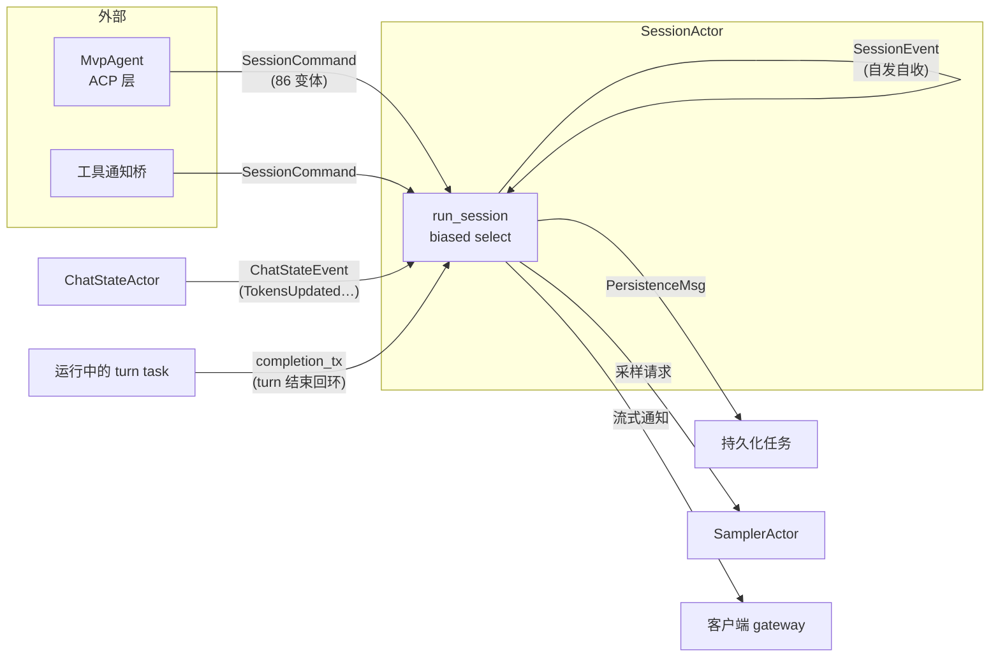

# 第 3 章：Actor 化的会话引擎

> **定位**：本章分析 Grok Build 如何用 Actor 模型组织一个 agent 会话——SessionActor 的
> 消息拓扑、`biased` select 主循环、与 SamplerActor/ChatStateActor 的协作，以及"无锁"
> 承诺的证据与代价。前置依赖：第 2 章（crate 划分哲学）。适用场景：你要构建任何
> "多事件源 + 长生命周期 + 强顺序性"的并发状态机，agent 会话是其中典型的一种。

## 3.1 为什么这很重要

一个 agent 会话是一台被多方同时拉扯的状态机。客户端随时可能发来新 prompt 或取消命令；
上一轮 turn 的采样流正在逐 token 返回；文件系统监视器报告工作区变更；持久化层回报
token 预算更新；回放定时器提醒该给客户端刷新增量了。这些事件源各有各的节奏，但它们
要修改的是**同一份会话状态**：当前运行的任务、待处理的输入队列、通知缓冲。

教科书式的 Rust 方案是 `Arc<Mutex<SessionState>>`：谁要改状态谁加锁。这个方案的问题
不在性能——会话状态的锁竞争根本不热——而在**推理成本**。锁保护的是数据，不是不变量：
"turn 结束后才能拉起下一个任务""通知必须按序回放""关停前必须先 flush"这类跨多步的
时序约束，Mutex 无法表达，只能靠每个加锁点的自觉。随着事件源增多，任意两个加锁点之间
的交错都成为潜在的竞态现场，而复现依赖时序的 bug 是并发调试里最昂贵的活动。

Grok Build 的选择是把每个会话收进一个 **Actor**：外界只能投递消息，状态修改由消息
循环串行化，时序约束由主循环的代码顺序直接表达。这个选择不是局部技巧而是全仓库范式——
会话（SessionActor）、采样（SamplerActor）、持久化（ChatStateActor）、hunk 追踪
（第 10 章）全部如此。但先把期望校准：这套范式**不等于零锁**。它是一条光谱——
下游的 SamplerActor 与 ChatStateActor 做到了字面意义的单属主无锁，而 SessionActor
自己仍保留一把调度锁，只是被单线程执行环境化解了竞争。范式的收益（可推理的时序）与
代价（消息样板、调试间接性）本章都会一并算上。

## 3.2 SessionActor：一个会话就是一个单线程宇宙

### 3.2.1 消息拓扑

外界与会话交互的唯一入口是 `SessionHandle`
（crates/codegen/xai-grok-shell/src/session/handle.rs:41），它持有一组
`mpsc::UnboundedSender`。主循环 `run_session`
（crates/codegen/xai-grok-shell/src/session/acp_session_impl/run_loop.rs:33）
同时消费三条入向流。命令的主要发送方是 ACP 层（Agent Client Protocol，客户端/编辑器
与 agent 运行时之间的标准协议，第 7 章展开）的 `MvpAgent`：



- **命令通道**承载外部意图。`SessionCommand` 有 86 个变体
  （crates/codegen/xai-grok-shell/src/session/commands.rs:106），查询类变体一律附带
  `oneshot::Sender` 做请求-响应（如 `GetSessionInfo { responds_to }`）。
- **ChatState 事件**来自持久化 actor 的反向通知（`ConversationReset`、`TokensUpdated`
  等，crates/codegen/xai-grok-shell/src/session/acp_session_impl/run_loop.rs:182）。
- **会话事件**是内部产物，只有两种（crates/codegen/xai-grok-shell/src/session/replay_events.rs:105）：
  待回放给客户端的流式通知，和 flush 请求——回放定时器旁挂任务把 `FlushReplay`
  回灌进主循环，形成"自发自收"。

所有入向通道都是**无界**的——没有 backpressure。这看起来违反直觉（无界队列是内存
失控的经典来源），但这里的替代策略是**手工限深**，且分两套各自封顶 50：空闲期待排空的
`pending_notifications` 队列（`MAX_PENDING_NOTIFICATIONS`，超限丢弃最旧，
crates/codegen/xai-grok-shell/src/session/acp_session_impl/notification_drain.rs:7、
run_loop.rs:400），以及 turn 中途的事件缓冲（`MAX_BUFFER_EVENTS`，
crates/codegen/xai-grok-shell/src/session/acp_session_impl/run_loop.rs:392）。
这个取舍要展开说：阻塞发送方（有界通道）会把 backpressure 传导回 ACP 层甚至客户端 UI，
一个卡住的会话可能拖住整个 leader 进程；而通知本质上是**可再生的视图增量**——丢掉
最旧的一条，客户端在下一次 flush 时依然能收敛到正确状态。于是"裁剪队列"比"阻塞上游"
更符合这个域的语义。这是无界通道的正当使用方式：不是没想过溢出，而是为溢出选了
比阻塞更便宜的失效模式。

### 3.2.2 biased select：优先级即协议

主循环的 `select!` 声明了 `biased`
（crates/codegen/xai-grok-shell/src/session/acp_session_impl/run_loop.rs:154），
分支自上而下按固定优先级轮询：内存空闲刷写定时器 → dream 检查 → 模型切换 →
ChatState 事件 → 回放事件 → **turn 完成信号** → 外部命令。外部命令排在最后不是轻视，
而是保护：内部状态收敛（回收完成的 turn、flush 通知）永远先于接纳新工作，
系统在过载时优先"消化"而非"进食"。

`biased` 在这个代码库里不是一处优化而是**统一惯例**——SessionActor、SamplerActor、
ChatStateActor 三个主循环全部如此（run_loop.rs:154、
crates/codegen/xai-grok-sampler/src/actor/mod.rs:61、
crates/codegen/xai-chat-state/src/actor/mod.rs:100）。随机轮询（tokio 默认）适合
吞吐公平，固定优先级适合"分支之间有语义顺序"的场合；三个 actor 不约而同选择后者，
说明在这套架构里**分支顺序本身就是协议文档**：读一遍 select 就知道什么事永远压过什么事。

### 3.2.3 旁挂任务与两条对称的退出路径

进入主循环前，`run_session` 用 `tokio::task::spawn_local` 挂起一组旁挂任务：回放
flush 定时器（run_loop.rs:50）、按需启动的 fs-watch（run_loop.rs:62）、git 分支通知、
MCP dispatcher（run_loop.rs:121）。注意是 `spawn_local` 而非 `spawn`——所有这些任务
连同主循环一起钉在同一个 LocalSet（tokio 的单线程任务集：其上任务并发交错但绝不并行）
上，这是"单线程宇宙"的字面实现，也免掉了状态类型上的 `Send + Sync` 约束传染。

这里要澄清本章最容易被误读的一点：旁挂任务与主循环**共享**着 `Arc<SessionActor>`
（run_loop.rs:34 起随处可见 `session.clone()`），所以 SessionActor 的可变状态并不是
"只有主循环能碰"——调度相关的字段仍躺在一把 `TokioMutex<State>` 里
（crates/codegen/xai-grok-shell/src/session/acp_session.rs:593），结构体注释写得明白：
"Task scheduling state — the only fields that **remain** behind `TokioMutex`"
（acp_session.rs:263）。"remain"一词泄露了架构演化方向：重量级状态（对话历史、采样、
持久化）已迁往真正单属主的下游 actor，剩下的调度残余仍用锁。这把锁运行在 LocalSet
上——没有跨线程并行，于是不会有"两个线程同时改状态"的数据竞争，也免掉了
`Send + Sync` 传染。但要说清它没有消灭什么：`TokioMutex` 是异步锁、会跨 `.await`
持有，若一个任务持锁期间 `.await` 让出，另一个任务仍会在 `.lock().await` 上挂起
等待——锁等待并未消失，只是从"并行抢锁"变成了"协作式排队"。**Actor 化在这里消灭
的是跨线程并行与数据竞争，不是锁、也不是锁等待**；这个区分是理解本章其余部分的前提。

优雅退出有两条对称路径：`cmd_rx` 返回 `None`（所有 handle 被 drop，run_loop.rs:222）
与显式的 `SessionCommand::Shutdown`（run_loop.rs:772）。殊途同归：flush 回放 →
触发 SessionEnd/Stop hooks → 写记忆摘要 → 取消同步循环 → 返回。"最后一个 handle
消失，actor 自然消亡"是 Actor 模型借 Rust 所有权免费获得的生命周期管理——不需要
显式的引用计数或注册表，通道关闭就是死亡通知。

## 3.3 一次 prompt 的消息链路

把上面的静态拓扑串成动态链路，跟踪一条用户 prompt 从进门到发起采样（采样之后的
agentic 循环是第 4 章的主题）：

1. ACP 层的 `MvpAgent` 调 `handle.cmd_tx.send(SessionCommand::Prompt {…})`。
2. 主循环 `Prompt` 臂（run_loop.rs:281）：确认前缀就绪、递增输入代号、把 `InputItem`
   压入 `pending_inputs` 队列，然后调 `maybe_start_running_task`。
3. `maybe_start_running_task`（notification_drain.rs:22）是**单飞闸门**
   （single-flight：同类工作至多一个在途）：先 `state.lock().await` 取得调度状态
   （notification_drain.rs:26），若 `running_task` 已被占用，直接返回——排队的输入
   等下一次机会；否则从队头取出输入，创建 `AgentTask` 存入 `running_task`
   （notification_drain.rs:118），并把 `completion_tx` 的克隆交给它。
4. task 在自己的 future 里跑 turn，最终经
   `sampler_handle.submit_and_collect(request_id, request)` 发起采样
   （crates/codegen/xai-grok-shell/src/session/acp_session_impl/sampler_turn.rs:872）。
5. turn 结束，task 用 `completion_tx.send((prompt_id, result))` 发回**完成信号**；
   主循环的 `completion_rx` 臂做善后（run_loop.rs:211），随后再次调
   `maybe_start_running_task` 拉起队列里的下一条。

这条链路里的关键是 `completion_tx` 回环（run_loop.rs:43）。turn 是并发执行的
future，主循环是串行的状态机，靠一条 mpsc 把"我结束了"作为消息传回。于是"同一时刻
至多一个 turn 在跑"这条不变量，收敛为 `TokioMutex<State>` 里的
`running_task: Option<AgentTask>` 一个字段（acp_session.rs:271）：占用即拒绝、
完成信号到达才清空再拉起下一个。锁在这里守护的只是字段访问的瞬间；不变量本身的
维护——"何时置入、何时清空"——完全由主循环与 completion 回环的消息顺序表达。
这正是 3.2.3 那个区分的实例：竞争与交错被架构消灭了，锁只剩下形式。

还有一个防御性细节藏在 flush 语义里：`FlushComplete` 命令在 actor 内联执行 flush，
而不是给自己投递一个 `FlushReplay` 事件再等它被处理——注释直言这是为了避免"等待
同一个循环才能处理的 mailbox 事件"
（crates/codegen/xai-grok-shell/src/session/replay_events.rs:131）。Actor 给自己
发消息再同步等待，是这个模型里典型的自我死锁形状；内联执行是标准解法。

## 3.4 SamplerActor：单线程命令，多请求并发

会话把采样请求交给独立的 SamplerActor。它的问题域和 SessionActor 有一个关键差别：
采样是**天然并发**的——多个会话、多个子代理的请求同时在流式返回。单线程串行处理
会把所有流串成一条，不可接受。SamplerActor 的答案是"单线程命令 + 每请求 spawn"
（crates/codegen/xai-grok-sampler/src/actor/mod.rs:58）：

```rust
loop {
    tokio::select! {
        biased;
        // Prefer cleaning up finished tasks before processing new commands
        Some(joined) = self.tasks.join_next(), if !self.tasks.is_empty() => {
            match joined {
                Ok(request_id) => { self.state.remove(&request_id); }
                Err(join_err) => { tracing::warn!(/* … */); }
            }
        }
        cmd = self.cmd_rx.recv() => { /* Submit 时 spawn 进 JoinSet */ }
```

（节选，crates/codegen/xai-grok-sampler/src/actor/mod.rs:58 起。）

命令处理是单线程的——`active_requests` 表只被 actor 任务触碰，无需任何同步
（crates/codegen/xai-grok-sampler/src/actor/state.rs:1 的模块注释原文："All fields
are touched only from the actor task, so no mutex / atomic synchronization is
needed"）；而每个 `Submit` 把实际的流式工作 `tokio::spawn` 进 `JoinSet`
（mod.rs:121），并发不受影响。`biased` 让 `join_next` 优先于新命令：先回收已完成
请求的登记项，防止 `active_requests` 里的陈旧条目存活超过必要时间——回收优先于
接单，与 SessionActor 的"消化优先于进食"是同一条设计原则。

**取消是三层叠加的**。同一 `request_id` 重复提交时旧请求的 token 立即被 cancel
（mod.rs:110）；显式 `Cancel` 命令触发对应 token
（crates/codegen/xai-grok-sampler/src/actor/state.rs:59）；第三层在调用方侧的
RAII（Resource Acquisition Is Initialization，把动作绑定在对象生命周期上的 Rust 惯用法）——
`submit_and_collect` 返回的 future 内嵌 `CancelOnDrop`，future 被 drop 的瞬间自动
fire-and-forget 一条 Cancel 命令（crates/codegen/xai-grok-sampler/src/handle.rs:118）。
第三层意味着调用方**不可能忘记取消**：turn 被中断、上层 select 放弃了这个分支、
甚至 panic 展开，只要 future 析构，取消就已发出。任务内部则用 `biased` select 把
`cancel_token.cancelled()` 排在流的下一个 chunk 之前
（crates/codegen/xai-grok-sampler/src/actor/request_task.rs:510），协作式即时响应。

还要标注一点：**并发没有上限**。JoinSet 无界，命令通道无界，没有 semaphore。
这里的隐含假设是请求数由上游（会话数 × 每会话单飞）自然有界；如果未来出现风扇形
子代理爆发，这里会是第一个需要补 admission control 的位置。剖析一个系统时，
"没有做什么"与"做了什么"同样要记下来。

## 3.5 无锁的证据、范围与代价

先划定范围："无锁"是**下游两个 actor** 兑现的承诺——SamplerActor 与 ChatStateActor
是字面意义的单属主、零 Mutex、零原子；SessionActor 如 3.2.3 所述保留调度锁与若干
原子标志（run_loop.rs 内即有多处 `atomic::Ordering` 使用），靠单线程执行消解竞争。
把范围划清后，注释证据才好正确解读：

> The actor owns persistence exclusively (`Box<dyn ChatPersistence>`), so the trait
> uses `&mut self` — no locks, no atomics, no shared state.
> （crates/codegen/xai-chat-state/src/persistence.rs:3）

> All fields are touched only from the actor task, so no mutex / atomic
> synchronization is needed — the actor's command-loop serialization gives us a
> "single-threaded with shared state" discipline matching the hunk-tracker pattern.
> （crates/codegen/xai-grok-sampler/src/actor/state.rs:1）

看第一条：持久化 trait 的方法签名是 `&mut self`。这不是风格选择——
`&mut` 意味着独占借用，**编译器**保证同一时刻只有一个调用者；如果哪天有人试图把
持久化对象塞进 `Arc` 共享，代码直接不编译。锁把不变量的维护成本摊到每个运行时
加锁点，`&mut self` 把它一次性付给类型系统。第二条注释里 "matching the
hunk-tracker pattern" 一句则确认这是仓库层面的统一方向，而非某个模块的偶然。

于是全景是一条**渐进光谱**而非非黑即白：新拆出的叶子 actor（sampler、chat-state、
hunk-tracker）生来单属主；老资格的 SessionActor 还背着历史演化中的
`TokioMutex<State>`，但 acp_session.rs:263 的 "remain" 表明方向一致——能迁走的
状态都在迁走，迁不走的调度残余仍用锁，靠 LocalSet 把争用从"并行抢"降成"单线程
排队"（而非消灭竞争）。剖析真实系统时，这种"进行中的
架构"比教科书式的纯净范式更常见。

代价同样要算。其一是**消息税**：`SessionCommand` 的 86 个变体，驱动 run_loop
里约 550 行的 match（run_loop.rs:272-817）；每个查询型交互都要手写"定义变体 →
附带 oneshot → 发送 → await → actor 侧 `responds_to.send()`"的五段式样板。共享锁
方案里一次方法调用能完成的事，这里要穿过一层消息协议。其二是**调试的间接性**：
栈回溯在消息边界断裂，一个行为的因果链横跨多个 actor。缓解手段是重度结构化 tracing：
每个采样请求有独立 span 并记录 `request_id`/`ttft_ms`/尝试次数
（crates/codegen/xai-grok-shell/src/session/acp_session_impl/sampler_turn.rs:879），
跨 actor 用 `traceparent` 串联（run_loop.rs:293）——消息传递撕碎了调用栈，
就用分布式追踪的办法把它缝回来，哪怕整个系统跑在同一个进程里。

## 3.6 同一问题，codex 怎么做

openai/codex 的 Rust 实现面对同样的"多事件源会话"问题，架构语汇不同，取舍点集中在两处：

**其一，消息化的深度**。codex 把 UI 与核心的交互收敛成一对显式队列——Submission
Queue（用户→核心）与 Event Queue（核心→用户），协议类型定义在独立的
`codex-rs/protocol` crate；核心内部一个会话对应一个 `submission_loop` 主任务，会话
状态的可变部分以 `Mutex<SessionState>` 形式挂在 `Session` 结构上。Grok Build 的 SessionActor 同样保留会话级的
`TokioMutex<State>`（3.2.3）——两者在会话层其实同构。真正的差异在**下一层**：
Grok 把采样、持久化、对话状态继续拆成独立的单属主 actor（消息化多推了一层），
codex 则让这些职能留在会话任务内共享锁访问。多拆一层换来的是 3.5 的类型级独占与
各组件独立的消息时序；付出的是更多的通道、handle 与协议样板。

**其二，串行化的承载者**。codex 的会话内时序靠"单个会话主循环 + 局部锁"维持，
跨组件顺序由调用方自律；Grok Build 用 `biased` select 的分支顺序把优先级写成代码
（3.2.2），用 `&mut self` 把下游独占写进类型（3.5），用 LocalSet 把会话锁的争用
降为单线程排队。两者都能工作；差别在于约束放在"约定"里还是"编译器与主循环结构"里——
团队规模越大、外部贡献越多，后者的防御价值越明显。

（本节对 codex 的描述基于 openai/codex 仓库 2026 年年中的 main 分支；其核心正在
快速迭代，核对时以 `codex-rs/core` 为准。）

## 3.7 模式提炼

**模式一：会话即 Actor（session-per-actor）**。适用于"多事件源 + 强时序不变量 +
长生命周期"的状态机。要点：入向统一成消息、用 handle 的 drop 语义做生命周期管理、
把"至多一个在跑"这类不变量收敛为单个字段。允许渐进落地：暂时迁不走的共享状态可以
留在锁后，用单线程执行环境（LocalSet）把锁从并行争用降为协作排队（消除数据竞争，
但不消除异步等锁），再逐步向单属主拆分。

**模式二：biased select 即优先级协议**。当 select 分支之间存在语义顺序（回收先于
接单、内部收敛先于外部命令），用 `biased` 把顺序固定下来，让主循环成为可读的优先级
文档。前提：每个分支的处理都足够短，否则高优先级分支会饿死低优先级。

**模式三：RAII 取消（cancel-on-drop）**。跨 actor 的请求把取消绑在调用方 future 的
析构上，杜绝"忘记取消"这类泄漏。适用于任何"发起方可能中途放弃"的异步请求-响应。

**模式四：可再生数据用裁剪代替背压**。当队列内容是可重建的视图增量而非不可丢失的
事实时，无界通道 + 限深裁剪比有界通道 + 阻塞上游更符合语义；前提是必须真的可再生，
且限深值经过容量论证。

## 设计要点回顾

速查索引（详述见对应小节）：

- 共享锁方案的问题在推理成本而非性能；Actor 把时序不变量交给消息串行化 → 3.1
- SessionHandle 三路入向、86 变体命令、无界通道 + 手工限深的取舍 → 3.2.1
- `biased` select 全仓惯例：分支顺序即优先级协议 → 3.2.2
- `spawn_local` 单线程宇宙；`Arc<SessionActor>` + `TokioMutex<State>`——消灭的是
  竞争而非锁本身；双路径优雅退出 → 3.2.3
- prompt 链路与 `completion_tx` 回环：单飞不变量收敛为锁后一个字段 → 3.3
- 自发自收的死锁形状与内联 flush 规避 → 3.3
- SamplerActor：单线程命令 + JoinSet 并发、回收优先于接单、三层取消、无并发上限 → 3.4
- "无锁"承诺的准确范围（下游 actor）、`&mut self` 类型强制、渐进光谱；消息税与
  tracing 缝合 → 3.5
- codex 对照：消息化深度（会话层同构、下一层分岔）、约定 vs 编译器承载串行化 → 3.6
- 四个可迁移模式：会话即 Actor、biased 优先级、RAII 取消、裁剪代替背压 → 3.7

---

### 版本演化说明

> 本章核心分析基于本书快照仓库（同步自 xAI monorepo，commit 8adf901，SOURCE_REV 2ec0f0c，2026-07）。
> 涉及的 crate：xai-grok-shell（session 模块）、xai-grok-sampler、xai-chat-state。
> codex 对比基于 openai/codex 2026 年年中 main 分支。上游同步后请以
> `book/tools/check_chapter.py` 校验本章引用有效性。
