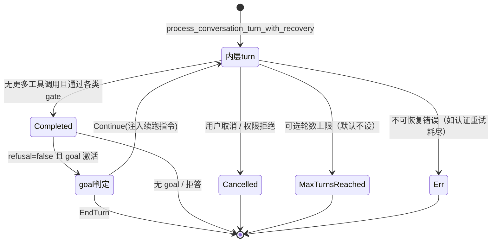
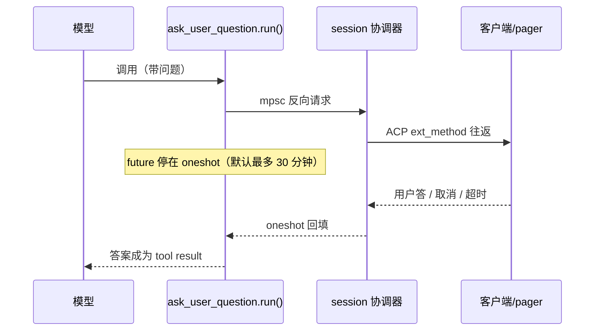
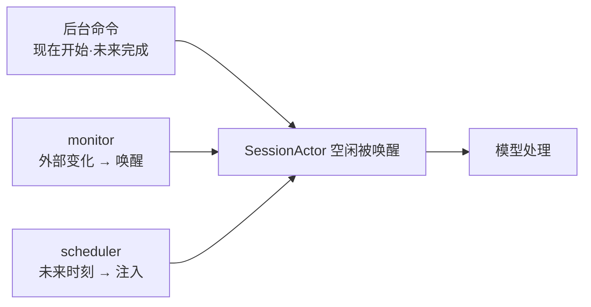

# 第 4 章：Agentic 循环——采样、工具与终止判定

> **定位**：本章解剖一个 turn 内部的完整生命周期——采样→工具→再采样的循环如何组织、
> 四个终态各自的出口、错误恢复与结构化输出的实现，以及"防失控"在生产系统里的真实形态。
> 前置依赖：第 3 章（SessionActor 与消息拓扑）。适用场景：你要实现任何"模型驱动、
> 工具增强、多轮自主"的执行引擎。

## 4.1 为什么这很重要

如果说第 3 章的 SessionActor 是 agent 的骨架，那 agentic 循环就是心跳：模型说话，
说到一半要用工具，工具跑完把结果喂回去，模型接着说——如此往复，直到"完成"。
这个循环用伪代码写只有五行，每个做 agent 的团队都写得出来。难的不是循环本身，
而是三个边界问题：

1. **谁决定"够了"？** 模型自己说完了就算完？那模型偷懒怎么办？外部计数器说了算？
   那复杂任务被腰斩怎么办？终止判定是 agent 产品最核心的产品决策之一。
2. **错误算不算终止？** 采样断流、工具报错、模型拒答、用户按下 Esc——每一种"非正常"
   都需要一个明确的出口语义，否则要么循环失控，要么半途而废。
3. **约束怎么叠加？** 结构化输出、必须调用的收尾工具、token 预算、权限门……多个约束
   同时作用于一个循环时，它们的优先级与冲突消解必须是显式设计而非巧合。

Grok Build 的 agentic 循环集中在 `turn.rs`（2463 行）与 `tool_calls.rs`（3015 行）
两个文件里。本章顺着"一个 turn 的一生"拆解它对这三个问题的回答。

## 4.2 turn 状态机：四个终态与唯一的续跑理由

外层循环在 crates/codegen/xai-grok-shell/src/session/acp_session_impl/turn.rs:759：
每轮调用 `process_conversation_turn_with_recovery`，然后判定去留
（turn.rs:773，节选）：

```rust
if !matches!(round, Ok(TurnOutcome::Completed { .. })) { break round; }
if matches!(round, Ok(TurnOutcome::Completed { refusal: true, .. })) { break round; }
let goal_active = laziness_injection_active(
    self.goal_harness_enabled(), self.goal_tracker.lock().status());
if !goal_active { break round; }
match self.run_goal_round_end().await {
    GoalRoundDecision::Continue(directive) =>
        { self.inject_goal_continuation_message(directive).await; }
    GoalRoundDecision::EndTurn => break round,
}
```

读这段代码能得到本章最重要的一个结论：**默认情况下这个"循环"只跑一轮**。工具调用
的往复发生在内层 `process_conversation_turn` 里——模型请求工具、执行、结果回填、
再采样，这个内层往复持续到模型不再请求工具为止（严格说中间还夹着 4.4 的 recovery
包装层，全貌是 goal→recovery→采样-工具三层嵌套；本节先按两层讲，不影响结论）；外层唯一的续跑理由是 goal 编排，
一个显式开启的"抗偷懒"机制。层次划分本身传递了一个判断：工具往复是**对话的自然
延伸**（模型自己知道什么时候用完了工具），值得内联在一个 turn 里；而"你真的做完
了吗"是**外部意志对模型判断的覆盖**，必须显式开启、显式判定、显式注入。两种
"继续"在语义上不同层，代码结构就把它们放在不同层。

终态有四个，各有独立出口与遥测（turn.rs:817-909）——注意遥测里的细节：
`MaxTurnsReached` 上报时归类为 `Cancelled` 加 `reason:max_turns_reached` 标签
（turn.rs:877），轮数耗尽在数据口径上被视为一种系统发起的取消而非独立事件：



拒答（`refusal: true`）被单独拎出来：即便 goal 激活，模型明确拒绝的 turn 也不续跑
（turn.rs:774 后的第二个判定）——把"模型不愿意"与"模型偷懒"区分开，前者尊重，
后者矫治。

goal 编排本身出乎意料地薄：`run_goal_round_end`
（crates/codegen/xai-grok-shell/src/session/acp_session_impl/goal.rs:2119）只做一件
事——调 `prepare_goal_continuation`，返回 `None`（目标已达成或 token 超限）即
`EndTurn`；返回计划则无条件 `Continue`。续跑指令经 `inject_goal_continuation_message`
（goal.rs:2139）以下一个 user 轮的形式注入，注入前先清掉历史里所有旧的续跑指令——
指令每轮重嵌完整目标，上下文里只留最新一份，避免陈旧指令堆积成噪音。判定"何时该停"的智能全部在策略层
（`prepare_goal_continuation` 内部），循环骨架只认二值决定——机制与策略的干净分层。

## 4.3 工具执行编排：串行审批、并行执行、两种错误哲学

内层 turn 的每一轮，模型可能一次吐出多个工具调用。`execute_tool_calls`
（crates/codegen/xai-grok-shell/src/session/acp_session_impl/tool_calls.rs:284）
把处理切成两个性格迥异的阶段。

**第一阶段：串行审批**。从 tool_calls.rs:294 的循环起顺序遍历每个调用做权限与
hook 门控（`prepare_tool_call`，调用点 tool_calls.rs:337；机制细节见第 11 章）。这个阶段对特定失败是**熔断式**的：一旦
出现权限拒绝、用户取消或插话（interjection——用户在 agent 运行中追加的新指令），
后续调用不再执行，只回填"因先前取消而取消"的 tool_result（tool_calls.rs:295-321）。
两个精确边界值得记牢：其一，hook 拒绝**不触发熔断**——被 hook 拦下的调用只跳过
自身，其余照常审批执行（turn.rs:2272 对 HookDenied 是继续而非取消）；其二，熔断
只斩"后续"，拒绝点**之前**已批准的调用仍会进入并行阶段执行完毕并回填结果，turn
才以 Cancelled 收尾。

**第二阶段：并行执行**。通过审批的调用进入 `FuturesUnordered` 无序并发执行
（tool_calls.rs:409-491）；结果按**完成顺序**流回，但用捕获的索引 `idx` 回填到
预留的结果槽里，保证乱序完成的结果仍能对号入座。写同一文件的调用有额外保护：
按路径分配 per-path `Mutex`，同路径写操作串行化（tool_calls.rs:387），防止模型
一次发两个编辑同一文件的调用自己打架。这个阶段是**自愈式**的：单个工具执行报错
不中断其他工具，错误文本作为该调用的 tool_result 回填（`handle_tool_error`，
tool_calls.rs:558），模型下一轮看到错误自行调整。

同一个函数里并存两种错误哲学，非对称是刻意的：**用户意志类失败**（权限拒绝、
取消、插话）是安全事件，继续执行剩余调用等于绕过意志，必须熔断；**环境类失败**
（工具报错、hook 按策略拦下某一个调用）是模型擅长自愈的领域，把错误喂回去比
中断更有生产力。错误处理策略跟着错误的"性质"走，而不是跟着"发生位置"走——
hook 拒绝与权限拒绝同发生在审批阶段，待遇却不同，正是这条原则的注脚。

还有一个细节值得记下：等待型工具（`wait`、`get_task_output`）在有 pending 插话时
会被 select 抢占，返回"被打断的等待"结果（tool_calls.rs:19-73）——用户 Esc 后的
新指令不必干等一个 10 分钟的后台任务轮询。

审批阶段还藏着一条**不信任权限层的安全不变量**。权限系统有一条 YOLO 快路径
（"全部批准"模式，跳过逐项审批），但 plan 模式的编辑门 `PlanEditGate` 刻意独立于
权限管理器（tool_calls.rs:141）：即便用户开了全部批准，plan 模式下的写操作依然
被拦。理由值得抄进任何安全设计的笔记里——"plan 模式不改文件"是**产品承诺级**的
不变量，它的强度不应该依赖另一个子系统（权限层）的配置状态。两个都能说"不"的
系统串联时，各自把守各自的不变量，谁也不通过谁的绿灯放行自己职责内的红线。

## 4.4 完成契约与 recovery：矫治"跑完了但没交差"

`process_conversation_turn_with_recovery` 的 "recovery" 极易被误解为传输层重试。
它不是（turn.rs:1346）。传输重试在采样器内部（第 3 章）；这里恢复的是**完成契约**：
某些 agent 定义声明了 `completion_requirement`——turn 结束前必须调用某个收尾工具
（比如子代理必须调 `StructuredOutput` 汇报结果）。模型跑完了却没调，就触发恢复
（turn.rs:1414，节选）：

```rust
if attempt > recovery.max_retries { /* AutoRecoveryExhausted，返回最后结果 */ }
let delay_ms = std::cmp::min(
    recovery.base_delay_ms * 2u64.pow(attempt.saturating_sub(1)),
    recovery.max_delay_ms);
sleep(delay).await;
let recovery_message = ConversationItem::auto_recovery(recovery_prompt.clone());
self.chat_state_handle.push_user_message(recovery_message);
result = self.process_conversation_turn(req_id, /* … */, None).await;
```

恢复手段朴素而有效：注入一条提醒消息，整轮重跑。不换模型、不降级——这个"不做"
值得一句解释：契约违约的主因是模型没注意到要求，而不是能力不够；换更强的模型
治不了"没注意"，只会让恢复路径引入第二个模型的行为差异，把可复现的失败变成
难排查的分叉。用提醒消息治注意力问题，对症。预算 `recovery.max_retries` 次，
指数退避封顶。最后一个参数藏着精细的取舍：重跑时
`json_schema` 传 `None`（turn.rs:1457）——恢复轮不再强制结构化输出，避免
"你必须调必需工具"与"你必须调 StructuredOutput"两个约束在同一轮里打架。多约束
系统里，冲突消解往往就藏在这种不起眼的参数选择里。

`MaxTurnsReached` 被显式排除在恢复之外（turn.rs:1396、1460）：轮数上限是硬边界，
不消耗恢复预算——预算之间不串账，这个原则在 4.6 还会反复出现。recovery 与 goal
的关系则是嵌套而非互斥：recovery 在内层把契约补齐后，外层 goal 判定照常进行；
实务中两者很少同时激活——完成契约多用于子代理，goal 编排多用于主会话。

**goal 完成的另一面：声称完成 ≠ 系统接受完成。** 上面治的是"该调的收尾工具没调"；
还有一种"没交差"更隐蔽：模型**调了** `update_goal(completed: true)`、嘴上说完成了，
但事情根本没做完。Grok Build 不把这句话当事实。`update_goal` 每次调用都配一个
`oneshot::Sender<UpdateGoalAck>` 发给 `SessionActor`，**工具阻塞在这个 ack 上**，
直到拿到裁决才回复模型——"消息刚发出去就谎称成功"被结构性地堵死（update_goal/mod.rs:1）。

裁决怎么来？一次声称完成会**并行启动默认 3 个对抗性 skeptic 子代理**，各自独立判断
"目标真达成了吗"，以多数"不反驳"为通过门槛（`⌈3/2⌉ = 2`，一个橡皮图章或一个误反驳
都翻不了盘，goal_classifier.rs:98）。裁决回到工具时是一个带语义的 `UpdateGoalAck`：
`Accepted` / `ClassifierNotAchieved` / `ClassifierBlocked` / `ClassifierStalled` /
`ClassifierCapReached`（update_goal/mod.rs:47），工具据此把**真实结论**回给模型，
而不是一句"已记录"。两条原则值得拎出：**其一，模型的声明是待验证的命令，不是事实**
——"我完成了"要过对抗性复核才算数；**其二，失败语义分两类**——验证反驳（业务失败）
fail-closed 不放行，验证基础设施给不出结论（CapReached/Stalled）则可 fail-open，
不让验证器自己的故障永久卡死一个真达成的目标。这与 4.6 的"预算不串账"、第 17 章
hook 的 fail 语义分层是同一种思路：每一处 fail 方向都对应"失败时谁承担、后果多重"。

## 4.5 StructuredOutput：给不支持约束的后端补一个"假工具"

调用方经常需要 agent 返回符合 JSON Schema 的结构化结果。先看设计空间里的备选项：
在 prompt 里恳求"请输出 JSON"——无强制力，模型高兴时在 JSON 外面包一段客套话；
对输出做正则抽取加解析——把格式问题推迟到最脆弱的环节；让模型输出后再起一轮
"修复调用"——多付一整轮采样成本（公平地说，假工具方案校验失败时同样要重采样，
差别在 happy path：格式正确时它零额外成本，修复轮方案则轮轮都多付）。这些方案的
共同缺陷是**校验与生成不在同一个反馈回路里**：格式错了，没有机制把"哪里错了"
送回模型手上。

工具调用恰好天然具备这个回路——模型发起调用、运行时校验参数、结果（包括错误）
回填、模型看到错误再来。于是支持原生约束的后端直接走 `request.json_schema`
（turn.rs:1890）；不支持的后端，Grok Build 把 schema 伪装成一个名为
`StructuredOutput` 的假工具，借工具回路实现校验闭环（turn.rs:1841，节选）：

```rust
effective_tools.push(ToolSpec {
    name: STRUCTURED_OUTPUT_TOOL.to_string(),
    description: Some("Return your final answer as JSON matching the required schema...".into()),
    parameters: schema,
});
```

schema 原样变成工具的参数定义，再配一条 system reminder 要求"完成所有真实工作后
恰好调用一次"（turn.rs:1792）。模型"调用"这个工具时，参数经 jsonschema 校验
（`handle_structured_output_tool_call`，turn.rs:1568）：校验失败且重试未用尽，
把错误信息作为 tool_result 回填并要求重调（turn.rs:1594）——模型看到具体的校验
错误，下一轮通常能修正。

失败语义是这个机制的要害：`STRUCTURED_OUTPUT_MAX_RETRIES = 3`
（turn.rs:10）用尽后，turn **仍以 `Completed` 结束**，只是结果里携带
`structured_output: Some(Err(..))`（turn.rs:2208），校验错误经专门字段上报客户端。
schema 违规被降级为"带错误标注的完成"而非 turn 失败——一次跑了几十个工具调用的
长任务，不因最后一步的格式瑕疵全盘作废；要不要重来，让拿到错误详情的调用方决定。
边角情况也有安排：模型把假工具和真实工具混在同一轮发，拒绝假工具、保留真实工具
（turn.rs:1580）；用户提供的 schema 本身非法，校验器构造失败，每次调用直接短路
（turn.rs:30）。

## 4.6 取消的穿透与"防失控"的真相

**取消**有两条穿透路径，对应循环所处的两个阶段。采样期：cancel token 在采样任务的
`biased` select 里优先命中（第 3 章），错误沿 `submit_and_collect` →
`handle_sampling_failure` → `?` 一路上抛
（crates/codegen/xai-grok-shell/src/session/acp_session_impl/sampler_turn.rs:901）。
工具期：`execute_tool_calls` 返回 `Cancelled`/`PermissionReject`，在 turn.rs:2261
转成 `TurnOutcome::Cancelled` 并短路外层。取消后还有一个反直觉的细节：**故意跳过**
平时要做的多秒 usage drain（turn.rs:1098 附近注释）——用户已经在等退出了，
计费对账的窗口宁可留脏标记（fail-closed，turn.rs:46）也不阻塞响应。

**防失控**的盘点结果可能让人意外：主会话**默认没有轮数上限**——`max_turns` 是
`Option<usize>`，默认 `None`（crates/codegen/xai-grok-shell/src/session/acp_session.rs:661），
只在子代理场景由定义或父代理填充；也没有全局的工具调用计数器。真正的防线是
**分层预算**：StructuredOutput 3 次、完成契约恢复 `max_retries` 次、认证重试有独立
schedule、采样器内的 doom-loop（模型自信地原地打转）检测有独立的重采样预算
（crates/codegen/xai-grok-sampler/src/actor/request_task.rs:118，检出循环即"毒化"
该次尝试重新采样，预算耗尽则原样接受）。各预算**互不串账**——恢复重跑不消耗
doom-loop 预算，轮数上限不消耗恢复预算。

这个设计值得正面陈述而非辩解：全局计数器防的是"跑太久"，但"跑太久"对主会话
不是错误——用户看着屏幕，随时能 Esc；真正要防的是每一类**具体的失控模式**
（格式打转、忘调工具、认证风暴、自信循环），每类给一个有针对性的预算。粗粒度
的兜底反而留给了人：交互场景里最好的 circuit breaker 是用户的手。子代理没有
这只手，所以子代理才有 `max_turns`。

预算家族里还有一个方向相反的成员值得一提：别的预算都在防"跑太多"，`TodoGate`
防的是"停太早"。turn 收尾时如果 todo 清单上还有未完成项，gate 会注入一条 nudge
让模型继续（turn.rs:2119）——但 nudge 本身也有 `max_fires_per_prompt` 上限，
用尽后放行，把"还没做完"交还给用户。推动与放手各有预算，正反两个方向的
失控（提前躺平、无限自催）被同一套机制对称地约束住。

turn 的收尾处同样有工程细节。其一，**流排空屏障**：采样成功后等待最多 5 秒让
事件流排空再继续（sampler_turn.rs:886）——工具调用的 eventId 顺序对客户端渲染
有语义，宁可付 5 秒的尾延迟也不让乱序事件泄漏出去，超时则告警放行。其二，
**usage 记账 fail-closed**（turn.rs:46）：drain 超时或查询失败时，prompt 与
session 两级账本同时标脏，宁可把账记糊也不漏记——计费正确性排在可用性前面；
而当失败发生在仍存活的后台子代理身上时（`background_live`），只标"报告不完整"——
花费稍后自然入账，不必标脏。两档严格度的分界不是调用方身份，而是**失败的性质**：
账已经收不回来了（超时/查询失败）就 fail-closed 标脏；账只是还没到（任务还活着）
就等它。

## 4.7 工具作为控制面：模式切换、反向请求与用户在环

前面的工具都在**操作对象**——读文件、跑命令、改代码。还有一类工具不操作对象，而是
**改变 agent 自己的运行方式**：它们是控制面。

**Plan mode：把工具集切成只读。** `enter_plan_mode` 不写任何业务数据，它翻转一个
会话级状态机。`PlanModeState` 有四态：`Inactive → Pending → Active → ExitPending`，
持久化，处理中途切换、重启恢复、异步退出（plan_mode.rs:17）。进入 Active 后：工作区
进入只读约束、只有会话的 plan 文件可写、即使开了"全部批准"那道独立的 `PlanEditGate`
仍生效、turn 只能靠"询问用户"或"提交计划"结束。这本质上是 8.7 媒体族"能力门控"的
又一种形态——**一个工具调用重新定义了之后所有工具的可用性**：采样时按 plan 状态
过滤工具定义（sampler_turn.rs:149 附近的 `filter_cursor_tools_by_plan_mode`）。

**反向请求：工具把控制权交回用户。** `ask_user_question` 更反直觉——它不是发个通知
就返回，而是**阻塞着把一个请求送回用户**：



工具 `run()` 里发一条 mpsc 请求给 session 级协调器，协调器做一次 ACP `ext_method`
往返推给客户端，工具 future 停在一个 oneshot 上，默认最多等 30 分钟
（ask_user_question/mod.rs:219）。等待期由一个 RAII guard 守护：无论 await 正常返回、
被取消、还是出错，drop 都会清掉 pending 状态，"移除或空操作"让 resolution 幂等——
**first-answer-wins**，第二次回答静默丢弃（pending_interaction.rs:79）。这是把"人在环"
做成一个普通工具调用的干净办法：对模型它只是又一个返回结果的工具，底下却是一整套
跨进程的请求-应答与生命周期管理。

**一个容易误读的标注：`is_read_only` ≠ 无副作用。** `ask_user_question`、`update_goal`、
`todo_write` 都标 `is_read_only: true`（update_goal/mod.rs:238、ask_user_question/mod.rs:338，
还有测试锁死），但它们显然会改会话状态、甚至引发外部交互（弹窗问用户）。所以这里的
"只读"是**"不写工作区文件"**的意思，用于并发/审批分类，不等于"无副作用"。把控制面
工具的 `read_only` 读成"纯函数"，会误判它们的并发安全——这正是 4.3 串行审批 / 并行
执行分类里要小心的地方。

## 4.8 agent 的时间维度：后台任务、监控与定时调度

到此为止，循环都在响应"现在"：模型说话、工具跑完、再采样。但真实任务常要处理"未来"
——一个 10 分钟的构建、一条随时可能刷新的日志、一件半小时后才该做的事。Grok Build
用三种工具把"时间"接进 agent，各对应一种时间语义：



**后台命令：工作现在开始、未来完成。** `task` / `wait_tasks` / `get_task_output` 让
agent spawn 出子代理或后台任务，不必同步干等。4.3 已见等待型工具在有插话时会被
select 抢占——用户 Esc 后的新指令不必陪着一个 10 分钟的轮询空等。

**monitor：外部状态变化时主动唤醒。** `monitor` 启动一个后台脚本，把它的**每一行
stdout 变成一条会话事件**——"你可以继续工作，通知到达时出现在对话里"（monitor/tool.rs:30）。
它不是 `tail -f` 的包装，而是一条带背压与资源纪律的管线：token bucket 限流 + suppression
追踪，持续过载会自动杀掉 monitor（rate_limiter.rs:44）；被抑制的事件计数、恢复时补一条
通知，不让洪泛冲垮对话；管线用 `Weak` 句柄持有终端后端、**从不用强 `Arc`**——一个后台
monitor 不该把整个终端后端永久钉住（tool.rs:167、233）；子代理退出时，它的 monitor 会被
**reparent 给父代理**、在父的 runtime 上重启管线（tool.rs:230）。

**scheduler：在未来某刻重新注入意图。** `scheduler_create` / `delete` / `list` 背后不是
cron 命令，而是一个 `SchedulerActor`：命令与定时器在一个 `biased` select! 里统一调度
（actor.rs:44）；普通任务只活在当前会话，`durable` 任务经 `Resources` 持久化（actor.rs:29、
create.rs:40）；重启时 `handle_missed_tasks` 补触发错过的一次性任务（actor.rs:37、153）；
循环任务 7 天自动过期、上限 50、最小间隔 60 秒（create.rs:88、interval.rs:3）。

三者放在一起，能看清 agent 获得"时间维度"的完整形状：

> 后台命令让工作脱离当前 turn；monitor 把"外部世界变了"翻译成一次唤醒；scheduler 把
> "未来该做某事"存成一条会到期的意图。三者都在回答同一个难题——**一个本质请求-响应的
> 模型，如何安全地持有跨越多个 turn、甚至跨越重启的异步状态**。答案是把状态交给 actor
> 与 Resources（第 3 章），把唤醒交给通知系统，工具本身只负责登记与查询。

## 4.9 同一问题，codex 怎么做

openai/codex 的 turn 循环在两个维度上与 Grok Build 分岔：

**其一，并发控制的锁粒度**。两家都并行执行工具，但护栏不同。codex 用一把**全局
读写门**（`codex-rs/core/src/tools/parallel.rs` 的 `RwLock<()>`）：声明支持并行的
工具（shell、web-search、MCP 等）取读锁并发跑，不支持的取写锁独占全场——以工具
**类型**为粒度，一个"不可并行"工具会临时冻结所有并发。Grok Build 则是 per-path
`Mutex`（4.3）：以**资源**为粒度，只有写同一文件的调用互相排队，其余全速并行。
前者实现只需每个工具一个布尔声明，保守但零误判；后者吞吐上限更高，代价是要能
从参数里静态提取"会碰哪个资源"——两种粒度选择对应两种对工具行为可预测性的假设。

**其二，结构化输出的实现位置**。codex 主要面向原生支持 schema 约束的后端
（Responses API 一系），结构化输出可以直接下推给 API；Grok Build 因为要兼容
BYOK（Bring Your Own Key，用户自带第三方模型密钥）/Ollama/OpenAI-compatible
等异构后端（第 1 章的产品面决定），不得不在
运行时侧自建"假工具 + 校验 + 重试"兼容层（4.5）。这是产品边界反向塑造架构的
典型案例：支持的后端谱系越宽，运行时要补的"能力垫片"越厚。

此外 codex 没有 goal 续跑编排这一层——turn 以模型停止请求工具为终点，抗偷懒
依赖 prompt 工程而非循环机制。三处分岔背后是同一条产品逻辑：codex 与自家模型、
自家 API 深度绑定，能把复杂度下推给后端的就下推；Grok Build 要横跨异构后端与
更宽的自主性档位，运行时侧就得长出更多机制。读 agent 源码时，"这层复杂度为什么
长在这里"的答案往往不在代码里，而在产品边界上。

（本节对 codex 的描述基于 openai/codex 仓库 2026 年年中的 main 分支，核对时以
`codex-rs/core` 为准。）

## 4.10 模式提炼

**模式一：分层预算，互不串账（layered budgets）**。不设全局计数器，而是给每类
具体失控模式（格式违规、契约违约、认证失败、自信循环）配独立预算。前提：每类
失控可被区分检测；交互场景有人做最终兜底，无人值守场景（子代理）才补硬上限。

**模式二：审批熔断，执行自愈（asymmetric error handling）**。安全类失败（权限
拒绝）熔断剩余工作；环境类失败（工具报错）作为数据回填给模型自愈。错误策略跟着
错误性质走，不跟着发生位置走。

**模式三：能力垫片（capability shim）**。后端能力参差时，在运行时侧用已有原语
（工具调用）模拟缺失能力（schema 约束），配校验-重试循环兜底，失败降级为带错误
的成功而非中断。适用于任何"多后端 + 能力不齐"的抽象层。

**模式四：槽位回填（slot backfill）**。并行执行、乱序完成、按预分配索引槽回填
结果，兼得并发吞吐与结果顺序的确定性。适用于"发起顺序有语义、完成顺序无所谓"
的批量并发。

## 设计要点回顾

速查索引（详述见对应小节）：

- 终止判定的三个边界问题：谁决定够了、错误算不算终止、约束怎么叠加 → 4.1
- 外层循环默认单轮；四终态（Completed/Cancelled/MaxTurnsReached/Err）各有独立
  出口；拒答不续跑 → 4.2
- goal 编排：策略层判定、机制层二值执行、续跑指令只留最新 → 4.2
- 串行审批（熔断）+ 并行执行（自愈）+ per-path 锁 + 索引槽回填 → 4.3
- PlanEditGate 独立于权限 YOLO 快路径：串联的安全系统各守各的不变量 → 4.3
- recovery 是完成契约重试非传输重试；恢复轮 json_schema 传 None 的约束消解 → 4.4
- goal 完成：声称≠接受，update_goal 阻塞到 verdict、3 skeptic 多数不反驳、
  业务 fail-closed / 验证无结论 fail-open → 4.4
- StructuredOutput 假工具：schema 即参数、校验错误回填重调、3 次用尽仍 Completed → 4.5
- 取消双路径穿透；取消时跳过 usage drain（fail-closed 留脏标记）→ 4.6
- 防失控真相：主会话无全局上限，分层预算互不串账，人是交互场景的 circuit breaker → 4.6
- TodoGate 反向预算（防停太早）；流排空屏障与 usage fail-closed 两档严格度 → 4.6
- 工具作为控制面：plan mode 四态切只读工具集、ask_user_question 反向请求
  （mpsc→ACP→oneshot）+ RAII first-answer-wins；is_read_only≠无副作用 → 4.7
- codex 对照：并发锁粒度（全局 RwLock 门 vs per-path Mutex）、原生 schema vs
  能力垫片、无 goal 层 → 4.9
- 时间维度：后台命令(现在起未来完成)/monitor(每行stdout→事件、限流+Weak+reparent)/
  scheduler(SchedulerActor biased、durable持久化、补触发、7天/50/60s) → 4.8
- 四个可迁移模式：分层预算、非对称错误处理、能力垫片、槽位回填 → 4.10

---

### 版本演化说明

> 本章核心分析基于本书快照仓库（同步自 xAI monorepo，commit 8adf901，SOURCE_REV 2ec0f0c，2026-07）。
> 涉及文件：xai-grok-shell 的 turn.rs / tool_calls.rs / goal.rs / sampler_turn.rs /
> acp_session.rs / plan_mode.rs / pending_interaction.rs / goal_classifier.rs，
> xai-grok-tools 的 update_goal / ask_user_question / monitor / scheduler，
> xai-grok-sampler 的 request_task.rs。codex 对比基于 openai/codex
> 2026 年年中 main 分支。上游同步后请以 `book/tools/check_chapter.py` 校验本章引用。
