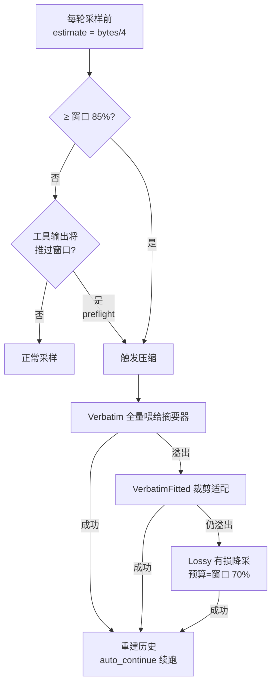

# 第 5 章：上下文管理与压缩

> **定位**：本章分析有限上下文窗口下 agent 的存活机制——token 估算与阈值触发、
> compaction-core 的 trait 缝库化设计、full-replace 压缩的完整解剖，以及"把摘要
> 当不可信输出对待"的质量工程。前置依赖：第 4 章（turn 循环，压缩的触发点在其中）。
> 适用场景：你的 LLM 应用会话长度可能超过上下文窗口——也就是所有严肃的 agent 应用。

## 5.1 为什么这很重要

上下文窗口是 agent 的元约束：模型没有记忆，它的"记忆"就是每次请求携带的历史。
一个改几十个文件的重构任务，工具结果轻松堆出几十万 token；窗口一满，agent 就会
失忆、报错或被 API 拒绝。这个问题没有绕开的办法，只有管理的办法——而且管理必须自动化，用户不会替你数 token。

先感受一下量级：128K token 的窗口按 bytes/4 折算约 512KB 文本。一次 `cargo build`
的报错输出可以是 50KB，读一个中等文件 30KB，一次全仓 grep 100KB——一个正经的
调试会话十几轮就能吃掉半个窗口。压缩不是边角优化，是 agent 能否完成"跨小时任务"
的先决条件。

最朴素的管理是**截断**：扔掉最老的消息。它错得很微妙。其一，会话历史不是均匀
重要的——第一条用户消息（任务目标）往往比中间某次 `ls` 的输出重要一千倍，按时间
截断恰好先扔目标后留噪音。其二，历史有**结构完整性约束**：assistant 的工具请求与
对应的工具结果必须成对出现，从中间一刀切下去，API 直接返回 400。其三，被截断的
内容并非真的没用——三小时前改过哪个文件，可能正是当前 bug 的答案。

所以压缩要回答的真问题是：**哪些信息是不变量（无论如何要保住），哪些可以有损**？
Grok Build 的答案分布在一个独立 crate（`xai-grok-compaction`，压缩引擎）和宿主侧
编排（`xai-grok-shell` 的 session/compaction.rs，3321 行）之间。本章先看触发，
再看引擎的库化设计，然后解剖 grok-build 实际使用的 full-replace 策略，最后看
质量与失败工程——这部分意外地是全章含金量最高的地方。

## 5.2 触发：估算、阈值与梯降

第一个反直觉的事实：这套系统的 token 计数**不是精确的**。
`xai_token_estimation::estimate_tokens` 就是 `bytes / 4`
（crates/codegen/xai-token-estimation/src/lib.rs:9）——没有 tokenizer，一个除法。
`/context` 显示的用量、自动压缩的触发、请求前的溢出预检，全部以它为唯一真值源。

用如此粗糙的估算做如此关键的决策，靠的是**用保守性换精确性**的三层兜底：



1. **保守阈值**：`should_auto_compact`
   （crates/codegen/xai-grok-agent/src/agent.rs:201）在估算用量达到窗口的
   `auto_compact_threshold_percent`（默认 85%）时触发。要诚实地说清这个余量的
   适用边界：bytes/4 对 ASCII 代码与英文大致持平或略高估，15% 余量足够；但对
   CJK 文本是**系统性低估**——UTF-8 每个汉字 3 字节折算 0.75 token，实际 tokenizer
   常给到 1~2.5 token，误差可达两三倍，且低估恰是危险方向（自以为余量充足实则
   已近溢出）。85% 阈值的安全性隐含了"代码与英文为主"的工作负载假设，中文重度
   会话更依赖下面两层兜底。
2. **preflight 溢出预检**：工具输出可能一步把用量推过窗口，`check_preflight_overflow`
   （crates/codegen/xai-grok-shell/src/session/compaction.rs:1826）在采样前抢先压缩，
   不等下一轮阈值检查。
3. **输入梯降（input ladder）**：压缩本身也是一次 LLM 调用——如果
   历史大到连"喂给摘要器"都溢出呢？梯降机制（compaction.rs:963）把喂给摘要器的
   输入按 `Verbatim → VerbatimFitted → Lossy` 三级降采，Lossy 级把输入预算压到
   窗口的 70%。溢出在这里不是错误而是**信号**：收到就降一级再试，避免"大到无法
   压缩"的死锁。

精确 tokenizer 不是做不了，是不值得：估算的消费场景全是"要不要压缩"这类粗粒度
决策，85% 阈值下 ±10% 的误差不改变任何决策结果，而 tokenizer 要跟着模型版本走、
要处理多模态、要付 CPU——工程上"够用的粗糙"胜过"昂贵的精确"。

压缩发生在 turn 循环的**采样前同步**位置（`check_auto_compact_needed`，
compaction.rs:1764）——主会话内不存在"压缩期间新输入并发"的数据竞态（后台的
prefire 预烧任务与子代理会话各自的压缩虽是并发活动，但都钉在同一 LocalSet 上，
见第 3 章）；
自动触发后通过 `auto_continue` 载荷让本轮在压缩完的新历史上继续（续跑逻辑在
`run_compact_inner`，compaction.rs:779），
用户看到的是一条"Context window X% full"通知加短暂停顿，任务不中断。

同步压缩的代价是用户要等一次完整的摘要采样（大历史下可达几十秒），于是有了
**两遍预烧（prefire two-pass）**优化：`should_prefire_two_pass`
（compaction.rs:221）判定条件满足时，在真正触发前先跑一遍摘要预采样，等真触发
时第二遍只做增量——把感知延迟摊到用户无感的时刻。延迟工程与正确性工程在同一个
子系统里分层存在：先保证压缩对、再让压缩快，两类改动互不纠缠。

## 5.3 compaction-core：一个引擎、两个宿主、三道 trait 缝

压缩引擎服务两个产品：Grok chat（对话产品）与 grok-build（编程 agent）。两者的
会话类型、token 计数策略、LLM 传输栈完全不同。引擎与宿主之间的解耦切了三道
trait 缝，每道缝的位置都值得端详：

**`CompactionItem`**（crates/common/xai-grok-compaction/src/item.rs:56）抽象
"一条会话项"，只暴露算法真正需要的能力——角色分类、取文本、工具配对判断：

```rust
pub trait CompactionItem {
    fn role(&self) -> CompactionRole;
    fn text(&self) -> Option<String>;
    fn is_tool_result(&self) -> bool { matches!(self.role(), CompactionRole::Tool) }
    fn has_tool_requests(&self) -> bool;
    fn is_compaction_summary(&self) -> bool;      // 故意无默认实现
    fn attachment_refs(&self) -> Vec<CompactionFileRef>;
}
```

注意 `is_compaction_summary` 与 `attachment_refs` **故意不给默认实现**
（item.rs:88、96）：给了默认，新宿主漏实现时代码照常编译，直到某次 re-compaction
静默丢掉上一轮摘要或附件引用才暴露。删掉默认实现，把"漏实现"从运行时数据丢失
变成编译错误——trait 设计里，默认实现的取舍不是人体工学问题，是失效模式问题。

**`ItemTokenCounter`**（crates/common/xai-grok-compaction/src/token.rs:19）把
token 计数外置：Grok chat 有真 tokenizer，grok-build 用 bytes/4，引擎不关心——
它只需要一个单调的"大小"信号，把策略差异隔离在缝外，引擎保持确定性、可测试。

**`CompactionSampler`**（crates/common/xai-grok-compaction/src/sampler.rs:119）是
唯一的 LLM 调用缝：`sample_compaction(turns, prompt, timeout)`。宿主把自己的传输、
重试、超时栈接进来（grok-build 的实现在
crates/codegen/xai-grok-shell/src/session/helpers/full_replace_compaction.rs:112）。

结果是这个 crate **既不依赖任何会话类型 crate，也不依赖采样类型 crate**
（lib.rs:8 起的模块文档明言这一设计目标，Cargo.toml 的依赖表印证）。第 2 章讲过的 `-types`/trait-seam 哲学在这里的收益具体
可感：压缩算法的每一次改进自动惠及两个产品，而两个产品的类型演化互不干扰引擎。

## 5.4 三种策略与 full-replace 解剖

引擎内置三种压缩风格，按"保留什么"分野：**intra_compaction** 保尾逐步压缩——
从尾部向前累加"保留预算"，预算外的头部送去摘要，且选择切点时绝不拆散工具请求
与结果对（crates/common/xai-grok-compaction/src/select.rs:27）；**inter_compaction**
分块跨轮摘要；这两者服务 Grok chat 的长对话形态。grok-build 用的是第三种：
**full-replace（code_compaction）**——不选尾不分块，整会话摘要后**从零重建历史**。
编程 agent 的会话被海量工具输出主导，"保留最近 N 条"意义不大，不如全量蒸馏。

full-replace 的两个端点都值得解剖。

**摘要怎么生成**：prompt 模板
（crates/common/xai-grok-compaction/src/code_compaction/templates/ 下的
full_replace_summary_prompt.txt）要求模型只输出一个 `<summary>` 块，内含 9 个
必填编号小节：主要请求与意图、关键技术概念、文件与代码段（要求贴完整片段）、
错误与修复、问题求解、全部用户消息、待办、当前工作、下一步（要求带最近消息的
逐字引用防漂移）。这不是随手写的清单——每个小节对应一类"截断会杀死会话"的
不变量，9 小节全填（没有就写 None）让遗漏在结构上可见。prompt 还有一个短版变体
`SELF_SUMMARIZATION_PROMPT`
（crates/common/xai-grok-compaction/src/code_compaction/prompt.rs:29），
措辞面向"即将接手的另一个 AI"——同一件事的两种叙事框架（"总结这段对话" vs
"给接班人写交接"），后者的设计意图是诱导模型写出可操作的状态而非流水账（这是
prompt 工程的经验判断，非可核验的代码事实）。开关 `use_short_prompt` 存在但在
当前 full-replace 梯降路径里被钉为 false（compaction.rs:982）——短版是备而未用
的基础设施。摘要 prompt 本质上是这套系统里最重要的一段"代码"，
它有变体、有开关、有模板文件，被当作正经工程资产管理。

**历史怎么重建**：`assemble_compacted_history`
（crates/common/xai-grok-compaction/src/code_compaction/assemble.rs:62）产出固定
结构：

```text
[系统提示, 用户信息, AGENTS.md?, 最后一条用户消息?, 当前轮 recent 消息…, 摘要, 状态提醒?]
```

三个细节暴露了对摘要器的信任边界：AGENTS.md 项目指令**原样重注**而不经过摘要器
（assemble.rs:70）——项目规则一个字都不能错，不能赌模型转述；最后一条真实用户
消息用 `<user_query>` 包裹逐字保留；当前轮的工具与子代理结果逐字保留。**可以
有损的只有"过程"，"契约"必须无损**——这就是 5.1 那个"不变量"问题的落地答案。

被压缩掉的原始内容去哪了？没有蒸发：完整压缩前历史落盘到
`compaction_checkpoints/{id}.json`（compaction.rs:2087），原始消息可按模式离线到
`compaction/` 目录（crates/codegen/xai-grok-shell/src/session/compaction_segments.rs:22），
摘要末尾还能附一个 transcript 指针告诉后续 agent 全量转录在哪。压缩是上下文的
瘦身，不是历史的销毁——找回机制与第 6 章的持久化衔接。压缩与会话时间旅行还有
两处交互值得预告：rewind（回退到历史某点，见第 10 章）会重置粘滞的压缩抑制
（compaction.rs:2450 注释：sticky until success/rewind/model switch——回退改变了
历史，上次失败的前提不再成立）；也会使 prefire 预烧的前缀失配作废（compaction.rs:45）。
另一个正面交代：多次压缩叠加时，上一轮摘要经 `is_compaction_summary` 被识别为
摘要项参与下一轮蒸馏——摘要的摘要必然伴随信息衰减，这是 full-replace 策略的
固有代价，9 小节模板的"逐字引用"要求正是为了减缓这种衰减。

## 5.5 质量与失败：把摘要当不可信输出对待

压缩的输出会成为下一轮的**全部记忆**，一次糟糕的摘要等于给 agent 做了失败的脑
移植。这套系统对摘要的态度是彻底的不信任，防线有三道：

**长度下限**：清洗后不足 `MIN_SUMMARY_SEED_CHARS = 500` 字符即判为 degenerate
——"退化摘要"，指模型敷衍产出的空洞短文本，对一个动辄数百轮的会话而言 500 字符
连小节标题都填不满（crates/common/xai-grok-compaction/src/code_compaction/summary.rs:123；
据仓库测试样例观察，健康摘要通常在 3000 字符以上）。妙在处置方式：degenerate
**当作瞬时失败重试**而不是接受——
"模型这次没写好"与"网络这次没通"享受同样的重试待遇。

**输出清洗**：`format_compact_summary`（summary.rs:19）剥离模型的 `<analysis>`
草稿段；更防御的一手是把正文里回显的 `<summary>` 等控制 token 插入零宽空格中和
（summary.rs:111）——摘要会进入下一轮上下文，任何存活的控制 token 都可能在
**下一次**压缩时被解析器误认，形成跨轮的自我污染。同样的自指防御也写进了 prompt：
明令摘要器不要把压缩指令本身当作用户消息复述、不要去读带外的 segment 文件。
生成式系统的输出即未来输入，所有"标记"都要按注入风险对待。

**结构校验**：落库前 `sanitize_compacted_history` 剥离孤儿工具结果、
`validate_compacted_history` 复查，仍不合规则回退到不含 recent 消息的最小历史
（compaction.rs:1515）——宁可多丢一点，不交付一个会被 API 拒绝的历史。

失败侧同样精细。重试环 `sample_summary_with_retries`
（crates/common/xai-grok-compaction/src/code_compaction/sample.rs:80，默认 3 次、
间隔 3s、单次超时 120s）先给错误分类：schema 错误、context 溢出等**确定性失败
不重试**直接短路（重试只会烧钱重现同一个错误）；超时、空响应、degenerate 属
**瞬时**，睡眠后重试。context 溢出的识别甚至不得不靠错误消息文本匹配
（crates/common/xai-grok-compaction/src/code_compaction/failure.rs:29）——各后端
的错误码不稳定，这是多后端兼容的又一笔"垫片税"（对照第 4 章的能力垫片）。
宿主侧对确定性失败调 `suppress_auto_compaction`（compaction.rs:647）按原因分级
粘滞——大小/schema 类粘滞到手动干预，额度/认证类挂到下次成功——防止每一轮都
撞同一堵墙的重试风暴。可观测性也有一处细心：共享重试环在每个梯降级别会重置
尝试计数，但观察者保留跨级累计值（full_replace_compaction.rs:278），产出的
诊断 artifact 编号保持连续——调试"为什么这次压缩跑了六次采样"时，你要的是
全局叙事而不是每级各自从 1 数起的碎片。还有一个防循环的细节：fork 会话（从既有会话某点派生出的新分支，继承父会话的
历史前缀）若因继承的前缀压完立刻又过阈值，会释放前缀并粘滞抑制
（compaction.rs:729），掐断"压完即再压"的死循环。

## 5.6 手动与自动

`/compact` 手动命令与自动触发共用 `run_compact_inner`，差异只在门与载荷：手动
**豁免 suppression**（compaction.rs:646 注释明言 manual /compact is exempt）——
用户显式要求时，"上次失败了所以先别压"的保护逻辑应当让路；手动可带参数
（`/compact keep auth`），用户上下文内联进摘要 prompt 定制保留重点；自动则带
`auto_continue` 续跑载荷并多发遥测。同一机制、两个入口、两套门——权限差异
（人 > 自动化）编码在入口而不是机制里。

## 5.7 同一问题，codex 怎么做

codex 同样有接近窗口时的自动压缩（`codex-rs/core` 的 compact 模块，摘要后以
桥接消息重建历史），方向一致，分岔在两处：

**其一，计数的真值源**。codex 依赖 API 响应回传的真实 token 用量（Responses API
的 usage 字段）驱动压缩决策；Grok Build 用本地 bytes/4 估算。前者精确但只在
"收到响应后"可用，且依赖后端诚实回报；后者粗糙但随时可算、后端无关——异构
后端谱系再次塑造了架构（BYOK 后端的 usage 字段五花八门，本地估算是最大公约数）。

**其二，引擎的组织形态**。codex 的压缩逻辑内联在 core 会话代码里（内部也有多个
变体：远程压缩、token 预算版等），服务单一产品；Grok Build 把引擎抽成宿主无关的
crate，三种策略、三道 trait 缝、两个产品共用。这不是谁更"好"——内联版本代码路径短、改起来快；库化版本是在"第二个
宿主出现"这个事实约束下的必然选择。值得记住的是库化的成本线索：三道缝、一个
工厂 trait、若干无默认实现的方法，这是"同一引擎服务两个产品"的最小协议面。

（本节对 codex 的描述基于 openai/codex 2026 年年中 main 分支，核对时以
`codex-rs/core` 为准。）

## 5.8 模式提炼

**模式一：保守估算 + 分层兜底（estimate with ladders）**。粗估算（bytes/4）配
保守阈值（85%）+ 抢先预检 + 输入梯降，胜过昂贵的精确计数。前提：估算的消费
场景是粗粒度决策；每层兜底针对一种具体的估算失效。

**模式二：不变量分治（invariant partitioning）**。压缩前先回答"什么必须无损"：
契约类内容（项目指令、用户原话、当前轮结果）绕过摘要器原样重注，过程类内容
交给有损蒸馏。适用于一切有损压缩场景——先分治，再压缩。

**模式三：输出即未来输入（output-as-future-input hygiene）**。生成的摘要会被
再次解析，所以控制 token 要中和、自指要在 prompt 层禁止、质量要有硬下限且
不达标按瞬时失败重试。适用于任何"模型输出回流进模型输入"的闭环系统。

**模式四：无默认实现的 trait 缝（no-default seam）**。跨宿主 trait 里，漏实现
会造成静默数据丢失的方法不给默认实现，把失效从运行时提前到编译期。默认实现的
取舍标准是失效模式，不是便利性。

## 设计要点回顾

速查索引（详述见对应小节）：

- 截断为何错：重要性非均匀、工具配对完整性、旧内容仍可能是答案 → 5.1
- bytes/4 估算 + 85% 阈值 + preflight 预检 + 三级输入梯降；溢出是信号不是错误 → 5.2
- 采样前同步压缩，无并发竞态；auto_continue 续跑 → 5.2
- 三道 trait 缝（Item/TokenCounter/Sampler）；无默认实现防静默丢数据；crate 零
  会话/采样依赖 → 5.3
- 三策略分野；full-replace 的 9 小节摘要 prompt 与固定重建结构；契约无损、过程
  有损；被压内容落盘可找回 → 5.4
- 摘要三道防线（500 字符下限当瞬时失败、控制 token 中和、孤儿清洗+最小历史回退）；
  错误分类重试与 suppression 分级 → 5.5
- 手动豁免 suppression：权限差异编码在入口 → 5.6
- codex 对照：真实 usage vs 本地估算、内联单策略 vs 库化三策略 → 5.7
- 四个可迁移模式：保守估算+梯降、不变量分治、输出卫生、无默认缝 → 5.8

---

### 版本演化说明

> 本章核心分析基于本书快照仓库（同步自 xAI monorepo，commit c68e39f，2026-07）。
> 涉及 crate：xai-grok-compaction、xai-token-estimation、xai-grok-agent、
> xai-grok-shell（session/compaction 族）。codex 对比基于 openai/codex 2026 年
> 年中 main 分支。上游同步后请以 `book/tools/check_chapter.py` 校验本章引用。
