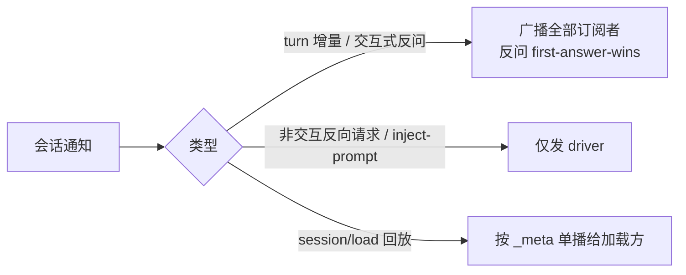

# 第 7 章：Leader-Follower——一个进程服务所有入口

> **定位**：本章分析单机单 leader 架构——TUI、IDE、headless 多客户端如何经 Unix
> socket 共享同一个 agent 运行时：flock 自举、请求 ID 命名空间、会话的订阅者/驱动者
> 路由、版本驱动的 leader 抢占与崩溃重连。前置依赖：第 3 章（会话运行时）、第 6 章
> （持久化——抢占交接的基石）。适用场景：你要让多个前端入口共享一个有状态的本地
> 服务，且该服务需要自更新、自愈。

## 7.1 为什么这很重要

先交代术语：本章的 leader/follower 不是分布式共识里那对概念——这里没有选举
算法、没有日志复制，只有单机上"谁持有运行时、谁只是窗口"的分工。名字相同，
问题域小得多，但麻雀虽小：自举竞态、抢占、故障恢复这些分布式的经典戏码一样
不少，只是舞台从集群缩到了一台笔记本。

最省事的进程模型是"每个终端窗口各起一个 agent"。它的问题在第二个窗口打开时就
出现了：两个进程各持一份会话列表、各自监听文件变更、各自维护 MCP 连接与登录
态；用户在窗口 A 里跑的任务，窗口 B 看不见；两个进程还会在共享资源上互踩——
同一个 worktree 池、同一个搜索索引、同一份凭证缓存。更隐蔽的是**版本混乱**：
auto-update 之后，新打开的窗口是新版本，旧窗口还是旧版本，两个版本对同一份
磁盘状态各写各的。

Grok Build 的答案是把 agent 运行时收进一个**常驻 leader 进程**：所有入口——
全屏 TUI、`grok -p` headless、IDE 插件——都只是客户端，经 `~/.grok/leader.sock`
上的 ACP 协议（第 3 章）接入。会话状态只有一份，任何窗口都能看到任何会话；
资源锁与索引只有一个持有者；版本升级有明确的交接协议（7.4）。

用一个具体场景感受这个架构的用户面：你在 VS Code 插件里让 agent 重构一个模块，
中途切到终端开了个全屏 TUI——同一个会话就在列表里，流式输出正在滚动，你可以
直接在 TUI 里追加指令；agent 弹出的权限确认在两边同时出现，谁先点算谁的。这些
行为都不是同步机制"复制"出来的，而是因为**本来就只有一个会话、一个运行时**，
两个前端只是两扇窗户。多入口产品的一致性问题，最彻底的解法是让"多副本一致"
这个问题不存在。

公平起见，"每窗口一进程"也有单 leader 永远给不了的优点：**崩溃隔离**——一个
窗口的 agent 崩了只影响自己，没有单点；进程模型也简单到无需本章余下的全部机制。
Grok Build 判定共享状态的收益大于隔离的收益，但这是权衡而非碾压。

代价同样要在开头说清：leader 是**单点**——它崩了所有客户端一起掉线（7.5 的
重连机制因此是必选件而非可选件）；多客户端复用一条 socket 引入了路由复杂度
（server.rs 有 6208 行，7.3 只讲其骨架）；还有一整类"谁当 leader"的分布式
自举问题被搬到了单机上（7.2）。本章就按这三笔代价的偿还顺序展开。

## 7.2 谁当 leader：flock 与自举竞态

没有 leader 时，第一个客户端负责把它拉起来。`connect_or_spawn`
（crates/codegen/xai-grok-shell/src/leader/mod.rs:1188）分三步：先直连 socket
（快路径，leader 已在）；连不上就抢锁；抢不到锁说明别人正在拉，轮询等 socket。

单例保证靠 **OS 级 flock**——内核提供的建议性文件锁系统调用
（crates/codegen/xai-grok-shell/src/leader/lock.rs:191）——不是 pid 文件方案
（pid 只写进锁文件供诊断）。flock 的优势正在崩溃语义：进程
死亡内核自动释放锁，没有"陈尸 pid 文件挡住所有后来者"的经典故障。两个客户端
同时启动时，flock 串行化出唯一的 spawner；输家不重试抢锁，直接进入"等 socket
可连"的轮询（mod.rs:1305）。赢家在真正 spawn 前还会再探一次 socket——可能有
兄弟客户端刚在驱逐竞态后拉起了新 leader，那就直接收编（adopt）并释放锁
（mod.rs:1250）。leader 进程侧有对称防重：启动时发现"锁被持有且 socket 已存在"
即自行退出（crates/codegen/xai-grok-shell/src/agent/app.rs:963）。

spawn 出的 leader 以 `--no-exit-on-disconnect` 常驻（最后一个客户端断开也不退，
crates/codegen/xai-grok-shell/src/leader/server.rs:1588 的退出分支被该旗标关闭），
进程组脱离、stdin/stdout 接空设备、stderr 写 `~/.grok/leader.log`。它的退出路径
只有两条：SIGTERM（手动）与 auto-update 触发的 relaunch（7.4）；协议里保留了
`IdleTimeout` 退出原因这个变体，但当前没有任何代码路径发射它
（crates/codegen/xai-grok-shell/src/leader/protocol.rs:317）——枚举变体先于
实现存在，闲置退出是留了位置的未来选项。锁与
socket 的文件名还有一个容易漏看的设计：连接非默认云端 relay 端点时，端点 URL
的哈希会拼进文件名（crates/codegen/xai-grok-shell/src/leader/lock.rs:78）——
不同上游环境各有各的 leader，测试环境的 leader 永远不会意外服务生产客户端。

（这里的 relay 指 leader 与 grok.com 云端之间的 WebSocket 中继通道——本地
客户端走 Unix socket，云端流量统一经这条中继，7.6 详述。）

安全边界也值得一句：socket 文件没有显式 chmod，跨用户隔离完全依赖 `~/.grok`
目录本身的权限。这在单用户工作站上成立；若部署到共享主机，目录权限就是唯一
的门，审计时应当知道门在哪里。

还有一个必须与第 6 章对照的盲区：锁文件住在 `~/.grok`，而 flock 的可靠性假设
恰恰是第 6 章论证过 NFS **给不了**的——home 目录挂网络盘、多台主机共享时，
flock 退化为各机本地语义，两台主机可以各自"持有"排它锁，双 leader 脑裂正是
本章全部机制要防的事故。第 6 章的 SQLite 层为此做了 per-host 分库；leader 锁
没有等价的防护，共享 home 的部署应当用 `--leader-socket` 把 socket 与锁改到
本地磁盘。同一个代码库对同一威胁（NFS 锁语义）在两处的防护厚度不同——数据层
被事故教育过了，进程层还没有；读者若在企业环境部署，这是第一个要检查的坑。

回到自举路径本身，还有两个细节展示了对"自更新的长驻进程"这一身份的自觉。其一，**socket-then-lock**：leader 先绑 socket（毫秒级）让客户端尽早连上，
认证与模型预取推迟到 socket 可用之后（app.rs:900）——自举路径上的每一毫秒都是
所有客户端的启动延迟。其二，**spawn 的二进制经 managed-symlink 解析**
（mod.rs:1336）：优先用 `~/.grok/bin/grok` 符号链接而非 `current_exe()`，因为
auto-update 原子换链接后，`/proc/self/exe` 仍指向旧版本文件——用它 spawn 会
复活刚被淘汰的二进制。自引用的进程管理里，"我是谁"要问安装器，不能问内核。

## 7.3 多客户端不串台：ID 命名空间与会话路由

一条 socket 进来的是多个客户端的混流，leader 要解决两个方向的路由。

**上行（请求）**：leader 把每个客户端请求的 JSON-RPC id 改写为
`{client_id}|{原始id}`（server.rs:40），响应回来时按前缀还原并投递回原客户端；
请求方已断开则作为孤儿丢弃——丢弃而非缓存是对的：JSON-RPC 响应只对发起方有
意义，发起方不在了，响应就没有收件人，缓存只会积累永远不会被认领的包裹。只
改写请求、不动响应方向的 id——agent 自己发出的反向请求要靠原始 id 匹配 pending
表。一层字符串前缀就实现了命名空间隔离，不需要每客户端一条连接，也不需要在
协议层增加"客户端标识"字段——对 agent 侧而言多客户端完全透明，它以为自己
只有一个对话方。透明性是这个设计的真正产出：ACP 协议本身保持了单客户端的简单
心智模型，多路复用是网关的私事。

**下行（会话通知）**：这是路由的精华。每个会话维护两张表
（server.rs:1623）——`session_subscribers`（订阅集）与 `session_driver`（唯一
驱动者）；客户端对某会话一发消息就自动订阅并竞选 driver。通知按语义分流
（server.rs:1761）：



流式输出人人可见（这就是"窗口 B 能看窗口 A 的任务"的实现），权限反问广播给
所有人、谁先答算谁的（first-answer-wins；晚到的答案在 agent 侧因 pending 请求
已被首答消解、id 无从匹配而自然丢弃——丢弃点不在 leader 路由层）；而"替我注入一条 prompt"这类
**指令性**反向请求只发 driver——多个客户端同时替会话做主是灾难。分流的判据
是消息的**幂等性**：反问答一次和答三次效果一样（后到的答案被丢弃），广播无害
且提升响应速度——用户在哪个窗口都能就地批准；指令重复执行则语义错误，必须
单点投递。给消息分类时问"重复送达会怎样"，比问"这条消息重要吗"更能导出
正确的路由策略。driver 断开时不是中断会话，而是把
驱动权**转移**给下一个订阅者（server.rs:1572）；订阅集清空才通知 agent 卸载会话。
子代理会话在 spawn 时整份继承父会话的订阅集与 driver（server.rs:1788）——
"看得见父任务就看得见它派生的子任务"，权限拓扑跟随任务拓扑。

还有一个时序细节：客户端 `session/load` 回放历史期间，会话可能还在产生新的
live 通知。回放先行、live 缓冲排队（有上限），回放完再放行（server.rs:1777）——
否则客户端会看到"新消息插在旧历史中间"的穿越现象。

## 7.4 版本驱动抢占：单调收敛

auto-update 后，新版客户端连上旧版 leader，谁听谁的？判定函数小到可以整段引用
（mod.rs:104）：

```rust
fn should_evict(leader_version: Option<&str>, client_version: &str) -> bool {
    leader_version.is_some_and(|v| leader_is_older_than(v, client_version))
}
```

semver（语义化版本号，major.minor.patch 三段可比较）**严格小于**才驱逐；版本相等、无法解析（开发版二进制报 "unknown"）、
或 leader 反而更新，一律不动——注意开发版的处理方向：无法比较时选择"不驱逐"，
宁可让开发者手动杀进程，也不让一个来路不明的二进制篡位。这个"只进不退"的偏序保证了两件事：多客户端反复上线不会互相踢（同版本
互不驱逐——没有抖动），且系统单调收敛到装机的最新版本。规则简单到不需要
协调者——每个客户端独立判断，结论必然一致。

驱逐的执行分两条腿（mod.rs:1104）：优先发 `RelaunchForUpdate` 让旧 leader 优雅
退场——旧 leader 收到后给 agent 最多 5 秒转入 idle，再花最多 5 秒把每个会话
actor 落盘（server.rs:1383），然后自杀；不支持优雅协议的（更旧的版本）直接
SIGTERM。驱逐者最多等 8 秒（`EVICT_WAIT_TIMEOUT`），超时强杀，随后清理 socket、
spawn 新 leader。并发驱逐用一个 `AtomicBool` 去重（server.rs:1360）——多个新版
客户端同时发难，也只 drain 一次。

注意**状态交接的实现是"不交接"**：没有内存状态的序列化移交，旧 leader 只负责
把一切 flush 进第 6 章的持久化层，新 leader 从磁盘冷启动，客户端用
`session/load` + cursor 重放追齐。第 6 章"磁盘即真相"的纪律在这里兑现成了
架构红利：进程交接协议 = 持久化协议，不需要第二套。

值得对比被放弃的替代方案。热交接（旧进程把内存状态序列化传给新进程）能省掉
冷启动，但要求新旧两个版本对**内存布局**达成一致——而版本升级恰恰是内存布局
最可能变化的时刻，热交接协议自己成为升级的绊脚石。socket 文件描述符传递
（SCM_RIGHTS）能让客户端连接无缝存续，但连接背后的会话状态仍要走磁盘，省下的
只是一次重连握手。冷交接以最多十几秒的切换窗口，换来"新旧版本之间唯一的契约
是磁盘格式"——而磁盘格式恰好是第 6 章里向后兼容工程最完善的一层。交接协议的
选择本质上是选择"新旧版本在哪个接口上见面"，见面的接口越古老越稳定越好。

在跑会话的体验上，这套协议给出的答案是"暂停而非丢失"。诚实地说，5 秒的 idle
等待对真实的长采样 turn 通常**等不到**自然收尾——超时后照样 relaunch，在飞的
turn 被取消、以中断状态落盘；5 秒真正兜住的是短尾任务与工具执行的收官。但结论
不变：会话历史完整落盘，新 leader 起来后客户端重新 load，用户看到任务停在上次
的位置，续一句"继续"即可。升级打断的是**一个 turn**（且多半是取消而非完成），
不是一个会话。

## 7.5 崩溃与重连

leader 崩溃时，客户端的桥接层检测到断连即进入重连
（crates/codegen/xai-grok-pager/src/acp/leader_bridge.rs:87）。重连的实现直白
得漂亮：**再调一次 `connect_or_spawn`**（mod.rs:987）——于是第一个重连的客户端
自动成为新 leader 的拉起者，7.2 的自举逻辑同时就是灾难恢复逻辑，一套代码两个
职责。退避策略按客户端性格分化：TUI 无限重试（用户在看着，等就是了），
headless 有界重试 5 次（CI 里挂死不如挂快，mod.rs:113）。

重连成功后 reconnector 递增一个 generation 计数（mod.rs:962）——桥接层用它
识别"这个响应属于断线前的旧连接"，防止跨代串扰；随后客户端重放 `initialize` +
`session/load`，用 `_meta` 里的 cursor（`eventId = {sessionId}-{counter}`）从
断点续传，回放标记的更新按事件序号去重
（crates/codegen/xai-grok-pager/src/acp/meta.rs:26）。断线重连的三件套——代际
标记、幂等重放、游标续传——与分布式消息系统的消费者恢复完全同构；单机 IPC
并不豁免分布式问题，只是把网络分区换成了进程崩溃。`ShutdownReason` 区分
auto-update（立即重连，无缝换新二进制）与手动关闭（不重连）——同样的断连信号，
按语义走不同的恢复路径。

## 7.6 ACP gateway 与 headless

支撑这一切的协议层是 `xai-acp-lib` 的双向 gateway：同一套
`AcpGatewaySender/Receiver` 按 `AcpSide` 泛型分化出 agent 侧与 client 侧
（crates/codegen/xai-acp-lib/src/gateway.rs:22），请求/反向请求对称。每条消息的
`_meta` 携带 W3C `traceparent`
（crates/codegen/xai-file-utils/src/trace_context.rs:80），gateway 的 on_meta
回调把它接成 tracing span——client→leader→agent→云端 relay 的一次交互在
观测系统里是一条连续的分布式 trace。第 3 章说过"消息传递撕碎调用栈，用分布式
追踪缝回来"；这里是同一思想跨出进程边界的延续。

一个容易误判的问题：`grok -p`（口语里的 headless——无界面运行）走不走 leader？
**走**（crates/codegen/xai-grok-shell/src/leader/protocol.rs:114 的注释明确
`grok agent stdio` 与 `grok -p` 都归 `ClientMode::Stdio`，即本地 IPC 客户端；
留意命名陷阱——代码里的 `ClientMode::Headless` 枚举值反而指经云端 relay 接入
的远程客户端，与口语的 headless 不是一回事）。CI 里第一次调用拉起常驻
leader，同工作区的后续调用全部复用——脚本里循环调十次 `grok -p`，模型连接、
MCP 握手、索引加载只付一次成本。这个决定并不显然：headless 的直觉形象是
"无状态一次性进程"，让它挂到常驻服务上似乎违背直觉。但换个角度看，CI 脚本里
连续的 `grok -p` 调用之间往往存在会话延续（`--resume` 接着上一步的产出继续），
让它们共享 leader 恰好让"跨调用的会话"成为一等公民，而不是靠临时文件手工
缝合。云端 relay 则按需建立：leader 对上游只维护一条 WebSocket，首个需要它的
客户端注册时才拨号（app.rs:914）——常驻不等于常连，本地的持久性与网络的
懒惰性各自独立决策。

## 7.7 同一问题，codex 怎么做

codex 的进程模型走了另一条路，差异集中在三点：

**其一，无常驻服务**。codex 每次调用（TUI、`codex exec`）自成进程，核心与前端
在同一进程内经 SQ/EQ 队列交互（第 3 章）；没有跨窗口共享的运行时，也就没有
自举、抢占、路由这一整层。简单是真简单——7.2~7.5 的全部机制在 codex 里不存在；
代价是两个窗口互不知晓，MCP/登录/索引每进程各付一份。

**其二，IDE 集成的进程边界**。codex 为编辑器集成提供独立的 app-server 协议
（每编辑器实例一个服务进程）；Grok Build 让 IDE 插件与 TUI 共享同一个 leader
socket——编辑器里发起的会话，终端窗口里能接着聊，反之亦然。

**其三，升级语义**。codex 无常驻进程，升级即"下次调用用新版"，天然无交接
问题；Grok Build 为常驻进程付出了 7.4 的整套抢占协议，换来长会话跨升级存续
（会话在旧 leader flush 落盘、新 leader 加载续跑）。常驻与否是这一章所有分岔
的根源：**要不要为"状态活得比进程久"付协议税**，两家给了相反的答案。

（本节对 codex 的描述基于 openai/codex 2026 年年中 main 分支。）

## 7.8 模式提炼

**模式一：flock 自举单例（crash-safe singleton）**。单机服务的单例用 OS 文件锁
而非 pid 文件——内核在进程死亡时自动释放，无陈尸问题；输家不争锁，转为等待
产出物（socket）就绪。崩溃恢复直接复用自举路径。

**模式二：ID 前缀命名空间（id namespacing）**。多客户端复用一条连接时，网关
改写请求 id 加客户端前缀、响应按前缀还原，单向改写保持另一方向的匹配语义。

**模式三：订阅者/驱动者二表（subscribers + driver）**。共享可观察、指令有唯一
归属：观察类消息广播订阅集，指令类只达 driver；driver 断开转移而非中断。适用
于任何"多视图共享一个有状态任务"的场景。

**模式四：单调版本收敛（monotonic takeover）**。抢占条件用严格偏序（仅更新者
驱逐更旧者），各节点独立判定即可全局一致、无抖动；交接不搬内存状态，全部走
持久化层 + 客户端重放。

## 设计要点回顾

速查索引（详述见对应小节）：

- 每窗口一进程的四宗罪：状态割裂、资源互踩、版本混乱、重复成本；单 leader 的
  三笔新代价 → 7.1
- connect_or_spawn 三步；flock 单例与崩溃语义；sibling adopt；socket-then-lock；
  managed-symlink 防复活旧版 → 7.2
- `{client_id}|id` 上行命名空间；订阅者/驱动者二表下行分流；driver 转移；
  子会话继承订阅；live-before-replay 缓冲 → 7.3
- should_evict 严格偏序防抖动单调收敛；5s+5s+8s 三段式优雅驱逐；AtomicBool
  去重；交接=持久化+cursor 重放 → 7.4
- 重连即重走自举；TUI 无限 vs headless 有界退避；eventId 去重续传 → 7.5
- ACP 双 side gateway；traceparent 跨进程 trace；grok -p 也走 leader；relay 按需 → 7.6
- codex 对照：无常驻（简单换隔离）、per-editor 服务 vs 共享 leader、升级免协议
  vs 会话跨升级存续 → 7.7
- 四个可迁移模式：flock 自举、id 前缀、二表路由、单调收敛 → 7.8

---

### 版本演化说明

> 本章核心分析基于本书快照仓库（同步自 xAI monorepo，commit c68e39f，2026-07）。
> 涉及文件：xai-grok-shell 的 leader/{mod,lock,server,protocol}.rs 与 agent/app.rs、
> xai-acp-lib、xai-grok-pager 的 acp 模块。codex 对比基于 openai/codex 2026 年
> 年中 main 分支。上游同步后请以 `book/tools/check_chapter.py` 校验本章引用。
