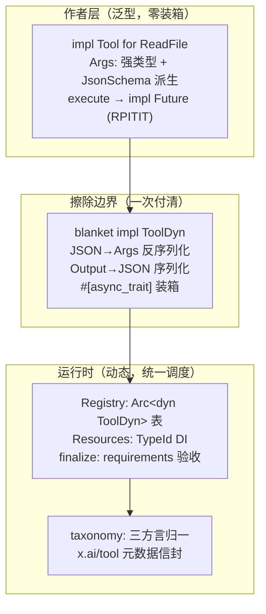

# 第 8 章：两层工具抽象

> **定位**：本章分析工具系统的类型设计——底层 `Tool` trait 如何用 RPITIT
> （trait 方法直接返回 `impl Trait`，Rust 1.75 起稳定）做到作者层零装箱、`ToolDyn` 如何把类型擦除的代价集中在一条边界上，以及上层注册
> 系统的依赖注入、taxonomy 归一与 `Expr<T>` 声明式可用性。前置依赖：第 4 章
> （工具的执行编排——本章只讲类型，不讲调度）。适用场景：你要设计任何"多实现、
> 统一调度、对外暴露 schema"的插件式接口。

## 8.1 为什么这很重要

工具是 agent 的手。一个编程 agent 内置几十个工具——读文件、执行命令、检索、
编辑——还要接入 MCP（Model Context Protocol，外部工具服务器协议，第 17 章
详述）带来的任意外部工具。数量不是难点，难的是这张工具表的
**变率**：产品每周都在增删工具、调整参数、试验新变体，而模型对工具的调用
完全由 schema 驱动——类型定义、运行时行为、对模型的描述三者任何一处脱节，
都表现为模型"用错工具"这种最难归因的故障。工具抽象的质量直接决定这张表能
以多快的速度安全演化。工具抽象因此要同时伺候三方：**工具
作者**要人体工学（强类型参数、直接 async、不写样板）；**运行时**要统一调度
（一张表存所有工具、统一的调用与流式协议）；**模型**要 JSON Schema（参数结构
的机器可读描述）。三方诉求在 Rust 里天然打架——统一调度要 `dyn Trait` 对象
安全，人体工学要关联类型与原生 `async fn`，而这两样恰恰破坏对象安全。

社区的常规解法是 `#[async_trait]` 一把梭：所有方法返回 `Pin<Box<dyn Future>>`，
对象安全了，代价是**每个工具的每次调用**都装箱一次 future——包括那些根本不需要
动态分发的泛型调用路径。这笔钱花得冤枉：装箱是为擦除付的，却让不需要擦除的
场合也一起付。

Grok Build 的答案是把两难**拆到两层分别解决**：`Tool` trait 服务作者，用原生
async 不装箱；`ToolDyn` 服务运行时，集中支付全部擦除成本。本章顺着这条边界
从下往上走，最后到达 taxonomy——当同一个运行时要容纳三家词汇表（第 12 章的
codex/opencode 移植）时，类型层还得再长出一个归一层。全景如下：



## 8.2 Tool trait：作者层的零成本

底层契约在 crates/common/xai-tool-runtime/src/tool.rs:36。作者面对的是完全
强类型的世界：`Args` 关联类型要求 `Deserialize + JsonSchema`（schema 由此派生，
见 8.5），`Output` 要求 `Serialize + ToolOutput`。执行入口有两个：流式的
`execute` 与阻塞便捷的 `run`——默认 `execute` 把 `run` 的结果包成单元素终止流
（tool.rs:92），`run` 默认返回 not_implemented：两者都不实现的工具在第一次调用
时**响亮失败**，而不是静默空转。

为什么不用 `#[async_trait]`？注释给了教科书级的说明（tool.rs:79，节选）：

> Uses a native `async fn` in trait (RPITIT) with an explicit `Send` bound rather
> than `#[async_trait]`, so the returned future is not boxed. The `Tool` trait is
> only ever consumed generically (type erasure goes through `ToolDyn`), so it
> does not need to be dyn-compatible.

RPITIT（trait 方法返回 `impl Future`）加显式 `Send` 约束，future 不装箱；而
放弃对象安全是安全的，因为 `Tool` **从不以 dyn 形态被消费**——擦除是 `ToolDyn`
的职责。签名本身长这样（tool.rs:87，节选）：

```rust
fn execute(
    &self,
    ctx: ToolCallContext,
    args: Self::Args,
) -> impl Future<Output = ToolStream<Self::Output>> + Send;
```

对比 `#[async_trait]` 展开后的
`Pin<Box<dyn Future<Output = …> + Send + '_>>`，泛型路径每次调用省一次堆分配。
这笔钱相对工具的真实 IO（毫秒级）微不足道，且运行时的主路径本就
经过装箱的 `ToolDyn`——这个设计的真正价值不在性能数字，而在**边界的正确性**：
不需要擦除的路径（工具内部组合、测试）不背擦除的债，成本模型与职责模型对齐。
这句注释值得反复读：它不是在炫技，而是在陈述一个职责划分——"谁需要对象安全"
决定"谁付装箱钱"。

## 8.3 ToolDyn：把代价集中在擦除边界

`ToolDyn` 是对象安全的擦除 trait，配一个 blanket impl `impl<T: Tool> ToolDyn for T`
（tool.rs:336）——任何实现了 `Tool` 的类型自动获得擦除形态，作者无感。擦除层
干三件收费的事（tool.rs:358 起）：入参 `serde_json::from_value` 反序列化成
`T::Args`（失败即 invalid_arguments 终止流）；出参逐项序列化回 JSON 并打包成
`TypedToolOutput`；以及——**这一层自己用 `#[async_trait]` 装箱**（tool.rs:305）。

（严格记账的话还有第四笔小钱：映射后的流被 `Box::pin` 重新装箱，每个流项做
一次输出重打包——边际开销，但"集中付费"的清单应当完整。）

于是出现了一个乍看矛盾的画面：同一个文件顶部 import 了 `async_trait`
（tool.rs:19），却在 `Tool` 上明确拒绝它、在 `ToolDyn` 上使用它。这不是不一致，
是**零成本抽象边界**的精确画法：泛型侧（工具实现、测试、内部组合）全程无装箱；
动态侧（注册表以 `Arc<dyn ToolDyn>` 持有全部工具）把反序列化、序列化、future
装箱三笔费用一次付清。付费点只有一个，且正好是"类型世界"与"JSON 世界"的
汇合处——本来就要做 serde 转换的地方，装箱的边际成本几乎消失。

`TypedToolOutput`（tool.rs:245）打包 JSON 值、模型可见输出与可选的补充输出，
让下游"永不需要把 Value 反序列化回具体类型"；其中 `model_output` 有非空保证
（tool.rs:238）——工具不自定义时，默认把 JSON 渲染成 text block，天然满足 MCP
的内容块协议。真正的运行时调用契约是旁边的 `ToolDispatch`
（crates/common/xai-tool-runtime/src/dispatch.rs:31），其 `call_terminal` 默认
实现排干流、丢弃进度、若流结束仍无终止项则报 `stream_no_terminal`——注释直言
这是"实现方的协议违规"（dispatch.rs:47）。

顺带一个考古发现：底层还预留了 `ToolFamily`/`ToolVariant`（同一工具 id 下多
实现按变体路由，tool.rs:419、409），但检索全仓，**上层注册系统从未接线**——上层的
"同名多实现"实际用命名空间 + 独立类型 + finalize 期互斥校验解决（hashline
编辑器与普通编辑器作为两个独立 toolset 注册，启动时校验互斥，
registry/types.rs:878）。基础设施先于需求存在、需求最终走了另一条路，这类
"未被采用的预留"在大型代码库里比想象中常见；识别它的线索通常是"只有定义与
单测引用、无生产调用方"——本例中 ToolFamily 的唯一使用者就是运行时 crate
自己的测试文件。读代码时把预留误当主干，会让你高估一条路径的成熟度。

## 8.4 ToolStream：一个用约定维护的契约

流式契约的形状写在类型注释里：`[Progress(_)*, Terminal(Result)]`（tool.rs:114）
——零或多个进度项，恰好一个终止项在最后。`ToolProgress` 三臂：纯文本、内容块、
以及 `Custom{subkind, payload}` 逃生舱（外层 serde tag 恒为 custom，生产者自己
的判别子下沉一层，避免未来新增变体撞 tag）。

补上签名里两个尚未解释的角色。**`ToolCallContext`** 是每次调用的上下文袋：
`call_id` 加一个按类型索引的扩展容器
（crates/common/xai-tool-runtime/src/context.rs:66）——注意它与 8.5 将讲的
`Resources` 是**两套容器**：前者是 per-call 的（这次调用的取消令牌、trace
上下文、会话信息），后者是 registry 级的长生命周期依赖（文件系统、通知句柄），
生命周期不同，混用是常见误读。扩展袋里最重要的租户是取消令牌
（context.rs:142）：注释写明取消是**协作式 + 硬兜底**双轨——工具应当在长循环
里检查令牌配合退出，但即便它不配合，调度方 drop 掉调用 future 也能硬取消
（Rust 的 future 取消语义免费提供了这层兜底）；超时同理表达为"到点 drop"。

**错误契约**由 `ToolError` 统一承载：约 17 个语义变体
（crates/common/xai-tool-runtime/src/error.rs:181 起——权限拒绝、限流、并发
上限、网络错误、超时、取消……），每个配构造器。这不是错误美学：第 4 章的
执行编排要按错误性质决定熔断还是自愈、第 11 章的权限层要识别 permission_denied、
重试逻辑要区分 rate_limited 与 network_error——统一的错误分类是所有下游策略
的前提词汇表。

进度流的存在改变了工具的表达力边界：一个跑五分钟的测试命令可以边跑边把关键
输出行推给 UI（用户看到的是活的终端而非五分钟白屏），一个多文件搜索可以逐文件
汇报命中。而对不需要这些的简单工具（读一个文件），`run` 入口让它完全无感——
流式能力按需付费，这是 `execute`/`run` 双入口设计的真正意图。

要记一笔：**这个契约没有类型强制**。"Terminal 后不得再发"靠的是所有
消费者以"见到 Terminal 即短路"实现——违规的后续项被自然丢弃；"必须有
Terminal"靠消费端检测——排干了还没有终止项就报协议违规错误。类型系统当然
可以编码这个协议：让 execute 返回 `(impl Stream<Progress>, impl Future<Terminal>)`
的二元组，"恰好一个终止值"就由类型保证了。但代价链条很长——每个工具的返回
类型复杂一截；组合器（把一个工具包装成另一个）要同时操心两个通道的生命周期；
擦除层要为二元组再设计一套对象安全形态。而它防住的违规，在"只用官方构造器"
的纪律下本来就不会发生。这里的取舍是：**协议简单到违规
只有两种形态时，运行时检测比类型编码更便宜**——配套的是只提供两个"不可能
违规"的构造器（`terminal_only` 与 `with_progress`，tool.rs:206/218），正确的
路径最好走，错误的路径可检测。

## 8.5 schema 与注册：派生、注入、验收

**schema 是派生的**。`Args: JsonSchema` 让注册时一行 `generate_schema::<T::Args>()`
（crates/codegen/xai-grok-tools/src/registry/types.rs:595）产出 draft-07 schema，
子 schema 全部内联（模型消费方不解析 `$ref`）。派生的价值不只是省手写：schema
的**参数结构**与反序列化代码来自同一个类型定义，这一层永不漂移——手写 schema
的系统里，"文档说有这个参数、代码早就改名了"是慢性病。要限定的是：工具的
**描述文本**（description）仍是手写的，它与行为的一致性没有编译期保障——8.1
说的三方脱节里，派生消灭了结构脱节，语义脱节仍靠人。手写的部分下沉到字段级：一批"宽松
反序列化器"接受数字/字符串/浮点形态的整数
（crates/codegen/xai-grok-tools/src/types/schema.rs:84），另有定制的整数 schema
去掉 schemars 默认的 `format: uint` 噪音（schema.rs:7）——模型输出的 JSON
并不总是规矩的，参数层的宽容比对模型说教便宜；schema 层的整洁则直接省 token。

**依赖注入是类型索引的**。`Resources` 本质是
`HashMap<TypeId, Box<dyn Any + Send + Sync>>`
（crates/codegen/xai-grok-tools/src/types/resources.rs:175）：工具按类型取资源
（Cwd、文件系统、通知句柄……近 30 种），缺失得到明确的 missing_resource 错误。
序列化边界也有讲究：只有显式注册的 Params/State 类型参与持久化，`Cwd` 这类
瞬态资源被静默跳过（resources.rs:331）——容器区分"值得记住的配置"与"每次
重建的环境"，快照里不会混入过期的工作目录。
一个精巧细节：`Params<T>` 与 `State<T>` 是不同 TypeId 的包装（resources.rs:71、
104）——同一个类型 `T` 的"配置"与"运行态"可以共存不撞。还有一处防御：工具
内部要调用其它工具时（如 MCP 转发），必须走存放在扩展槽里的 `InnerDispatch`
句柄而非外层 `ToolBridge`——注释直言走外层"会死锁"（外层持注册表锁，
registry/types.rs:1217）。DI 容器里藏着一条重入规则，这是文档写不到、只有
注释能救的知识。

**验收在 finalize**。注册完成后统一跑参数校验与 requirements 求值
（registry/types.rs:902），失败产出人类可读的解释（形如"enabled_background=true requires get_task_output and kill_task…"，转述自 registry/types.rs:1818 的两段拼合消息）——配置错误在启动时爆炸，而不是在
用户调用时。

## 8.6 taxonomy 与 Expr<T>：三方言的归一层

第 12 章将看到，这个运行时同时容纳 grok_build、codex、opencode 三家工具方言。
词汇归一由 tool_taxonomy 承担：`ToolKind` 32 个语义变体加 `Other` 兜底，
`ToolNamespace` 六值闭集；`presentation_name`
（crates/codegen/xai-grok-tools/src/tool_taxonomy.rs:37）把多个 kind **折叠**到
统一显示标签——codex 的 `read_file` 与 opencode 的 `Read` 都显示为 "Read"，
UI 层从此不认识方言。match 是穷举的：新增 kind 不配显示名就不编译。

归一的输出是 `x.ai/tool` 元数据信封（tool_taxonomy.rs:190）：版本、名称、kind、
label、namespace、只读标记与输入投影。"投影"一词是精确的：`input` 字段只保留
跨方言有共识的键，编辑工具的 old_string/new_string、写文件的全文这类大 payload
**永不投影**——信封是给 UI 与遥测消费的轻量摘要，不是输入的镜像，需要原始
输入的消费者回落到 raw_input。信封自身的 JSON Schema 是入库文件，由测试保证
与代码同步（tool_taxonomy.rs:332）——协议文档过期即测试失败。消费方契约里有一个精心设计的**不对称**
（tool_taxonomy.rs:162 起的文档，及锁死它的测试）：`kind` 的 JSON Schema 是
**开放字符串**（未知值降级 Other，前向兼容——旧消费者遇到新工具种类不崩），
`namespace` 却是**封闭枚举**（新命名空间会让严格类型的消费者反序列化失败——
注释明言这是故意的，"强迫类型化消费者更新"）。同一份信封，两个字段两种演化
策略：kind 是描述性的，错了无非显示难看；namespace 是语义边界，静默吞掉等于
消费者在不知情中处理了一整个新工具家族。**前向兼容不是全有全无，按字段的
失效后果分级**。

工具之间还存在"存在性依赖"：编辑工具的说明书里写着"编辑前先用 Read 读文件"
——如果这套配置里根本没启用 Read 呢？说明书成了谎言，模型会困惑地寻找不存在
的工具。这类跨工具约束若用代码检查，会散落成一地与被检对象相距甚远的 if。
可用性声明因此交给 `Expr<T>`——一棵泛型布尔树（Value/And/Or/Not/True/False，
crates/codegen/xai-grok-tools/src/types/requirements.rs:17），`eval` 接受叶子
求值闭包。同一棵树在三层复用：顶层叶子是"工具依赖"、中层叶子是"参数条件"、
底层叶子是"值相等"——文件头的文档直接画出了这个三层嵌套。看一个真实例子
（search_replace 的 requirements，
crates/codegen/xai-grok-tools/src/implementations/grok_build/search_replace/mod.rs:768）：
"除非配置了 skip_read_before_edit，否则要求 Read 工具在场；且 Edit 工具的
schema 必须暴露 old_string/new_string/replace_all 三参数"——后半句存在的原因
是它的描述模板会引用 `${{ params.edit.old_string }}`。工具之间的依赖不再是
散落在代码里的 if，而是可求值、可解释（失败时产出人话）、可测试的数据。

## 8.7 媒体生成工具族：从能力门控到终端产物

前面几节的抽象都以同步文本工具为样本。Grok Build 里有一族工具把同一套 `Tool`
抽象推到了另一个端点——图像与视频的**生成**。`impl xai_tool_runtime::Tool` 的
共四个：`image_gen`（image_gen/mod.rs:382）、`image_edit`（image_edit/mod.rs:276）、
`image_to_video` 与 `reference_to_video`（video_gen/mod.rs:990、1086）。它们值得
单列，不是因为多了四个 API，而是因为它们暴露了前几节没有端到端展示的两个模式。

**模式一：能力门控的条件注册。** 这族工具不是无条件存在的。
`AgentBuilder::with_image_gen_config` 的文档写得很直白：当 `Enabled` 时，创建
`ImageGenClient` 注入 ToolBridge 的 resources，`image_gen` 工具被注册；`Disabled`
（默认）时工具不注册（builder.rs:456）。`with_video_gen_config` 对 `VideoGenClient`
同理（builder.rs:469）。于是"这个 agent 有没有画图能力"不是编译期常量，而是一条从
远程配置流下来的开关：**config → client 资源注入 → 工具注册**，三步全架在 8.5 的
`Resources` 依赖注入之上。工具集合本身成了配置的函数——这是"能力即配置"在工具层
的落点，也是同步文本工具那一批看不到的一层动态性。

**模式二：异步「发起—轮询—下载」长任务。** 文本工具多是一次 `run` 就返回；视频
生成做不到。`video_gen/mod.rs` 头注把流程写死成三段：① 发起生成请求；② 轮询
`GET /v1/videos/{id}` 直到状态 `done`（`VIDEO_POLL_INTERVAL_SECS = 5`，
video_gen/mod.rs:21、40）；③ 下载 MP4 字节，落到 `<session>/videos/<n>.mp4`
（video_gen/mod.rs:14）。一个 `ToolOutput` 背后是一整条带超时、带预签名 URL 生命周期
管理的异步管线。这是长running 工具与同步工具在同一 `Tool` 抽象下的形态差异：抽象不
变，`run` 内部的时间尺度变了——8.4 的协作式取消在这里不是可选项，是必需品。

**一个易错点：没有直接的"文本→视频"工具。** `/imagine-video` 看着像文生视频，实际
是一条**组合流水线**。它由 `image_to_video` 门控（slash_commands.rs:54），其展开的
指令明写两步：先用 `image_gen` 生成"首帧源图"，再用 `image_to_video` 让它动起来
（slash_commands.rs:103、105；`reference_to_video` 只在用户给了参考图时才用）：


先文生图、再图生视频，中间接上模式二的轮询下载。把它写成"Grok 能文生视频"就错了
——真实能力是两个原子工具的编排，`/imagine-video` 只是把编排固化成一条 skill 指令。

**产物如何回到终端。** `image_gen` 的描述模板特意要求模型用**会话相对短路径**
（`images/1.jpg`）而非绝对路径报告保存位置，"好让它渲染成可点击链接、点开就是图片"
（image_gen/mod.rs:374）。工具负责**产生**媒体并落地会话目录；如何在终端里**显示**
——Kitty / iTerm2 图像协议、滚动区渲染——是第 16 章的事。本节讲"媒体如何产生"，
第 16 章讲"媒体如何显示"，一条链的两头，不重复。

## 8.8 同一问题，codex 怎么做

codex 的工具层与 Grok Build 在两个维度分岔：

**其一，归一层的有无**。codex 只有一套自家工具词汇，不存在"三方言归一"问题
——taxonomy、presentation_name、`x.ai/tool` 信封这一整层在 codex 里没有对应物。
这层不是抽象洁癖，是 Grok Build "移植别家工具"的产品决策（第 12 章）拉出来的
必要基建：**方言数量决定归一层的存在性**。

**其二，并发能力的声明位置**。第 4 章已见 codex 用 `tool_supports_parallel`
布尔声明并发能力、全局 RwLock 门控；Grok Build 的对应信息分散在 taxonomy 的
`is_read_only` 穷举分类与 per-path 锁提取逻辑里。前者把"能否并行"作为工具的
一等属性；后者从"是否只读/碰哪个资源"推导并行性——声明式标签与结构化推导
的老对话，在工具元数据上重演。

（本节对 codex 的描述基于 openai/codex 2026 年年中 main 分支；其工具层在
`codex-rs/core/src/tools/`。）

## 8.9 模式提炼

**模式一：代价集中于擦除边界（pay-at-erasure）**。人体工学 trait 用 RPITIT
保持零装箱，对象安全交给独立的擦除 trait + blanket impl，序列化与装箱在同一条
边界一次付清。前提：泛型消费与动态消费的路径可以清晰分开。

**模式二：类型索引 DI（TypeId container）**。插件式组件的依赖用
`HashMap<TypeId, Box<dyn Any>>` 注入，配置与运行态用不同包装类型区分；容器内
的重入规则（内层句柄防死锁）必须随容器一起交付。

**模式三：按失效后果分级的前向兼容（consequence-tiered compat）**。同一份
元数据中，展示性字段用开放 schema + 降级兜底，语义边界字段用封闭 schema +
响亮失败；用测试锁死这种不对称，防止后来者"顺手统一"。

**模式四：声明式可用性（requirements as data）**。组件间依赖写成可求值的
表达式树而非散落的条件判断，失败时可自动生成人类可读解释；泛型树 + 叶子闭包
让同一结构在多个抽象层复用。

## 设计要点回顾

速查索引（详述见对应小节）：

- 三方诉求（作者/运行时/模型）与 #[async_trait] 一把梭的冤枉钱 → 8.1
- Tool trait：RPITIT + 显式 Send 零装箱；run/execute 双入口；响亮失败 → 8.2
- ToolDyn blanket impl 三笔集中付费；同文件两种 async 策略即抽象边界 → 8.3
- ToolFamily 预留未接线：识别"未被采用的预留" → 8.3
- ToolStream 约定式契约：两个安全构造器 + 消费端违规检测 → 8.4
- ToolCallContext（per-call 扩展袋）≠ Resources（registry 级 DI）；协作式取消 +
  drop 硬兜底；ToolError 17 变体是下游策略的词汇表 → 8.4
- schema 派生 + 字段级宽松反序列化；TypeId DI 与 Params/State 分离；
  InnerDispatch 防死锁；finalize 启动期验收 → 8.5
- taxonomy 折叠三方言；kind 开放/namespace 封闭的前向兼容不对称；
  Expr<T> 三层布尔树与 search_replace 实例 → 8.6
- 媒体生成工具族：能力门控条件注册（config→client→注册）；异步发起-轮询-下载长任务；
  /imagine-video 是 image_gen→image_to_video 组合而非原生文生视频；产物落会话目录、
  显示见第 16 章 → 8.7
- codex 对照：方言数量决定归一层存在性；并发能力声明 vs 推导 → 8.8
- 四个可迁移模式：擦除边界付费、TypeId DI、后果分级兼容、声明式可用性 → 8.9

---

### 版本演化说明

> 本章核心分析基于本书快照仓库（同步自 xAI monorepo，commit 8adf901，SOURCE_REV 2ec0f0c，2026-07）。
> 涉及 crate：xai-tool-runtime、xai-grok-tools、xai-grok-agent、xai-grok-tools-api。codex 对比基于 openai/codex
> 2026 年年中 main 分支。上游同步后请以 `book/tools/check_chapter.py` 校验本章引用。
