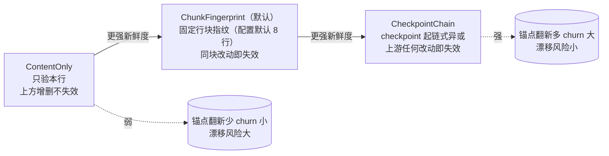

# 第 9 章：文件编辑的艺术

> **定位**：本章对比同一代码库内共存的四种"让 LLM 改文件"方案——字节精确的
> search_replace、行锚点的 hashline、上下文补丁的 apply_patch（codex 移植）、
> 极简的 opencode/edit——回答"这个问题为什么至今没有唯一正解"，并给出各方案的
> 失效模式谱系。前置依赖：第 8 章（工具抽象与 requirements）。适用场景：你要
> 设计任何"由模型生成、对精确性零容忍"的结构化操作接口。

## 9.1 为什么这很重要

先解释一个前提：为什么不让模型直接输出整个文件？小文件可以（write 工具就是
这么干的），但对几千行的源文件，全文重写意味着每次编辑烧掉数千 token、引入
"顺手改坏无关区域"的风险、还让 diff 审查失去焦点。**增量编辑**是必须的，
而增量编辑的核心难题只有一个：让模型精确指出"改哪里"。

"把文件里的 X 改成 Y"是编程 agent 使用频率最高、失败代价最大的操作。它难在
模型与文件系统之间隔着三重现实：

1. **定位歧义**。模型说"改这一行"，但同样的行在文件里出现了三次——改哪个？
   猜错一次就是一个静默引入的 bug。
2. **内容漂移**。模型对文件的认知来自几轮之前的读取；此后 agent 自己的编辑、
   用户在编辑器里的手改、格式化工具的自动运行，都可能让模型记忆中的内容与
   磁盘现状脱节。基于过期认知的编辑，轻则失败，重则改错位置。
3. **保真陷阱**。模型输出要经过采样、转义、JSON 编码几道工序才落到工具参数里，
   一个智能引号变直引号、一个 tab 变空格、行尾多一个空格——字节级匹配就此
   失效，而模型自己看不出差别在哪。

把三重现实各配一个具体画面。定位歧义：模型要给三个重载函数之一加参数，
`old_string` 是函数签名——三处命中，改错一处，编译器都未必报警。内容漂移：
模型第 5 轮读了配置文件，第 12 轮要改它，中间第 8 轮它自己已经在同一文件里
插过一段——第 5 轮记忆里的行号与上下文全部过期。保真陷阱：用户从网页拷来的
代码里有个 U+2019 撇号，模型复述时输出了 ASCII 撇号——肉眼零差别，字节匹配
必败，模型收到"未找到"后一脸无辜地再试一次同样的参数。

这三重现实互相拉扯出一条设计光谱：**匹配越严格，错改越少、拒改越多**；反之
亦然。错改是静默的错误代码，拒改是显式的重试成本——两者的相对代价因场景
而异，这正是四种方案能在同一个代码库里共存的原因。本章按"严格 → 宽容"的
顺序过一遍，重点解剖本仓库独有的 hashline。

## 9.2 search_replace：字节精确，加三重善后

grok_build 标准套的编辑工具走最保守的路线：读文件、CRLF 归一后，用
`match_indices` 收集 `old_string` 的**全部**字节偏移
（crates/codegen/xai-grok-tools/src/implementations/grok_build/search_replace/mod.rs:554）。
零匹配报错；多于一处且未开 `replace_all` 也报错（多处匹配时改哪处都是赌博，
拒改是唯一正确答案）；恰好一处才动手。默认**没有任何空白容差**——纯字节比较。

两个边界细节体现字节方案的严谨。CRLF 处理是**往返式**的：读取时 `\r\n` 归一
成 `\n` 参与匹配，写回时按原文件风格还原——Windows 风格的文件不会被一次编辑
悄悄改成 Unix 换行。`replace_all` 不是循环调 replace，而是一次线性扫描收集
全部位置后重建整串（helpers.rs:75），顺带记录每处替换的新偏移供 diff 展示——
n 处替换 O(n) 完成且不受替换串与匹配串互相包含的经典陷阱影响。

严格性把大量失败推给了"拒改"，于是这个工具把工程重心放在**拒改之后**：错误
信息不是给人看的日志，是给模型看的**修复指引**。零匹配的回复由三段可选提示
拼成（mod.rs:644，节选）：

```rust
message: format!(
    "The string to replace was not found in the file, use the {} tool \
     to see the correct string.{}{}{}",
    read_name, user_edit_hint, hint, confusable_hint
),
```

注意 `read_name` 也是变量——工具名经模板渲染成客户端实际配置的名称，错误里
引用的是模型真正能调用的工具，而不是硬编码的内部名。给模型的指引必须用模型
的词汇表。三段提示分别是：

- `user_edit_hint`：提醒"用户可能在你上次读取后改过文件"——直指漂移；
- 最近匹配提示：拿 old_string 首行的最长 token 在文件里找最相似的行，回报
  `line N: …`（mod.rs:390）——模型据此重读附近而不是全文；
- confusable 提示：如果失败疑似 Unicode 排版字符所致，列出含智能引号/长破折号
  的行号（mod.rs:423）。

对保真陷阱还有一个可选的自动化回退：`unicode_normalized_fallback`（默认关）
在零匹配后做 confusable 归一重试，且带回环校验、多义时 fail-closed
（helpers.rs:177）——归一命中多处、或归一后的替换无法无损映射回原文时，一律
放弃自动修复退回报错。宁可拒改也不在归一后的模糊地带赌一把；默认关闭则再退
一步——自动修复连存在与否都交给配置层决定。第 8 章的
requirements 在这里落地成产品约束：除非配置豁免，编辑工具要求 Read 工具在场
（mod.rs:768）——"先读后改"不是礼貌，是对抗漂移的最低纪律。

## 9.3 hashline：给每一行发一张身份证

漂移问题的根源是"模型引用文件内容时没有新鲜度凭证"。hashline 的回答激进而
优雅：**读取时给每行发一个哈希锚点，编辑时凭锚点操作**。模型看到的文件视图
变成（crates/codegen/xai-grok-tools/src/implementations/grok_build_hashline/read_file.rs:27）：

```text
22:abc:rst→  let x = compute();
23:dfk:rst→  return x;
```

`行号:本行哈希:上下文哈希→内容`。行哈希是 FNV-1a（一种快速、无密码学要求的经典散列函数）32 位，计算前先 trim 并把
连续空白折叠成单空格（util/hash.rs:41）——**缩进与行尾空白的改动不影响锚点**，
9.1 的保真陷阱被哈希的归一化直接吸收掉一半。

上下文哈希决定锚点的"新鲜度强度"，三种方案构成一个谱系
（crates/codegen/xai-grok-tools/src/implementations/grok_build_hashline/scheme.rs）：



ContentOnly 只担保"这一行还是这一行"——上方增删一百行它照样有效，代价是
"第 22 行"可能早已不是模型以为的那个位置的第 22 行，只是内容碰巧相同；
ChunkFingerprint 把固定行块（struct 常量 16 行，配置层生产默认 8 行）内所有行
哈希混成指纹，块内任何改动使全块锚点作废——新鲜度以块为粒度；CheckpointChain 从最近的 32 行 checkpoint 边界一路链式
异或到本行（scheme.rs:468），上游任何改动都会传染性地作废下游锚点——最强的
过期检测，也意味着每次编辑后最多的锚点翻新。三档的设计维度与第 5 章压缩的
"保什么/牺牲什么"同构：这里保的是引用有效性，牺牲的是锚点稳定性，档位就是
两者的汇率。防退化
细节：后两种方案**拒绝**缺失上下文段的截断锚点（scheme.rs:402）——模型偷懒
只给 `LINE:LOCAL`，系统不会悄悄按 ContentOnly 语义放行，而是判 Stale。

走一遍完整的编辑流感受这套机制：模型读文件拿到带锚视图；发起编辑
`{anchor: "22:abc:rst", content: "…"}`；此时文件已被上一轮编辑推移了三行——
本行校验 Stale；`find_shifted` 在附近找到唯一的哈希匹配在第 25 行；错误返回
"漂移到 25，用新锚点重试"；模型换锚点重发，成功。在这条**唯一漂移命中**的
顺境路径上，恢复不需要重读文件——新锚点由错误直接提供，比 search_replace 的
"回去重读"少一轮工具调用。要标注边界：搜索半径 ±15 行，但错误回带的
带锚上下文只有 ±5 行——候选落在 6~15 行外、或 `Ambiguous`/`NotFound` 时，
模型仍须重读。锚点方案缩短的是**最常见**失败（小幅漂移）的恢复路径，不是
全部失败。锚点方案先付读放大的成本（视图里的哈希占 token），换编辑失败时更短的
恢复路径；字节方案反之。两者的账要按"编辑失败率 × 恢复成本"算总账，这正是
benchmark 基建存在的原因。

锚点失配不是死路，是**引导式恢复**：`find_shifted` 在 ±15 行（`DEFAULT_SEARCH_RADIUS`，scheme.rs:190，调用点
apply.rs:597）内寻找哈希匹配的新位置，唯一命中时的错误信息直接给出解法
（edit/apply.rs:619）："Anchor stale at line 22. Content appears to have
shifted to line 25. Retry with anchor \"25:abc:xyz\"."——连同当前行的新锚点
与 ±5 行的带锚上下文一起回给模型。批量编辑里任一锚点失败则**全批回滚**
（apply.rs:186）——这是单次编辑调用内的原子性保证，与第 10 章的会话级
checkpoint 回退是两回事——避免半途而废的部分应用。

最后一个宝藏藏在 benchmark.rs：这套锚点方案有专门的评测基建，度量各方案的
"读放大 vs 抗漂移"权衡——而 CheckpointChain **只出现在评测里**，可配置的
选项只有 content_only 与 chunk（config.rs:96，默认 chunk）。最强的新鲜度方案
被度量过、然后未上线——"因锚点翻新成本太高"是从其 churn 属性做出的合理
推测，源码没有明言落选原因。但"三种方案被同一套评测度量、只有两种可配置"
是硬事实：选型是评测驱动的，不是拍脑袋的。

## 9.4 apply_patch：上下文游标与四级模糊

codex 移植来的 apply_patch 走另一条路：模型输出一个自定义格式（社区称 V4A 格式——codex 自创的补丁方言，非 unified diff）的补丁
（`*** Begin Patch` / `*** Update File:` / `@@ 上下文行`，Lark 文法在
crates/codegen/xai-grok-tools/src/implementations/codex/apply_patch/parser.rs:9），
`@@` 上下文行充当**游标**：先定位上下文，把匹配指针推进到其后，后续修改行
从那里顺序匹配——重复内容靠"从上一个游标之后找起"消歧，与字节方案靠唯一性、
hashline 靠哈希，形成三种消歧哲学。

定位用 `seek_sequence` 的四级模糊（严格度递减，
crates/codegen/xai-grok-tools/src/implementations/codex/apply_patch/seek_sequence.rs:48）：
精确相等 → 忽略行尾空白 → 忽略首尾空白 → Unicode 归一。四级是有序回退而非
并行尝试：先用最严格的标准扫全文，失败才降一级重扫——宽容度是逐步让渡的，
且每级都是全文范围内的确定性匹配，不存在"第二级的模糊命中抢在第一级的精确
命中之前"的次序问题。文件末尾另有特判：`*** End of File` 标记的 hunk 从文件
尾部倒着找，并对末行做去尾空行的重试——补丁格式里最脆弱的位置（EOF 处的
空行数）得到了专门照顾。第三级意味着**缩进
容差**——四方案中唯此一家。这是双刃剑：模型记错缩进层级时补丁照样能打上
（拒改率低），但也可能匹配到缩进不同的**错误位置**（错改风险高于字节方案）。
codex 的选择隐含了它的信任模型：补丁自带多行上下文，多行同时误匹配的概率低，
用上下文的冗余度去换单行匹配的宽容度。

移植适配值得一句（细节在第 12 章）：整个 apply_patch 被拆成**纯函数库**——
所有函数只吃 `&str`、零文件系统访问（apply.rs:1 的模块声明），I/O 隔离到工具
层；`seek_sequence.rs:2` 注明"逐字移植"。移植的第一刀不是改逻辑，是切 I/O
边界——逻辑保真与环境适配分离，上游更新时还能对得上。

## 9.5 opencode/edit：最朴素方案的存在理由

opencode 移植的 edit 是四方案中最简单的：camelCase 参数
（`filePath`/`oldString`/`newString`），纯字节 `match_indices` 定位，**没有
任何回退链**——零匹配直接报错，信息只有一句"确认包括空白与缩进在内完全
匹配"（crates/codegen/xai-grok-tools/src/implementations/opencode/edit/mod.rs:365）。
没有 confusable、没有最近匹配提示、不要求先读。

它的价值恰在朴素：参数语义与 opencode 原版一致，让习惯该方言的模型（或从
opencode 迁移的配置）零成本落地；实现上大量复用 grok_build 的 helpers
（edit/mod.rs:22）——方言不同，引擎共享。这个复用决策本身值得停一拍：移植
时完全可以照抄 opencode 的 TypeScript 逻辑重写一遍，但那会让同一类 bug 要修
两处、同一类改进要做两遍；把"方言"压缩到参数解析与输出格式这层薄壳，把
定位/替换/diff 的核心下沉到共享 helpers，是移植工程里"保语义、并实现"的
标准动作——第 12 章会看到这条原则的系统性应用。两个独有细节：错误里回带
`file_snapshot_at_edit`（刚读的文件字节直接附在错误上，消费方不必再读盘）；
对"新建文件"语义更严格——目标已存在非空文件时无条件拒绝，而 grok_build
的对应行为受配置门控（默认允许空 old_string 覆盖，可配置为拒绝）。同一个动作在两家方言里的边界语义并不相同，移植时保留
各自语义而非强行归一，正是"方言"的题中之义。

## 9.6 对照与共存

四方案的失效模式对照：

| 方案 | 定位机制 | 错改风险 | 拒改倾向 | 错误信息质量 |
|---|---|---|---|---|
| search_replace | 字节唯一匹配 | 低 | 高（1 字节差即拒） | 三重提示引导修复 |
| hashline | 行哈希 + 上下文哈希 | 低 | 中（Stale/Ambiguous） | 给出新锚点直接重试 |
| apply_patch | 上下文游标 + 四级模糊 | 中偏低（容差被多行冗余抵消） | 低 | 仅"找不到上下文" |
| opencode/edit | 字节唯一匹配 | 低 | 最高（无任何回退） | 一句话 + 快照回带 |

分水岭在**重复内容**：字节方案要求模型提供更长的上下文消歧；hashline 用
`Ambiguous` 拒改并列出候选；apply_patch 用游标顺序推进"就近取材"。共存的
边界由注册系统把守：标准三件套（read/search_replace/grep）与 hashline 三件套
**硬互斥**（crates/codegen/xai-grok-tools/src/registry/types.rs:859 起的 file
toolset 冲突校验）。为什么只有这一对上硬锁？因为它们的冲突在**文件视图**层：
hashline 的 read 输出带锚点的行、标准 read 输出裸文本，两者混配时模型一会儿
看到锚点一会儿看不到，编辑参数的心智模型直接崩坏——这不是"选哪个更好"的
偏好问题，是"同时用必然坏"的一致性问题。而 codex/opencode 方案与标准套的
差异只在编辑参数形态，read 视图相同，共存无害，靠 requirements 与命名唯一性
软约束即可。互斥的粒度追随冲突的性质：视图冲突上硬锁，参数方言留自由。
没有代码级的"默认方案"常量，选择权全部在配置层。

两个"化石级"发现值得记录。其一，search_replace 保留了 `legacy-0.4.10` 行为
版本，把结构化错误降级回历史字符串文案，测试逐字断言旧文案（mod.rs:1009）——
**工具的错误信息被当作对模型的 API 契约冻结**：模型（或下游解析）可能依赖
特定措辞，改文案等于破坏兼容。其二，hashline 容忍模型把 `edits` 数组误编码
成 JSON 字符串或单对象（edit/types.rs:24），还专门检测"锚点前缀被粘进正文"
的粘贴事故——每一段防呆代码都是一种真实 LLM 失败模式的化石，读工具代码时，
防呆的分布就是模型行为缺陷的地图。

## 9.7 移植环境的差异

还有一层值得点破的时间维度：这场四方案共存本质上是一场**仍在进行的实验**。
hashline 有 benchmark、CheckpointChain 在评测里待命、legacy 文案被冻结保护
存量行为——这些痕迹说明团队并不认为编辑问题已经解决，而是在生产流量里持续
对照。写这类章节时抵抗"盖棺定论"的诱惑很重要：今天的默认（chunk 锚点、
search_replace 标准套）是当前评测下的局部最优，不是终点。

apply_patch 在 codex 原生环境里是**主编辑工具**，与 OpenAI 模型的训练分布
协同——模型见过大量 V4A 格式的补丁。移植到 Grok Build 后它是可选命名空间
之一，服务的模型未必对该格式有同等熟练度——同一个工具，在两个环境里的实际
成功率可能截然不同。这提示一个容易被忽略的评测维度：**编辑方案的优劣不是
工具的内禀属性，而是"工具 × 模型训练分布"的联合属性**。四方案共存的深层
理由或许正在这里：不同后端模型各有格式偏好，运行时把选择权交给配置。

（codex 原生侧描述基于 openai/codex 2026 年年中 main 分支。）

## 9.8 模式提炼

**模式一：错误信息是给模型的 API（error-as-prompt）**。工具拒绝操作时，错误
文本会直接成为模型下一轮的输入——按"模型读了能自救"的标准写错误（指出最近
匹配、给出新锚点、提示漂移原因），并把文案当契约管理（版本化、测试冻结）。
安全边界：错误里回带的文件内容（上下文行、快照）是**不可信数据进入模型输入**
的通道之一，与工具输出同级——恶意文件可以经此注入指令，防护要靠系统层
（第 11 章的信任标注），错误构造方不应假设内容无害。

**模式二：fail-closed 的自动归一（normalize-then-verify）**。对保真陷阱做
自动修复（Unicode 归一）时，修复必须带回环校验、多义即放弃——歧义地带的
自动化比拒改更危险。

**模式三：新鲜度凭证谱系（freshness spectrum）**。引用外部可变状态的操作，
给引用附带可校验的新鲜度凭证（哈希锚点），并按"过期检测强度 vs 凭证翻新
成本"提供多档；用评测决定上线哪几档。

**模式四：消歧哲学三选一（uniqueness / anchor / cursor）**。重复内容的消歧
只有三条路——要求引用全局唯一、给引用发身份证、用顺序游标就近匹配；三者
的失效模式互补，选型取决于"错改与拒改哪个更贵"。

## 设计要点回顾

速查索引（详述见对应小节）：

- 三重现实（定位歧义/内容漂移/保真陷阱）拉出"严格-宽容"光谱 → 9.1
- search_replace：字节唯一匹配 + 三段修复指引 + fail-closed confusable 回退；
  先读后改的 requirements 纪律 → 9.2
- hashline：空白折叠 FNV-1a 行锚点；三档新鲜度谱系（CheckpointChain 评测落选）；
  拒截断锚点防退化；±15 行引导式恢复；批量全回滚 → 9.3
- apply_patch：上下文游标消歧 + 四级模糊（唯一有缩进容差，双刃）；移植第一刀
  切 I/O 边界 → 9.4
- opencode/edit：无回退链的朴素方案；方言语义保留（新建文件边界不同）→ 9.5
- 对照表与硬互斥；legacy 错误文案冻结为契约；防呆代码是 LLM 失败模式化石 → 9.6
- 方案优劣 = 工具 × 模型训练分布的联合属性 → 9.7
- 四个可迁移模式：error-as-prompt、归一后验证、新鲜度谱系、消歧三选一 → 9.8

---

### 版本演化说明

> 本章核心分析基于本书快照仓库（同步自 xAI monorepo，commit 8adf901，SOURCE_REV 2ec0f0c，2026-07）。
> 涉及目录：xai-grok-tools/src/implementations/{grok_build,grok_build_hashline,
> codex,opencode}。codex 原生环境描述基于 openai/codex 2026 年年中 main 分支。
> 上游同步后请以 `book/tools/check_chapter.py` 校验本章引用。
