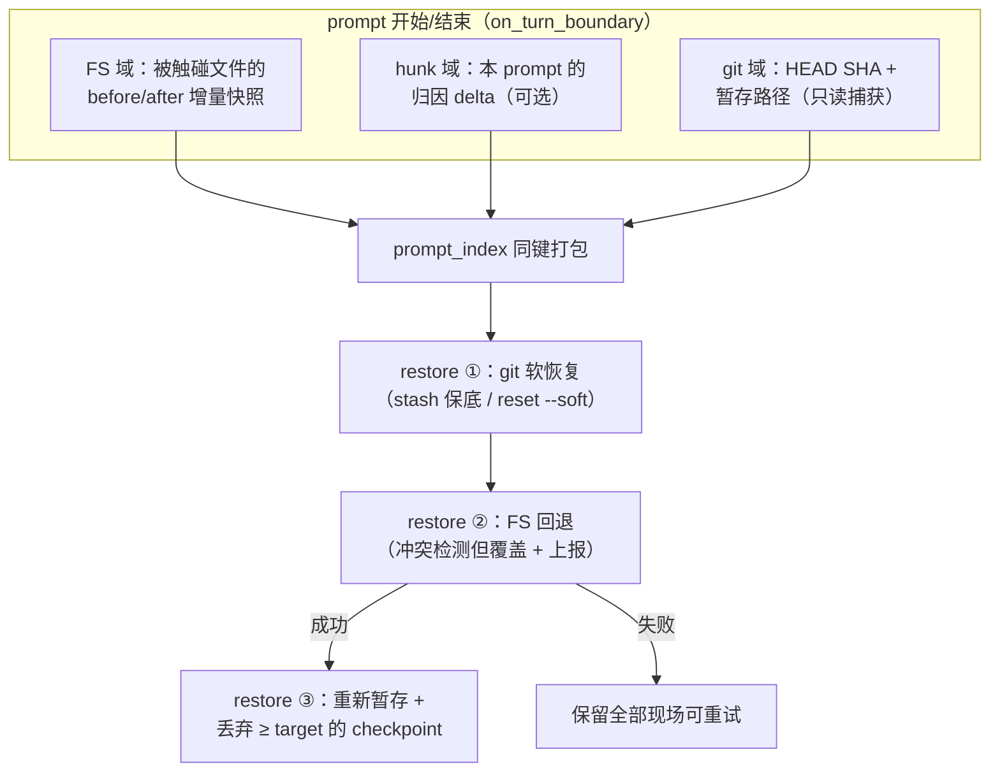

# 第 10 章：时间旅行——checkpoint 与 worktree

> **定位**：本章分析 agent 的可撤销性基建——checkpoint 如何按 prompt 边界打包
> 文件系统/hunk/git 三个域、restore 如何做到有序且可重试、hunk-tracker 的来源
> 归因，以及 fast-worktree 给并行子代理的 CoW（Copy-on-Write，写时复制——克隆时共享
> 数据块、谁写谁才真复制）隔离。前置依赖：第 6 章（持久化，
> rewind 点的落盘）、第 9 章（编辑工具，被撤销的对象）。适用场景：你要给任何
> "自动化改用户资产"的系统设计后悔药。

## 10.1 为什么这很重要

"agent 改坏了我的代码"是用户对编程 agent 最深的恐惧，后悔药因此是信任的
基础设施。第一反应通常是：git 不就是干这个的吗？让 agent 每步都 commit，
回退就是 reset。这个方案在 agent 场景有三个洞：

1. **未跟踪文件**。agent 新建的文件、生成的产物在 git 眼里不存在，reset 管
   不到它们；`.gitignore` 里的配置文件更是彻底的盲区。
2. **用户混编**。agent 干活的同时用户也在改文件——回退 agent 的第 3 步不该
   顺带抹掉用户第 4 分钟的手改，而 git 的树级操作分不出这两种改动。
3. **粒度与污染**。用户想要的撤销单位是"我的上一句话引发的全部效果"，不是
   某个 commit；而让 agent 频繁自动 commit 会把用户的 git 历史搅成垃圾场。

还有第四个更根本的错位：git 的撤销是**开发者工具**，它假设操作者理解暂存区、
引用、reflog；而 agent 的用户光谱里有大量"我只想让它帮我改代码"的人，对
他们说"用 `git reset --hard HEAD@{2}` 恢复"等于没说。后悔药要装在产品里，
不能装在说明书里。

所以这套系统的答案是在 git **之上**再建一层：以 **prompt 为撤销单位**，把
一次 prompt 触发的效果拆进三个各司其职的域——文件系统内容（谁的字节变了）、
hunk 归因（哪些变化是谁造成的）、git 状态（HEAD 与暂存区在哪）——三域同键
（`prompt_index`）打包、同键回退。三域缺一不可：只回文件不回 git，暂存区会
指着不存在的内容；只回 git 不回文件，磁盘还是改过的样子；没有归因，用户混编
就成了糊涂账。

## 10.2 checkpoint：prompt 边界的三域打包

checkpoint 的建立挂在统一入口 `on_turn_boundary`
（crates/codegen/xai-grok-workspace/src/session/checkpoint.rs:238）：prompt
开始时捕获文件系统 rewind 点与 git 状态，prompt 结束时补上 after 快照与
hunk delta，打包成：

```rust
pub struct RewindCheckpoint {
    pub prompt_index: usize,
    pub fs: RewindPoint,               // 文件 before/after 快照
    #[serde(default)]
    pub hunks: Option<HunkTurnDelta>,  // 增量 hunk delta
}
```

（checkpoint.rs:90，节选。）三域的打包与回退全景：



三个设计决定值得逐一咀嚼。

**快照是增量的，且 before 以首写为准**。全仓快照的诱惑很大（实现简单、语义
干净），但一个中型仓库几十万文件，每个 prompt 抓一次全量快照的时间与空间
成本都不可接受——除非底层文件系统支持 O(1) 快照，而那正是 10.5 的 worktree
走的路；checkpoint 面向的是**用户的主工作区**，不能假设文件系统能力，只能
走增量。于是 RewindPoint 只记录本 prompt 内被读/写触碰过的文件；同一文件被改多次，before 只保留第一次操作前的
版本（`add_snapshot` 用 `or_insert`，
crates/codegen/xai-grok-workspace/src/session/file_state.rs:311）——"回退这个
prompt"的语义就是回到 prompt 开始时，中间态不重要。CWD 之外的路径静默不入册
（file_state.rs:669）：agent 改了 `/etc/hosts` 不归 rewind 管，撤销的疆域与
工作区的疆域一致。

**git 域轻到只有两个字段**：HEAD 的 SHA 加暂存路径列表
（crates/codegen/xai-grok-workspace/src/session/git.rs:1948）——不存任何内容，
内容在 FS 域已经有了。捕获全程只读（`rev-parse` + `diff --cached --name-only`），
**不创建任何 git 对象**。三域的分工在这里看得最清：FS 域管字节，git 域只管
"指针们指在哪"。

**schema 为演化留了缝**：可选域全部 `#[serde(default)]`（checkpoint.rs:88），
旧版本序列化的 checkpoint blob 在新版本照样能读——第 6 章 load-time 兼容纪律
的又一处实例。持久化本身也是可选镜像：restore 永远在进程内存里做，磁盘只是
副本（checkpoint.rs:211），两个特性开关默认关闭时整条路径零磁盘 I/O。

三域的写入还全部遵守**首次为准的幂等**纪律：FS 用 `or_insert_with`、git 用
`or_insert`（git.rs:1972）加一次性 `claim_attempt`（git.rs:1982）——同一个 prompt 边界被
重复触发（重试、竞态）不会覆盖已捕获的快照。另有一个补漏路径：默认只有正常
完成的 prompt 建全 checkpoint，但 `workspace_rewind_all_outcomes` 开启后，
报错或被取消的 turn 也会在结束时把半开的 FS checkpoint 收尾
（checkpoint.rs:326）——失败的 prompt 同样可能改了文件，撤销的覆盖面不应
以"成功与否"为条件。

## 10.3 restore：有序回退与"可重试的部分失败"

`rewind_to`（checkpoint.rs:373）的回退是严格三段有序：先 git 软恢复，再回退
文件系统，**仅当 FS 成功**才重新暂存并丢弃已回退的 checkpoint。顺序有讲究：
git 的"stash 还是放弃"守卫要先看到活着的现场——它需要检查当前工作树是否
干净、是否处在 merge 中途，这些判断必须在文件被改回去**之前**做，否则守卫
看到的是回退后的假现场；重新暂存必须在 FS 之后——暂存的是恢复后的内容，
先 stage 再改文件等于 stage 了错的版本；而丢弃 checkpoint 必须最后做——它是
唯一不可逆的一步，前两步任何失败都不应该走到这里。三步的主干顺序由这些依赖关系确定（hunk 域的恢复插在哪一步之间有一定自由度）
——多域操作的排序题，先画依赖图再写代码。

失败处理的哲学是**可重试的部分回退，而非损坏态**：FS 回退失败时不截断 rewind
点、git 侧的收尾全部不执行（checkpoint.rs:413），一切数据原地保留等用户重试；
git 软恢复失败只警告，FS 照常回退——文件内容是用户最关心的，git 指针的恢复
失败不应连累它。

用户混编的处理是本章最微妙的权衡（file_state.rs:963）：回退前逐文件对比磁盘
现状与 after 快照，不一致就归类为"外部修改/外部删除/外部创建"记入冲突清单
——**但随后照样覆盖**。要精确定位这个语义的层次：这是 workspace 层**原语**
的行为——原语无条件执行、如实报告，把"要不要挡"的政策决定留给上层。而
用户真正接触的 shell 层把这个原语包进了**预览-确认两段门**（10.6）：第一次
请求永远是干跑（dry-run），有冲突时返回"确认后才回退"的错误，用户带 force
再来才真执行。于是三个候选语义在这套系统里各得其所：原语层"覆盖 + 上报"
（机制不做家长），交互层"预览 + 确认"（政策保护用户），只有"静默覆盖"
被彻底排除。机制与政策分层后，headless 调用方可以直接用原语的果断，交互
UI 可以享受确认门的稳妥——一个原语服务两种政策。

git 域还有一个"就近回退"细节：目标 prompt 处没有 git checkpoint（比如 flag
中途才开启）时，取**最近的更早**checkpoint（git.rs:2000）——宁可把 HEAD 停在
更早的已知好状态，也不留在回退后的未知态。恢复用的是 soft 语义全家桶：
`reset --soft` 移 HEAD（绝不 `--hard`，turn 内用户自己的 commit 得以幸存）、
脏树先 stash 保底（stash ref 通过日志告知用户）、遇上进行中的
merge/rebase/cherry-pick 直接拒绝碰 git（git.rs:1756）——别人的手术台上不动刀。

## 10.4 hunk-tracker：归因的三态

三域中的归因域由独立的 `xai-hunk-tracker` 承担（hunk 即一段连续的改动行块，
diff 的基本单位，第 9 章的编辑正是以它为展示粒度），actor 模式（专用任务独占状态，
第 3 章的范式）。关键问题是：怎么知道一个文件变化是 agent 干的还是用户干的？

答案不是时间窗启发式，而是**写入路径登记**：agent 的每次写都经工具层显式调
`record_agent_write`，直接标记 `AgentEdit { prompt_index }`
（crates/codegen/xai-hunk-tracker/src/actor/mutations.rs:66）；文件系统监视器
探测到的其余变化按"该文件是否已被 agent 碰过"二分为
`ExternalEditOnAgentFile`（用户改了 agent 的战场）与 `External`（用户在别处
自己干活）（mutations.rs:334）。三态而非两态——"用户改了 agent 碰过的文件"
正是 10.3 冲突检测最关心的那类：用户在自己领地里的编辑（`External`）与回退
无关，不必打扰；但踩进 agent 战场的编辑（`ExternalEditOnAgentFile`）会在回退
时被覆盖，必须点名上报。两态归因（agent/非 agent）给不出这个区分，冲突提示
只能要么全报（噪音）要么不报（危险）。归因的态数由消费方的决策需求反推，
不是越细越好，也不能少于决策所需。

归因的消费方揭示了一个容易想错的点：给子代理复制工作区时，用的是**全量**
tracked 路径而不是仅 agent 归因的路径——注释直白解释：agent 可能用 `echo`、
`cp`、`mv` 这类 shell 命令创建文件，这些写不走编辑工具、不会被登记为 agent
写入（crates/codegen/xai-hunk-tracker/src/handle.rs:198）。登记式归因的盲区
（shell 逃逸）被消费方用"宁多勿漏"策略兜住——归因供展示与冲突提示（精确
优先），复制供正确性（完备优先），同一份数据两种消费口径。

边界内容的处理：超过 1MB 的文件、含 NUL 的二进制、LFS 指针、符号链接（用
lstat 识别、不跟随）都**登记路径但跳过 hunk 计算**——归因降级，复制不缺席。
还有一个防"幻象 diff"的细节：符号链接与 HEAD 里的普通文本文件类型不匹配时，
借 git 的 dirty 缓存判断文件实际干净（mutations.rs:315）——类型层面的表观
差异不等于内容层面的真实改动，hunk 计算宁可借力 git 的判断也不报假警。假警
在这个域的代价很具体：UI 上多出一块"待处理改动"，用户困惑地点开却看不出
任何差别，对归因系统的信任从此打折。

## 10.5 fast-worktree：给子代理一间隔离房

并行子代理同时改同一个工作区是灾难，`xai-fast-worktree` 为每个子代理造一间
CoW 隔离房。速度是核心指标（大仓库克隆分钟级就没法用了），实现是一条按平台
能力递降的 fallback 链：overlay 快照（基于 overlayfs——把可写层叠在只读底层上的联合挂载，改动只落
可写层，O(1)）→ BTRFS 子卷快照（O(1)，
`btrfs subvolume snapshot`）→ 逐文件 CoW 拷贝
（crates/codegen/xai-fast-worktree/src/worktree/execute.rs:254；macOS 直接走 APFS
reflink 拷贝）。递降链上还有一个环境感知的跳步：进程若身处私有挂载命名空间
（沙箱里常见，第 11 章），overlay 路径被直接跳过——命名空间内的挂载点对外
不可见，做出来的快照没法用符号链接暴露给别的进程（execute.rs:324 附近的
判定）。创建模式也分三档（Linked/Standalone/GitCheckout），对应"共享对象库
的轻量链接"到"完全独立检出"的隔离强度谱——又一处按需付费。逐文件路径的并行化有个精巧的分片函数：按**父目录**哈希分片
（crates/codegen/xai-fast-worktree/src/copy/shard.rs:24）——同目录文件落同一
worker，建父目录的竞争就地消失。reflink（文件系统级的 CoW 克隆系统调用，APFS/BTRFS/XFS 支持——克隆瞬间完成、
磁盘上不复制数据块）失败自动退化普通拷贝，并显式补回权限位（copy/cow.rs:15）——CoW 只克隆数据块，权限是元数据，注释提醒了这个
容易踩的坑。

并行度的调校也有平台差异的痕迹：worker 数取 CPU 核数，但 macOS 上限 8（防
文件描述符耗尽）、其他平台 32（copy/engine.rs:26）；同名工作树靠全路径 64 位
哈希消歧（copy/shard.rs:34）——`frontend` 这种烂大街的目录名在快照命名与
数据库主键里不会互相踩踏。

worktree 池的元数据在 SQLite（第 6 章那个 NFS 感知的 worktrees.db），GC 的
判定是"过期**且**未被守卫"：守卫包括创建进程仍存活、有活进程的 cwd 在树内
（crates/codegen/xai-fast-worktree/src/api.rs:1596）；长任务靠每小时 touch
续命（第 6 章提过）。销毁前还要用新鲜数据**二次确认**（api.rs:1682）——GC
判定与销毁之间存在时间窗，并发的 touch 可能刚刚救活它。回收器的黄金法则：
判死刑用旧数据，行刑前用新数据再核一遍。

一条写进注释的教训值得转述：worktree 复制的文件遍历尊重项目 `.gitignore`，
但**永不读取** git 的 global ignore 与 `.git/info/exclude`
（copy/engine.rs:105 注释）——外部工具喜欢往 exclude 里塞 `*.min.js`、`*.zip`
这类模式，读了它们会把**已跟踪**的文件从复制中静默剔除。同名机制不同信任级：
项目内的 ignore 是团队共识，全局的 ignore 是个体习惯，基础设施只能信前者。

## 10.6 用户语义：/rewind 的三档模式

用户面的回退经 ACP 扩展暴露三档模式
（派发入口 crates/codegen/xai-grok-shell/src/extensions/rewind.rs:22，三档枚举
定义在 session/acp_types.rs:303）：`All`
（会话+文件都回）、`ConversationOnly`（只裁对话，文件保持现状）、`FilesOnly`
（只回文件，对话保留）。三档对应三种真实场景：说错话重来（All）、探索性对话想保留文件产出但换个
方向聊（ConversationOnly）、讨论有价值但这轮改动是灾难（FilesOnly）。撤销
从来不是一个动作，是一族动作——把"会话"与"文件"两个轴解耦后，用户拿到的
是 2×2 里除"什么都不动"外的全部三格。

扩展协议里还有 `points` 查询列出全部可回退点（每个点带 prompt 摘要供 UI
展示时间线），以及 `force` 参数——它不是"跳过冲突"，而是**提交门**：无 force 的请求一律
只做干跑预览（哪怕没有冲突也不写盘），带 force 才真正执行。10.3 原语层的
"检测-覆盖-上报"在协议层被包装成"预览-确认-提交"的两次往返。

`ConversationOnly` 藏着一个容易出错的不变量：对话回退了、文件没回，那么被
丢弃的那些 prompt 的**文件效果**怎么算账？实现把它们合并进前一个 rewind 点
（crates/codegen/xai-grok-shell/src/session/acp_session_impl/rewind.rs:504）
——保证之后 `/rewind 0` 依然能撤掉全部文件改动，新 prompt 也能拿到反映磁盘
现状的新鲜 before 快照。回退不是删除记录，是**重新记账**。与前几章的衔接在
此闭合：回退重置第 5 章的压缩抑制（历史变了，上次压缩失败的前提失效）；
rewind 点的懒加载是第 6 章"按需读"的实例。

## 10.7 同一问题，codex 怎么做

codex 没有与此对应的会话级三域 rewind 基建，差异集中在两点：

**其一，撤销的依托**。codex 把可撤销性主要交还给 git 工作流与用户自控——
agent 改坏了，用户用 git 的常规手段恢复；这与其"每次调用一个进程、不留常驻
状态"的总体哲学（第 7 章）一致。Grok Build 则把撤销做成产品内建：prompt 粒度、
三域对齐、冲突上报。内建的代价是本章展示的全部复杂度；回报是"不依赖用户的
git 素养"——对把 agent 当工具用的非专家用户，这层兜底就是敢不敢放手的分界。

**其二，并行隔离**。codex 的并行控制在工具级（第 4 章的全局 RwLock 门），
没有 worktree 池基建；Grok Build 用文件系统级的 CoW 隔离支撑子代理并行——
隔离层级决定并行形态：锁隔离下并行工具共享一个工作区，快照隔离下每个子代理
拥有独立宇宙，后者才撑得起"多个子代理各改各的方案再挑一个"这类工作流。

记两处本章未覆盖的开放面：其一，fast-worktree 只提供隔离，**没有**
把子代理改动"合并回主工作区"的内建路径——收敛靠子代理以会话产物（报告、
补丁文本）形式返回，由主 agent 决定如何应用；隔离与收敛是两个问题，这套
基建只答了前一个。其二，三域的 per-prompt 快照都是内存 HashMap、仅在回退时
截断，超长会话下的内存增长没有显式上限——增量快照让常数很小，但上界的
缺席仍值得使用者知情。

（本节对 codex 的描述基于 openai/codex 2026 年年中 main 分支，其撤销能力
以该时点公开代码为准。）

## 10.8 模式提炼

**模式一：多域对齐回退（multi-domain checkpoint）**。撤销单位横跨多个状态域
（内容/归因/指针）时，各域以同一键打包、按依赖序回退、失败保留现场可重试；
绝不让部分回退产生损坏态。

**模式二：检测而覆盖，覆盖而上报（detect-overwrite-report）**。用户显式请求
的破坏性操作遇到外部修改时：执行用户意志（覆盖）、保全知情权（冲突清单）、
不做拦路的家长（不中止）。

**模式三：守卫式 GC 双确认（guarded reclaim）**。共享资源池的回收 = 过期判定
+ 活性守卫 + 行刑前二次确认；续命（touch）必须比回收周期廉价得多。

**模式四：登记归因 + 完备消费（attribute-narrow, consume-wide）**。来源归因
用显式登记（精确但有盲区），正确性攸关的消费方改用全量数据（完备但粗糙）；
一份数据两种口径，各自对齐各自的失效代价。

## 设计要点回顾

速查索引（详述见对应小节）：

- git 不够的三个洞：未跟踪文件、用户混编、粒度与污染；prompt 为撤销单位 → 10.1
- 增量快照 first-wins；git 域只存指针不存内容且零对象创建；`#[serde(default)]`
  加性演化；durable 仅镜像 → 10.2
- 三段有序回退；可重试的部分失败；冲突"检测-覆盖-上报"；就近回退；soft-only
  与手术台原则（进行中 merge 不碰）→ 10.3
- 归因三态；登记式而非时间窗；shell 逃逸盲区由全量复制兜底；二进制/大文件
  降级登记 → 10.4
- overlay→BTRFS→CoW 拷贝的能力递降链；父目录哈希分片；权限补回；GC 双确认；
  global ignore 不可信的教训 → 10.5
- /rewind 三档；ConversationOnly 的效果合并记账；与 ch5/ch6 的衔接闭合 → 10.6
- codex 对照：git 自控 vs 产品内建、锁隔离 vs 快照隔离 → 10.7
- 四个可迁移模式：多域对齐、检测覆盖上报、守卫式 GC、窄归因宽消费 → 10.8

---

### 版本演化说明

> 本章核心分析基于本书快照仓库（同步自 xAI monorepo，commit 8adf901，SOURCE_REV 2ec0f0c，2026-07）。
> 涉及 crate：xai-grok-workspace、xai-hunk-tracker、xai-fast-worktree、
> xai-grok-shell（rewind ACP 扩展与会话侧）、xai-grok-pager（rewind UI 视图）。codex 对比
> 基于 openai/codex 2026 年年中 main 分支。上游同步后请以
> `book/tools/check_chapter.py` 校验本章引用。
