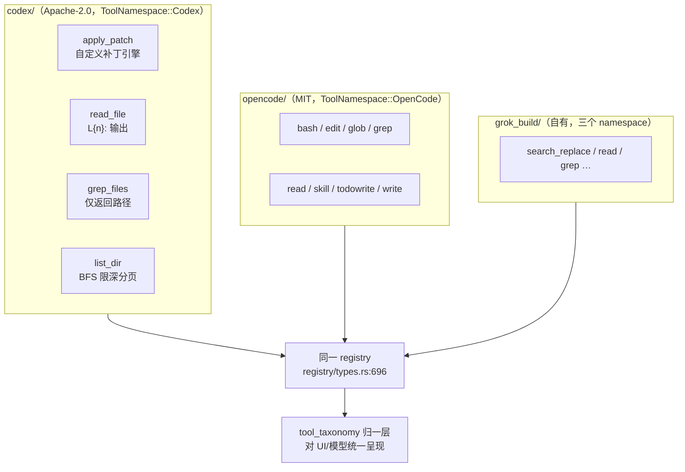

# 第 12 章：拿来主义与归一层

> **定位**：本章讲清如何把两个外部开源项目（openai/codex、sst/opencode）的工具
> 实现移植进同一代码库并共存——移植的系统性工程手法、开源许可的合规履行，以及
> taxonomy 归一层如何让三家方言对模型与 UI 呈现为统一工具。前置依赖：第 8 章
> （工具抽象与 taxonomy）、第 9 章（编辑工具，本章的局部案例来源）。适用场景：
> 你要把别家的开源实现纳入自己的产品，且要合规、可维护、与自有代码无缝共存。

## 12.1 为什么要移植别人的工具

自己能写 `read_file`、`grep`、`apply_patch`，为什么要把 codex 和 opencode 的实现
搬进来？答案不在"省事"，在**模型的训练分布**。一个工具好不好用，不是它的内禀
属性，而是"工具 × 模型"的联合属性（第 9 章的结论）：codex 的 `apply_patch` 之所以
对某些模型好用，是因为那些模型在训练中见过海量该格式的补丁；opencode 的
`edit`（`oldString`/`newString` 参数）对另一批模型顺手，也是同理。要支持异构后端
（BYOK——Bring Your Own Key，用户自带第三方模型密钥；Ollama 本地模型；各家
OpenAI 兼容模型），最务实的做法不是逼所有模型学一套新
工具方言，而是**把它们已经熟悉的方言搬过来**，让配置层按模型选方言。

于是这个代码库里同时住着三家工具方言：grok_build 自有的、codex 的、opencode 的。
本章讲两件事——**怎么搬进来**（移植的系统性手法，第 9 章只见了 apply_patch 一个
局部），以及**搬进来之后怎么让它们不打架**（归一层）。还有一件不能回避的事：
搬别人 Apache/MIT 的代码，**合规怎么做**。

先厘清一个可能的误解：移植不等于抄袭，也不等于 fork。fork 是把整个项目拉走
独立演化，抄袭是不留出处地据为己有——移植是**在保留完整归属与许可的前提下，
把外部实现纳入自己的运行时并做本地适配**。它是开源协作里最正当也最考验工程
纪律的一种复用：既要尊重上游的语义（否则失去移植的意义），又要嵌进本地的
抽象（否则无法与自有代码共存），还要在法律上滴水不漏（否则给公司埋雷）。
这三重约束——语义保真、集成归化、合规完整——构成本章的三条主线，也是评价
任何一次"拿来主义"是否做得专业的三把尺子。

移植清单先摆出来（均在
`crates/codegen/xai-grok-tools/src/implementations/`）：



12 个移植工具与自有工具并列注册进同一个 registry（crates/codegen/xai-grok-tools/src/registry/types.rs:696），再
组装成两个"仿原生"的 agent 预设 `AgentDefinition::codex()` 与 `opencode()`
（crates/codegen/xai-grok-agent/src/config.rs:1508），各挂对应的 toolset 与
提示词模板——让选了 codex 后端的会话，用起来就像在用原生 codex。

## 12.2 移植的五个系统性手法

第 9 章看了 apply_patch 一个案例，本节把移植的通用工法总结成五条，每条都是
"如何搬别人代码而不留后患"的一般原则。

**手法一：切 I/O 边界成纯函数库**。移植的第一刀不是改逻辑，是把逻辑与 I/O
剥离。apply_patch 把上游 `codex-rs/apply-patch/src/lib.rs` 重构成"任何函数都
不碰文件系统"，模块注释写得明白（crates/codegen/xai-grok-tools/src/implementations/codex/apply_patch/apply.rs:1，节选）：

```rust
//! Ported from `codex-rs/apply-patch/src/lib.rs`, but refactored so that
//! **no function in this module touches the filesystem**. Every function
//! accepts `&str` content directly, making the logic trivially testable.
```

I/O 只在 `tool.rs` 一层，经本 crate 的 `AsyncFileSystem` 抽象接入
（crates/codegen/xai-grok-tools/src/implementations/codex/apply_patch/tool.rs:1）。好处是双向的：纯逻辑可以逐字对拍上游、单元测试不需
要真文件系统；而所有 I/O 走统一抽象，意味着移植进来的工具**自动获得**沙箱
（第 11 章）与文件变更通知——搬进来的是算法，长出来的是本地集成。

**手法二：参数命名按各自方言保留**。这是反直觉的一条——你可能想把所有工具的
参数统一成一种风格，但那恰好破坏了移植的初衷。codex 保留 snake_case
（`file_path`），opencode 保留 camelCase（`filePath`/`oldString`/`newString`，
crates/codegen/xai-grok-tools/src/implementations/opencode/edit/mod.rs:62）。方言是**给模型看的**：模型在训练分布里见过
opencode 的 `oldString`，你把它改成 `old_string`，就等于把模型拉出了熟悉区。
测试专门锁死方言——edit 的测试断言错误信息里出现 `oldString`/`replaceAll`
（crates/codegen/xai-grok-tools/src/implementations/opencode/edit/mod.rs:677、745），read 的测试断言序列化回 `filePath`
（crates/codegen/xai-grok-tools/src/implementations/opencode/read/mod.rs:717）——方言保真被当作契约冻结。

**手法三：错误类型本地化**。移植不复用上游的错误类型，而在本地重定义
`ParseError`/`ApplyPatchError`（crates/codegen/xai-grok-tools/src/implementations/codex/apply_patch/errors.rs:9、18）。这里有一个
为可测试性做的精细取舍：`Io` 变体存的是**字符串**而非 `std::io::Error`，专门为
了能手写 `PartialEq` 让测试对拍（crates/codegen/xai-grok-tools/src/implementations/codex/apply_patch/errors.rs:29）。牺牲一点类型保真换测试的
可比较性——移植代码尤其需要"能和期望逐字节比对"的测试，因为你要长期跟上游
对照。

**手法四：输出归一到共享类型，核心下沉共享实现**。方言只保在**最外层的参数与
输出格式**这层薄壳，往下走全部汇入共享实现。opencode 的 `edit` 与 `write` 都
复用 `SearchReplaceOutput`（crates/codegen/xai-grok-tools/src/implementations/opencode/edit/mod.rs:7、write 的 `WriteOutput` 别名），
让"crate 的其余部分能对任何 namespace 的编辑一视同仁"；`edit` 甚至直接调用
`grok_build::search_replace::helpers`（crates/codegen/xai-grok-tools/src/implementations/opencode/edit/mod.rs:23），glob/grep 共用
grok_build 的 ripgrep 封装。这是第 9 章"方言压薄壳、核心下沉共享 helpers"原则
的系统性落地——同一类 bug 只修一处，同一个改进只做一遍。

**手法五：分级标注保真度**。移植注释用词精确区分"搬得多像"：`Ported verbatim`
（逐字，crates/codegen/xai-grok-tools/src/implementations/codex/apply_patch/seek_sequence.rs:3）、`exact port`（精确，
crates/codegen/xai-grok-tools/src/implementations/codex/read_file/indentation.rs:1）、`faithful port`（忠实，list_dir/grep_files）、
`Ported from … but refactored`（已刻意偏离，apply.rs:3）。这套词汇是给**未来的
维护者**的：review 时一眼知道哪些文件可以直接 diff 上游、哪些已经改过不能盲比。

要补一条本仓没有系统化、但任何"拿来主义"都应当有的**第六道工序：入库前的
安全审阅**。把外部代码纳入自己的运行时，等于把它的安全假设也一并纳入——
路径穿越、命令注入、危险 API 的使用，在上游或许有其原始上下文的防护，移植到
新环境后未必仍然成立。移植的三重约束（语义保真、集成归化、合规完整）之外，
成熟的供应链实践还应加上"安全审查"这第四重；本章把它单列出来，是因为它最
容易在"代码能跑、许可写全"的满足感里被跳过。

## 12.3 许可合规：三个文件的分工

搬 Apache-2.0 与 MIT 的代码不是复制粘贴就完事，两个许可都有必须履行的义务。
这个仓库用**三个层次的 notice 文件**分工承担：

- **根 `THIRD-PARTY-NOTICES`**（76 万字节，机器生成）：覆盖所有 crates.io/git
  依赖的逐包清单加许可全文矩阵——这是依赖树的合规，与移植的源码无关。
- **`third_party/NOTICE`**：只覆盖 in-source vendored 的 crate（mermaid-to-svg、
  dagre_rust 等），末尾明确指向根文件划清边界。
- **crate 级 `crates/codegen/xai-grok-tools/THIRD_PARTY_NOTICES.md`**：专管两处
  移植源码 + 打包的三方二进制（ripgrep/ugrep/bfs）。

重点在 **Apache-2.0 §4(b)"变更声明"义务的落实**。Apache 许可要求：如果
你修改了原文件，必须在显著位置声明"改过"。crate 级 notice 用一段话精确履行
（crates/codegen/xai-grok-tools/THIRD_PARTY_NOTICES.md:9，节选）：

> Ported files have been modified from their originals (translated between
> languages, adapted to this crate's `Tool` trait and runtime, and extended);
> this file constitutes the prominent notice of those changes required by
> Apache License 2.0 §4(b).

这段声明的措辞很讲究：它把移植做过的三类改动都列了出来——"跨语言翻译"
（codex 原本是 Rust、opencode 原本是 TypeScript）、"适配到本 crate 的 Tool
trait 与运行时"、"扩展"。严格说，§4(b) 的原文只要求声明"你改动了这些文件"
（carry prominent notices stating that You changed the files），并未强制枚举
改动类别；逐类列明是**更稳妥的实践建议**（本书的观点），把改动性质写清楚在
潜在争议时更站得住，但不是许可条款的字面要求。codex 段给出上游路径、
`Copyright 2025 OpenAI` 与 Apache 全文；opencode 段照抄 MIT 全文含
`Copyright (c) 2025 opencode`。源码里每个移植目录的 `mod.rs` 顶部
再指回这个 notice 文件（crates/codegen/xai-grok-tools/src/implementations/codex/mod.rs:6）——**双向可追溯**：从 notice 能找到
源码，从源码能找到许可。合规不是文档写一遍就完，是让任何一个入口都能追到
完整链条。

还有一处按"是否真打进本次构建"动态裁剪 notice 的巧思：打包的二进制（ripgrep
的 PCRE2（一个正则库，其许可带例外条款）例外条款、ugrep 的待补 notice、bfs 的 0BSD（零条款 BSD，一种无归属义务的极宽松许可）"礼节性收录"）按
`GROK_TOOLS_BUNDLE_*` 环境变量决定是否纳入 notice——**声明的范围跟着实际
分发的内容走**，不多不少。

## 12.4 归一层：三方言，一个身份

移植进来后，三家方言必须对 UI 与模型呈现为**协调一致**的工具，否则用户在
界面上一会儿看到 "Read" 一会儿看到 "read_file" 一会儿看到 "filePath"，心智
模型直接崩坏。归一由 `tool_taxonomy` 承担（机制细节见第 8 章，这里给移植视角）：

- **ToolNamespace 六值闭合枚举**：`GrokBuild`/`GrokBuildConcise`/
  `GrokBuildHashline`/`Codex`/`OpenCode`/`MCP`。闭合（无 `other` 兜底）是刻意的
  ——新增一家方言必须显式加枚举值、否则编译不过。这与 `ToolKind` 的开放
  `#[serde(other)]` 恰成对照（第 8 章）：**身份严格、能力宽松**。方言的"户口"
  不能含糊，方言的"能力"可以前向兼容。
- **presentation_name 折叠**：纯函数把语义等价的工具折叠到同一显示名——codex
  的 `read_file` 与 opencode 的 `Read` 都显示为 "Read"（crates/codegen/xai-grok-tools/src/tool_taxonomy.rs:37）。
  UI 层从此不认识方言。
- **`x.ai/tool` 元数据信封**的字段契约划分了三种消费者的视角
  （crates/codegen/xai-grok-tools/src/tool_taxonomy.rs:162）：`label` 是跨方言的**分组键**（等价工具共享，给 UI）、
  `kind` 是细分辨识器（不保证跨方言相等）、`name` 是**方言原名**（给模型看，
  codex 的 `file_path` vs opencode 的 `filePath`）。

关键在最后一条：**模型看到方言原名，UI 看到统一 label**。同一个工具，对模型
保持它熟悉的方言（不破坏训练分布），对用户呈现统一的视觉身份（不制造混乱）
——归一层的价值正是让"保方言"与"去混乱"两个矛盾的目标同时成立。

有一个破例值得记：opencode 其余工具都保 camelCase，唯独 `write` 被归一成
snake_case 的 `file_path`——它的 `WriteInput` 结构体没有 camelCase 的 serde
重命名（crates/codegen/xai-grok-tools/src/implementations/opencode/write/mod.rs:29），
测试还专门反向断言序列化结果**不含** `filePath`
（crates/codegen/xai-grok-tools/src/implementations/opencode/write/mod.rs:321）。
破例说明归一与保方言的边界不是教条划定的，而是逐工具权衡的——`write` 的参数
简单到模型不依赖特定方言，就归一；`edit` 的 `oldString`/`newString` 是模型的
肌肉记忆，就保留。

## 12.5 移植 vs 原生：哪些变了，哪些没变

移植保留了上游语义，因此移植工具与本仓自有工具**行为不同**，这正是"三方言
并存"的具体体现。codex 的 `list_dir` 不尊重 `.gitignore`、不排除隐藏文件、
要求绝对路径（crates/codegen/xai-grok-tools/src/implementations/codex/list_dir/tool.rs:4 的注释与 crates/codegen/xai-grok-tools/src/implementations/codex/list_dir/tool.rs:333 的运行时校验）——
与 grok_build 尊重 gitignore 的 ListDir 完全相反。codex 的 `grep_files` 只吐
文件路径不吐行，与 opencode `grep`（吐行号分组）、grok_build grep 三套并存。
**保留差异是移植的正确性**：改成"和自家一致"就等于改变了模型熟悉的行为。

但也有被"归化"的部分：**文件类**移植工具都经本 crate 的 `AsyncFileSystem`，
因此文件级沙箱隔离与变更通知与自家工具一致；grep 类都走仓库自带的 ripgrep
二进制而非上游各自的解析。要精确一点——不是"所有"移植工具都走同一条归化
路径：`bash` 工具走的是共享的 `TerminalBackend` 做进程管理
（crates/codegen/xai-grok-tools/src/implementations/opencode/bash/mod.rs:4），
它的沙箱是**进程级**的（第 11 章的 seccomp 子进程网络过滤、命令审批），与
文件类工具的**文件级**沙箱是两套不同机制。归化按工具的资源类型分流：碰文件
的归到文件抽象、碰进程的归到终端后端，而不是笼统的"一套沙箱管全部"。
**语义保留、基础设施按资源类型归化**——用户看到的工具行为是上游的，底下的
安全与集成是本地的、且分门别类。

维护成本要记，还要补上一个本章前面回避了的维度：**供应链安全**。移植靠
**顶注的上游文件路径**加**分级保真词**做对拍锚点，但本仓**没有记录 upstream
commit 或版本号**——notice 只写 `Copyright 2025`，无 commit 哈希、无快照日期。
需要说清这是本仓的**选择**而非移植的内禀属性：记录上游 commit 完全可行，很多
移植项目都这么做，本仓没做而已。这个选择的代价在安全场景最尖锐——**上游若
修复了一个 CVE，移植方没有版本锚点就很难判断自己这份拷贝是否受影响、该同步
哪个 diff**。移植第三方代码本质是一次供应链纳入，理想的实践应包含：入库前的
一次性安全审阅（危险 API、路径穿越、命令注入面），以及记录上游快照点以便
跟踪其后的安全修复。本仓在合规归属上做得严谨（12.3），在安全同步的可追踪性
上留了这个缺口——把它写出来，因为读者若照搬"移植"这套做法，这正是最容易
忽略、代价却可能最大的一环。一个悬挂引用也侧写了同步纪律的松动：`grep_files`
顶注引用的 "plan document" 并未随仓库入库。

## 12.6 模式提炼

**模式一：方言薄壳、核心下沉（dialect shell, shared core）**。移植外部实现时，
把"给模型看的方言"（参数名、输出格式）保在最外层薄壳，把定位/替换/搜索的
核心逻辑下沉到共享实现。方言保真维护训练分布，核心共享避免重复维护。

**模式二：I/O 边界即移植边界（isolate I/O first）**。移植的第一刀是把逻辑重构
成不碰 I/O 的纯函数库，I/O 收进单独一层经本地抽象接入。纯逻辑可对拍上游、
可无副作用测试，I/O 层负责长出本地集成（沙箱、通知）。

**模式三：分级保真标注（fidelity tiers）**。用 verbatim/exact/faithful/refactored
等分级词标注每个移植文件"改了多少"，给未来维护者留下"哪些能直接 diff 上游"
的地图。

**模式四：入口双向可追溯的合规（bidirectional attribution）**。许可 notice 与
源码互相指向，声明范围跟随实际分发内容动态裁剪；§4(b) 变更声明落在显著位置
且从任一入口都能追到完整链条。

**模式五：身份严格、能力宽松（strict identity, loose capability）**。归一层的
"户口"字段（namespace）用闭合枚举强制显式登记，"能力"字段（kind）用开放
枚举前向兼容。前者防止方言悄悄混入，后者容纳能力演化。

## 设计要点回顾

速查索引（详述见对应小节）：

- 移植的动机是对齐模型训练分布（工具×模型联合属性），不是省事 → 12.1
- 五手法：切 I/O 成纯函数库、参数按方言保留、错误本地化（Io 存字符串换
  PartialEq）、输出归一+核心下沉、分级保真标注 → 12.2
- 三层 notice 分工；Apache §4(b) 变更声明的落实原文；源码↔notice 双向追溯；
  按实际打包动态裁剪 → 12.3
- 归一层：namespace 闭合枚举（身份严格）vs kind 开放（能力宽松）；presentation_name
  折叠；label 给 UI / name 给模型的字段契约；write 破例归一 → 12.4
- 移植 vs 原生：语义保留（list_dir 不尊重 gitignore 等）、基础设施归化
  （AsyncFileSystem/自带 ripgrep）；无 commit pin 的维护代价 → 12.5
- 五个可迁移模式：方言薄壳、I/O 边界即移植边界、分级保真、双向合规、
  身份严格能力宽松 → 12.6

---

### 版本演化说明

> 本章核心分析基于本书快照仓库（同步自 xAI monorepo，commit 8adf901，SOURCE_REV 2ec0f0c，2026-07）。
> 涉及目录：xai-grok-tools/src/implementations/{codex,opencode}、
> THIRD_PARTY_NOTICES.md、根 THIRD-PARTY-NOTICES、third_party/NOTICE。移植的
> 上游为 openai/codex（codex-rs）与 sst/opencode，均以移植时点为准（仓库未
> pin 具体 commit）。上游同步后请以 `book/tools/check_chapter.py` 校验本章引用。
