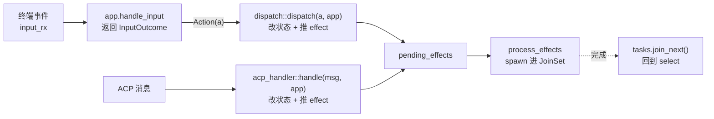

# 第 13 章：事件循环与 AppView

> **定位**：本章分析 TUI 的整体架构——极薄的 `tokio::select!` 事件循环只做 IO
> 管道、AppView 作为集中状态中枢、scrollback（会话历史的可滚动回看区）用 IndexMap 兼得顺序与 O(1)、
> 全屏与 `--minimal` 双渲染模式，以及用函数指针 seam 打破 crate 循环依赖的 IoC
> 手法。前置依赖：第 3 章（Actor 会话引擎，TUI 是它的一个客户端）。适用场景：
> 你要构建任何"多异步事件源驱动一块可变 UI 状态"的终端或图形界面。

## 13.1 为什么这很重要

一个 agent 的 TUI 要同时应付十几路异步事件：用户的键盘鼠标、ACP 通道涌来的
token 流（ACP 即第 7 章的 Agent Client Protocol，客户端与 agent 运行时之间
的通信协议）、后台任务的完成、动画帧、配置热重载、系统主题变化、语音听写的流式
中间结果……每一路都可能在任意时刻改变屏幕。把这些事件源与"当前该画什么"
的状态混在一起，是 TUI 代码腐烂的头号原因——状态散落在各个回调里，谁都能
改，没人说得清某一帧为什么长这样。

Grok Build 的架构选择是把职责切成泾渭分明的两层。**事件循环极薄**：一个
`tokio::select!` 只做"把 IO 事件搬进来"这一件事，自述"所有输入路由、渲染、
状态管理都委托给 AppView，事件循环只处理 IO 管道"
（crates/codegen/xai-grok-pager/src/app/event_loop.rs:1）。**AppView 是唯一的
状态中枢**：一个万行级的结构体持有全部 UI 状态，所有分支都拿 `&mut app` 去
改它。这个切分的好处是可推理性——想知道"屏幕状态怎么变的"，只看 AppView；
想知道"事件从哪来的"，只看 select 循环；两者的边界是一条清晰的
`input → outcome → action → effect` 单向管线（13.3）。本章拆解这两层，以及
它们之间那条管线，还有一个把双渲染模式优雅解耦的 IoC seam。

## 13.2 biased select：优先级即抗饥饿设计

主循环是一个 `biased` 的 `select!`（event_loop.rs:1681）——第 3 章讲过 biased
让分支按声明顺序轮询，这里的顺序是一套精心排布的**抗饥饿**策略。从高到低：
连接取消（leader 断链退出）、优雅退出（SIGTERM，注释说明放高位"以免被 ACP
firehose 饿死"，event_loop.rs:1690）、ACP 消息、后台任务完成、恢复进度、更新
检查、终端输入、一批定时器、配置热重载、外观变化、连接状态，最后是**语音
听写**。

优先级的排布逻辑值得展开，它揭示了 biased select 的真正用途不是"重要的先处理"
而是"高频的别饿死低频的"。语音听写被**故意放到最末位**（event_loop.rs:1698
的注释）：热麦克风以 5–20Hz 流式吐出中间结果，若放高位，每轮 biased 轮询它
都 ready，键盘、agent 流、动画就永远轮不上。同样的问题也出在 ACP 通道——
token firehose 会让 ACP 分支每轮都 ready，解法不是降低它的优先级（它确实重要），
而是给它加一道**门控**（event_loop.rs:1715，节选）：

```rust
msg = acp_rx.recv(), if input_rx.is_empty() => {
    let Some(msg) = msg else { break };
    let mut state_changed = acp_handler::handle(msg, &mut app);
    let mut drained = 1;
    while drained < ACP_DRAIN_BATCH_MAX && input_rx.is_empty() {
        let Ok(msg) = acp_rx.try_recv() else { break };
        drained += 1;
        state_changed |= acp_handler::handle(msg, &mut app);
    }
```

`if input_rx.is_empty()` 让 ACP 只在没有待处理键鼠事件时才消费——否则缓冲的
滚轮、按键会一直卡在 `input_rx` 里直到 token 流停下，用户会觉得"打字卡顿"。
配上批量 drain（一次醒来尽量多消费几条，上限 `ACP_DRAIN_BATCH_MAX`）平衡
吞吐与响应。还有第四件工具是**渲染节流**：state 变化后不立即重画，而是受
`min_draw_interval` 限速，超频的绘制被推成 `deferred_draw` 定时补画
（event_loop.rs:1745）——注释直说是"给绘制限速，免得重度 ACP 流式期间终端
输入被饿死"。这也顺带回答了"draw 在循环哪个环节触发"：不是每处状态变化都
立刻画，而是状态变化后按节流器决定立即画还是稍后补画。**优先级排序 + 条件
门控 + 批量 drain + 渲染节流**，四件工具共同解决"多速率异步源如何公平共享
一个单线程循环"这个 TUI 的核心难题。

两个结构性细节让这套循环更健壮。其一，定时器**不是** tokio 的 `interval`，而是
每轮循环顶部按当前状态**现算**一批 `sleep_until`——无事件时全部是
`std::future::pending()`，整个 loop 真正 park，没有空转的心跳 tick
（event_loop.rs:1600）。滚动时钟的注释点破了这个模式的价值："每轮循环重新
派生——它是滚动状态的纯函数，所以没有任何分支会忘记重新调度它"
（event_loop.rs:1607）。把"下次何时醒"做成状态的纯函数而非命令式的
`arm`/`rearm`，从结构上消灭了"忘记重新武装定时器"这类幽灵 bug。其二，终端
事件**不在 select 里直接 poll** crossterm，而是走一个专用 reader 线程 → mpsc
通道（event_loop.rs:1106）——因为直接 poll crossterm 的 `EventStream` 不是
cancellation-safe：某一轮 select 落败的分支会 drop 掉 `next()` future，把它的
后台 waker 弄丢（crossterm 的已知问题）。跨越"不 cancel-safe 的 IO"与
"cancel-safe 的 select"的标准桥梁，就是一个专用线程加一条通道。

## 13.3 AppView：单向管线的中枢

`AppView`（crates/codegen/xai-grok-pager/src/app/app_view.rs:534，约万行）持有
全部 UI 状态：多 tab 的 agent 视图（`IndexMap<AgentId, AgentView>`）、模型列表、
键位注册表、有效 UI 配置的内存快照（让 dispatch 保持无 IO）、滚动状态、
ACP 客户端发送端等等。所有权关系很干净：事件循环的 `run()` 里
`let mut app = AppView::new(...)`——**事件循环在栈上拥有 AppView**，每个分支
借 `&mut app`。

关键是事件如何流过它。这是一条**单向管线**：



输入先变成 `InputOutcome`（改了什么/要做什么动作），动作交给 `dispatch` 层
改状态并把副作用推入 `pending_effects`，再由 `process_effects` spawn 进 `JoinSet`
异步执行（event_loop.rs:2822 附近）。要精确一点，避免把架构说得比实际更纯：

其一，改 UI 状态的**不止 dispatch 一条路**。ACP 消息走的是并列的
`acp_handler::handle(msg, &mut app)`（crates/codegen/xai-grok-pager/src/app/acp_handler/mod.rs:137），
它**不经过**中央 dispatch 路由器，而是直接改 `app` 并推入同一个
`pending_effects` 队列。所以准确的说法是"两条汇聚路径（键盘动作经 dispatch、
ACP 消息经 acp_handler），但都只改同一个 `&mut app`、都汇入同一个 effect 队列"
——中枢性体现在"状态只有一份、effect 出口只有一个"，而不是"只有一个函数
能改它"。

其二，dispatch 层**基本无 IO 但非绝对**。约定是把副作用推成 effect 异步执行，
但也有承认的例外——比如 transcript 导出直接在 dispatch 处理器里做同步文件
写入，注释解释这是刻意的"薄命令层单一属主"（crates/codegen/xai-grok-pager/src/app/dispatch/transcript.rs:130）。
把它写成"约定 + 少数就地 IO 的例外"而非"零 IO 铁律"，既忠实也更有教益：
真实系统的分层纪律总有几处为务实开的口子，关键是这些口子是**被记录、被
限定**的，而不是散落各处的失控。好处仍然成立：绝大多数副作用被隔离在管线
末端，状态变换的主体是同步可测的。

## 13.4 scrollback：IndexMap 的双重身份

scrollback 是会话历史的核心数据结构，它的设计题是：既要按插入顺序渲染
（历史是有序的），又要按 id O(1) 查找（"把第 N 条的高度标脏"要快）。
`ScrollbackState` 的答案是 `IndexMap<EntryId, ScrollbackEntry>`
（crates/codegen/xai-grok-pager/src/scrollback/state/mod.rs:46），注释直说它
"兼得两性"：HashMap 的 O(1) 按 id 查找 + Vec 的插入序遍历渲染。`EntryId` 单调
递增分配，且注释明言"清空历史时也不重置 next_id 以避免 id 复用"
（crates/codegen/xai-grok-pager/src/scrollback/state/mod.rs:1079）——**进程内
永不复用**（跨进程重启的 resume 会从头分配，这里说的是同一进程生命周期内的
稳定身份）。旁挂的几个 `HashSet<EntryId>`（running、flashing、dirty_heights、
committed）都靠这个不复用性安全地关联同一批元素。

历史被组织成**块**（RenderBlock：用户 prompt、agent 消息、工具调用、思考、
系统、子代理……crates/codegen/xai-grok-pager/src/scrollback/block.rs:363），
再往上是 **turn**——一个 turn 是从用户 prompt 到下个 prompt 前的 entry 区间。
turn 导航（`h`/`l` 键跳上/下一个 turn）有一处体贴的语义：`prev_turn` 若当前
停在某个 response 里，先跳回本 turn 的 prompt，再按一次才到上一个 turn
（crates/codegen/xai-grok-pager/src/scrollback/state/nav.rs:196）——符合"先回到本
段开头，再翻上一段"的直觉。随机跳转分两种：按下标的 `jump_to_turn` 和按
稳定 id 的 `jump_to_entry`，后者先解析当前下标再跳，避免历史 shift 后落到
错误的块（nav.rs:150）。

粘性头（sticky header，crates/codegen/xai-grok-pager/src/scrollback/sticky.rs:1）
是 iOS 式的 section header：prompt 滚过屏幕顶部时钉住，下一个 prompt 逼近时
把它顶出去。实现是**纯一维坐标数学**——只认每个 prompt 的"总高度"，不管
块内部结构，输出一个 `render_height`（在最小与完整高度之间）加一个 `clip_top`
（顶部裁剪量，做出被顶出的推挤效果）。块渲染器拿到高度预算，自己决定内部
怎么分配。把"钉住/推挤"的几何逻辑与"块画什么"彻底分开，前者可以脱离渲染
独立测试。渲染本身用 scratch-buffer 复用（render.rs:96）避免每帧重新分配
buffer——细节留给第 14 章的渲染管线。

## 13.5 双渲染模式与函数指针 seam

Grok Build 有两种截然不同的渲染形态，分叉点在 `AppView::draw_inner`
（app_view.rs:3697）：全屏 `ScrollbackPane`（pager 拥有全部历史，支持滚动、
折叠、选择、鼠标）与 `--minimal` 模式。minimal 的本质差异是**历史的所有权
翻转**（crates/codegen/xai-grok-pager-minimal/src/lib.rs:1）：终端拥有历史——
已完成的块经 `insert_before` 打进终端的**原生 scrollback**，`ScrollbackPane`
完全不用，只留一小块 pinned 活动区（running turn 状态 + prompt + 状态行）
每帧重画。对喜欢用终端原生滚动、复制、搜索的用户，minimal 模式让 agent 输出
像普通命令输出一样融进终端历史。

这两种模式带来一个 Rust 工程的经典难题。minimal 模式需要深读 pager 的视图
模型（AppView、各种 view、scrollback），所以 **minimal crate 依赖 pager**；
但 pager 的 `draw_inner` 又需要在 minimal 模式下调用 minimal 的绘制逻辑——
如果 pager 反过来直接依赖 minimal，就成了 cargo 编译不了的**循环依赖**。

解法是一个教科书级的 IoC（控制反转）seam。pager 侧只声明一个函数指针类型
和一个空槽，**不 import minimal**
（crates/codegen/xai-grok-pager/src/minimal/hook.rs:23，节选）：

```rust
pub type MinimalDrawFn = fn(&mut AppView, &mut PagerTerminal);

#[derive(Clone, Copy)]
pub struct MinimalHooks { pub draw: MinimalDrawFn }

static HOOKS: OnceLock<MinimalHooks> = OnceLock::new();

pub fn install(hooks: MinimalHooks) { let _ = HOOKS.set(hooks); }
pub fn hooks() -> Option<&'static MinimalHooks> { HOOKS.get() }
```

`draw_inner` 在 minimal 模式下查这个 `OnceLock`，有 hook 就调、没有就是惰性
no-op。minimal crate 里定义真正的 `draw` 并注册进这个槽。**依赖箭头单向**：
minimal → pager，pager 只依赖自己声明的函数指针类型。最后由唯一同时依赖
两个 crate 的顶层 bin 在 `main()` 第一行装配
（crates/codegen/xai-grok-pager-bin/src/main.rs:1592 的
`xai_grok_pager_minimal::install()`）。这就是 IoC 的完整形态：**底层库定义
接口与空槽，插件在下游注册实现，唯一的 composition root（组合根，即那个同时依赖所有部件、负责把它们装配起来的
顶层入口）把箭头接上**。第 4 章
的 tool registry、第 5 章的 compaction trait 缝、这里的 minimal hook，是同一个
"用抽象缝解耦编译单元"的思想在不同粒度上的复现——trait 是类型级的缝，函数
指针 + OnceLock 是运行时级的缝，选哪个取决于解耦的两端是否需要泛型。

## 13.6 输入路由：分层拦截

modal 打开时，键盘该给 modal 还是给底下的 prompt？答案是**先 modal，且所有
overlay 都优先于 prompt**。`AgentView::handle_input_inner`
（crates/codegen/xai-grok-pager/src/app/agent_view/input.rs:239）是一条有序的
early-return 链，按覆盖层从上到下逐层拦截：子代理视图 → 图像/视频查看器 →
若干专用 modal（goal 详情、persona 详情、扩展列表……）→ agents modal →
块查看器 → 活动 modal → 权限队列 → 最后才落到 prompt 与 scrollback（中间
省略了数层，完整顺序见源码）。每一层命中就 `return`，键永远不会漏到下层。

但有一个不可协商的例外：即便 modal 打开，全局的 `Quit`（Ctrl+C）仍从
`When::Always` 键位表逃逸（input.rs:582）——modal 可以吞掉一切键，唯独不能
吞掉退出。这是第 11 章"安全不变量不依赖上层配置"思想在交互层的回响：
"用户永远能退出"是产品承诺级的不变量，不能因为某个 modal 的实现而失效。

prompt 输入框自身是分层的：`PromptWidget` 组合了一个来自独立 crate 的
`TextArea`（prompt_widget/mod.rs:467）。PromptWidget 是业务外壳（斜杠命令
补全、把粘贴的图片作为不可分的文本元素、图片预览、compact 模式），把纯文本
编辑（光标、多行、插入）下沉给 `TextArea`。这与第 12 章"方言薄壳、核心下沉"
是同一分层直觉——业务特性在外壳，通用能力在共享组件。

这套循环里还藏着两处值得一看的工程细节。其一，当 `$EDITOR` 或 `$PAGER` 要
接管终端时，事件循环得走一段精细的终端控制权交接流程（event_loop.rs:223 起）：
park 掉 reader 线程防止它和子进程抢 stdin、drain 帧写入器、并根据子进程是否
用了备用屏幕决定收回控制权后如何重新锚定光标——这套"交出终端再干净收回"
的 TTY 舞蹈细节留给第 16 章的终端工程学。其二，动画帧分支不只画帧，还兼做
"丢失响应"的恢复（event_loop.rs:1922）：它顺便收尾那些"完成广播已经过去、
但 RPC 响应始终没回来"的 turn，避免一个卡住的请求让 UI 永远显示"运行中"。
把补偿逻辑挂在本来就要定期醒来的动画 tick 上，是"复用已有的唤醒点做兜底"
的典型——不额外起一个定时器，蹭现成的节拍。

## 13.7 同一问题，codex 怎么做

codex 的 TUI 同样基于 ratatui、同样有事件循环，架构分岔在两点：

**其一，历史的默认归属**。codex 的 TUI 默认就把完成的内容提交进终端原生
scrollback（`insert_history` 机制，第 15 章会再遇到），活动区只保留正在生成的
部分——这更接近 Grok Build 的 minimal 模式。Grok Build 把"pager 拥有历史"
（全屏可滚动交互）作为默认、"终端拥有历史"作为可选的 minimal，等于提供了
两种历史所有权模型让用户选；codex 主要提供后一种。两种默认反映不同侧重：
全屏默认偏向"agent 会话是一个可导航的文档"，原生 scrollback 默认偏向
"agent 输出是终端命令流的延伸"。

**其二，状态集中度**。Grok Build 把全部 UI 状态收进单个 AppView 加一条
`input→outcome→action→effect` 管线；codex 的 UI 状态更多分布在各 widget 与
app 状态里，用 message/事件在组件间传递。集中式的好处是可推理（一处看全部
状态）、代价是那个万行结构体的体量；分布式反之。没有绝对优劣，但对"要
支持双渲染模式、多 tab、复杂 modal 栈"的 Grok Build，集中式让"当前该画什么"
有唯一权威来源。

（本节对 codex 的描述基于 openai/codex 2026 年年中 main 分支的 `codex-rs/tui`。）

## 13.8 模式提炼

**模式一：极薄循环 + 集中状态（thin loop, central state）**。事件循环只做
IO 搬运，状态只有一份、由少数几条汇聚路径（本例是 dispatch 与 acp_handler
两条）修改，副作用统一推成 effect 队列由单一出口异步执行；想理解"状态怎么
变的"只需看中枢，想理解"事件从哪来"只需看循环。前提：状态变换的**主体**
保持同步无 IO——务实地允许极少数被记录、被限定的就地 IO 例外（如导出
transcript），关键是例外可枚举，而非纪律形同虚设。

**模式二：优先级 + 门控 + 批量的抗饥饿（starvation-free multiplexing）**。
单线程消费多速率异步源时，用 biased 优先级排序、条件门控（高频源让位于
低延迟源）、批量 drain 三件套平衡吞吐与响应；高频源不靠降优先级而靠门控
控制。

**模式三：定时器即状态的纯函数（timers as pure functions）**。把"下次何时
醒"做成当前状态的纯函数，每轮重新派生，而非命令式 arm/rearm——从结构上
消除"忘记重新武装"的 bug。

**模式四：运行时 seam 破循环依赖（function-pointer IoC）**。两个 crate 有
双向依赖需求时，被依赖方声明函数指针类型 + OnceLock 空槽，依赖方注册实现，
唯一 composition root 装配。类型级用 trait 缝，运行时级用函数指针缝。

**模式五：IndexMap 兼得顺序与查找（ordered map）**。需要同时按插入序遍历
和按键 O(1) 查找的集合用 IndexMap；配单调不复用的 id 做稳定身份，让多个
旁挂索引集合安全关联同一批元素。

## 设计要点回顾

速查索引（详述见对应小节）：

- 多异步事件源驱动可变 UI 的腐烂风险；极薄循环 + 集中状态的可推理性 → 13.1
- biased 优先级抗饥饿四件套（语音末位、ACP 门控、批量 drain、渲染节流）；
  定时器纯函数化；
  专用 reader 线程桥接非 cancel-safe 的 crossterm → 13.2
- AppView 栈上被循环拥有；两条汇聚路径（dispatch/acp_handler）改同一 &mut app、
  汇入同一 effect 队列；dispatch 主体无 IO（有 transcript 导出等记录在案的例外）→ 13.3
- IndexMap 兼得顺序与 O(1）；EntryId 不复用的稳定身份；turn 导航语义；
  纯几何粘性头 → 13.4
- 双渲染模式=历史所有权翻转；函数指针 + OnceLock 的 IoC seam 破 crate 循环；
  唯一 composition root 装配 → 13.5
- 输入分层拦截 early-return；Ctrl+C 从 When::Always 逃逸的不变量；
  PromptWidget 组合 TextArea → 13.6
- codex 对照：历史默认归属（全屏 vs 原生 scrollback）、状态集中 vs 分布 → 13.7
- 五个可迁移模式：薄循环集中态、抗饥饿多路复用、定时器纯函数、运行时 seam、
  IndexMap 有序映射 → 13.8

---

### 版本演化说明

> 本章核心分析基于本书快照仓库（同步自 xAI monorepo，commit 8adf901，SOURCE_REV 2ec0f0c，2026-07）。
> 涉及 crate：xai-grok-pager（app/event_loop、app/app_view、scrollback、views）、
> xai-grok-pager-minimal、xai-grok-pager-bin。codex 对比基于 openai/codex
> 2026 年年中 main 分支。上游同步后请以 `book/tools/check_chapter.py` 校验本章引用。
