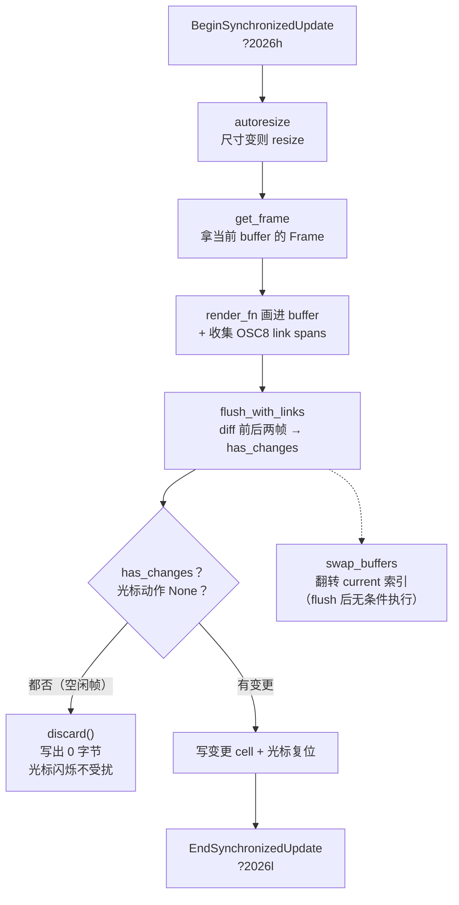

# 第 14 章：增量渲染管线

> **定位**：本章分析 TUI 的高性能渲染——fork 的 inline Terminal、flush 返回
> 变更信号、"零变更零字节"保护终端光标闪烁、synchronized update 防撕裂、
> LayoutCache 的 O(log n) 视口测量、OSC 8 超链接参与 cell diff。前置依赖：
> 第 13 章（事件循环，渲染在其中被触发）。适用场景：你要在终端里做高刷新率、
> 与终端原生行为（光标、滚动、复制）和平共处的增量渲染。
>
> 术语约定：本章的 flush 指"把缓冲区差异写进终端"，diff 指两帧缓冲的逐 cell
> 比较，cell 指终端的一个字符格。

## 14.1 为什么这很重要

终端渲染有两个容易被低估的约束。**其一，全量重绘很贵且很丑**：每帧把整屏
字符重新写一遍，不仅浪费带宽（尤其 SSH），还会让终端来不及合成、产生可见
的撕裂闪烁。所以严肃的 TUI 都做增量渲染——只写变化了的 cell。**其二，也是
更隐蔽的一个：渲染动作会干扰终端自己的行为**。最典型的是光标闪烁——终端
按自己的 500ms 周期闪烁光标，但每次程序发一个"移动光标"或"显示光标"的
命令，都会**重置这个闪烁周期**。一个 30fps 的 TUI 若每帧都发光标命令，闪烁
周期永远走不完，用户看到的是一个**常亮不闪**的光标。这不是崩溃、不是错误
输出，是一个纯粹体验层的 bug，却精确暴露了终端渲染的本质难点：**你不是在
一张白纸上画画，而是在一个有自己脾气的活物上操作**，渲染管线必须尊重它的
行为，而不只是把字符怼上去。

Grok Build 的渲染核心是一个 fork 的 ratatui inline Terminal。本章沿两条线走：
一是**性能**（增量 diff、O(log n) 视口测量、写线程解耦），二是**与终端和平
共处**（零变更零字节、synchronized update、resize 的跨终端一致性）。后者是
这一章比"又一个 diff 渲染器"更有意思的地方。

## 14.2 fork 一个 Terminal，但只 fork 必要的面

上游 ratatui 的 `Terminal` 面向全屏 alternate-screen，而 Grok Build 需要
**inline viewport**（渲染区嵌在终端原生 scrollback 上方，不占用整屏），还需要
一系列上游没有的能力（flush 返回变更信号、OSC 8 参与 diff）。直接 fork 整个
ratatui 会背上维护整个 widget 生态的负担，所以这个 fork 用了一个精巧的
**最小化 fork 面积**手法（crates/codegen/xai-ratatui-inline/src/terminal.rs:91）：
自定义一个 `OurFrame`，让它与 ratatui 的 `Frame` 字段一一对应，`mem::transmute`
互转——于是上游所有接受 `Frame` 的 widget 照常能用，只有渲染管线被替换。
fork 的哲学在这里很清楚：**fork 一个类型的布局，而不是 fork 整棵类型树**。

但这个手法必须标注它的**风险**，不能给读者虚假的安全感。代码用
`assert_eq!(size_of::<Frame>(), size_of::<OurFrame>())` 守卫，然而**大小相等
远不足以保证 transmute 安全**：两个类型都是默认的 `#[repr(Rust)]`，而 Rust
**不承诺**字段布局——编译器可以对 `Frame` 和 `OurFrame` 的字段各自独立重排。
两者恰好总大小相同、但字段偏移不同，是完全可能的，此时 transmute 就是未定义
行为，而 `size_of` 断言**在编译期抓不到**这种偏移错位。更危险的是升级场景：
上游 ratatui 换个版本、重排了 `Frame` 的字段但总大小没变，断言照样通过，
transmute 却已经静默地变成 UB。这不是说这个手法一定出错——只要两个类型的
字段定义严格镜像、且随上游同步更新，实践中它能工作——而是说它的正确性依赖
"字段顺序镜像 + 跟紧上游"这个**人工维护的不变量**，`size_of` 断言只是一道
象征性的哨兵，真正的保证在别处（代码 review 与测试）。这类"务实但脆弱"的
手法，书里的责任是把脆弱性说清楚，而不是把它写成一个安全的银弹。

inline viewport 的实现是把整块终端当作 `Viewport::Inline(rows)`，只有全屏模式
才 `EnterAlternateScreen`（crates/codegen/xai-grok-pager/src/app/mod.rs:1073）。
最核心的改动是 `flush` 的签名——它**返回 `bool` 表示这一帧是否真的写了 cell**
（terminal.rs:299，节选）：

```rust
pub fn flush(&mut self) -> io::Result<bool> {
    let previous_buffer = &self.buffers[1 - self.current];
    let current_buffer = &self.buffers[self.current];
    let updates = diff_large(previous_buffer, current_buffer);
    let has_changes = !updates.is_empty();
    self.backend.draw(updates.into_iter())?;
    Ok(has_changes)
}
```

双缓冲（`buffers: [Buffer; 2]` + `current` 索引）比较前后两帧，只把差异 cell
写出去，并把"有没有差异"作为返回值交给上层——这个返回值就是 14.3 光标
保护的关键信号。双缓冲的另一半是 `swap_buffers`（terminal.rs:724）：它把
非活动的那块 buffer `reset()` 清空后翻转 `current` 索引，于是下一帧渲染进
一块干净 buffer，而刚渲染完的这块留作下一次 diff 的"前一帧"。这是经典的
双缓冲 diff 渲染：永远拿"这次画的"和"上次画的"比，只写差集。

两条边界要说清。其一，**diff 本身是 O(cells) 的**——逐 cell 比较整屏，
永远与屏幕面积成正比；14.5 讲的 O(log n) 是"决定哪些 entry 进入视口"那一步，
不是整条管线亚线性。把两者分清很重要：视口测量对数级、cell diff 线性级，
渲染的下界是屏幕的 cell 数。其二，diff 要正确处理**双宽字符**（CJK 汉字、
部分 emoji 占两个 cell），`diff_large` 用符号宽度加 skip 逻辑处理这些占位 cell
（terminal.rs:1160）——"一个 cell 一个字符"是简化说法，真实终端里一个宽字符
横跨两个 cell，diff 必须成对处理否则会串位。这是所有终端渲染都绕不开的复杂度，
本章其余部分为叙述清晰按"cell≈字符"简化，但读者应知道底下有这层宽度账。顺带一提，fork 时还把上游的 `Buffer::diff` 换成了 `diff_large`
修了一个 u16 截断 bug（大终端超过 65535 个 cell 时坐标计算溢出，UI 会挤进
角落，terminal.rs:1135）——"fork 时顺手修上游的 bug"是维护 fork 的常见收益，
也是负担：你的改动越多，跟上游同步越难。

## 14.3 零变更零字节：保护光标闪烁

手动渲染流程在 `draw_frame`
（crates/codegen/xai-grok-pager-render/src/render/draw.rs:334）里，它**刻意
绕过** ratatui 的 `try_draw()`——因为后者每帧无条件发光标命令，正是 14.1 那个
bug 的来源。手动流程是：包裹 synchronized update → autoresize → get_frame →
渲染 → flush（拿到 `has_changes`）→ swap 缓冲。整条管线与那个关键分岔：



关键在 flush 之后的决策（draw.rs:355，节选）：

```rust
let action = cursor.action(cursor_pos, has_changes || post_flush_wrote_cursor);
if !has_changes && !post_flush_wrote_cursor && action == CursorAction::None {
    terminal.backend_mut().writer_mut().discard();
    return;
}
```

如果这一帧没有任何 cell 变化、没有后续逃逸序列、光标动作是 `None`，就**丢弃
整个缓冲直接返回，写出零字节**。空闲的 agent 会话（模型没在输出、用户没在
打字）每帧都走这条路，终端收不到任何命令，于是它自己的光标闪烁周期得以
完整走完——光标正常闪烁。

`CursorState::action` 是个纯函数，把"要不要动光标"的决策集中成一张状态表
（draw.rs:281）：同位置且无变更 → `None`（保护闪烁）；同位置但有变更 →
`Reposition`（cell 写动了光标，物理上必须复位，闪烁重置这时不可避免也无所谓，
因为屏幕本来就在动）；位置变了 → `Reposition`；可见性切换才发 `Show`/`Hide`。
决策逻辑与副作用分离，于是可以脱离终端测试——测试很充分：一个
`idle_frame_emits_zero_bytes` 断言第二帧真的是 0 字节（draw.rs:372），外加
十几个状态矩阵单测。这个 bug 的解法之所以优雅，是因为它**复用了 diff 已经
算出的信息**——"有没有变更"本来就是 diff 的副产品，把它提升成返回值，
光标保护就几乎免费。好的性能优化信号往往能一物二用。

## 14.4 synchronized update：让一帧原子出现

即便只写变化的 cell，一帧的多个 cell 更新之间仍可能被终端合成打断，造成
半帧撕裂——尤其 tmux/zellij 这类多路复用器。解法是 synchronized update：每帧
用 `\x1b[?2026h`（开始）与 `\x1b[?2026l`（结束）包裹（draw.rs:345），告诉终端
"这中间的更新请攒着、一次性合成"。主流支持的终端（iTerm2、kitty、WezTerm、
Windows Terminal 等）会原子呈现整帧；**多数不支持的终端静默忽略这两个序列**
——降级策略近乎"无"，不需要探测能力，这是 DEC private mode（DEC 私有模式，
一类以 `?` 引导的终端控制序列）的常见特性：未知的 mode 通常被忽略而非报错
（个别老终端或转发层可能回显原始序列，属边缘情况）。值得留意这类原子机制
本身的失败模式：如果开始序列发了、结束序列因异常路径没发出，终端可能卡在
"一直在攒更新不刷新"的状态——原子边界必须成对闭合，这是所有"begin/end 包裹"
型协议的共同风险，实现时要保证异常路径也能补上 end。

## 14.5 LayoutCache：O(log n) 的视口测量

渲染前要知道"当前滚动位置下，哪些 entry 可见、各自多高"。历史可能有几万条
entry，每帧从头量一遍是 O(n)，不可接受。`LayoutCache`
（crates/codegen/xai-grok-pager/src/scrollback/state/layout.rs:29）用几个并行
数组解决：每 entry 的高度、一个 `measured` 标记（是精确测量还是廉价估算）、
以及 `virtual_y`——累积高度的**前缀和**。

两个惰性手法叠加。其一，**测量本身惰性**：批量加载（如 resume 一个长会话）时
所有 entry 先用廉价估算，只有进入或接近视口的才精确测量
（`settle_visible_measurements`）——恢复成本是 O(视口) 而非 O(历史)。其二，
**可见窗口计算 O(log n)**：`compute_paint_window`（layout.rs:1648）对前缀和
`virtual_y` 做二分查找（`partition_point`），直接定位"第一个进入视口的 entry"
和"第一个离开视口的 entry"，跳过屏外的所有元素。前缀和 + 二分是把"给定
像素偏移求 entry 区间"这个问题降到对数复杂度的标准解法。

缓存的失效用一个脏标记 `gaps_may_be_dirty` 控制（crates/codegen/xai-grok-pager/src/scrollback/state/mod.rs:1620）：
折叠/展开/增删/宽度变化会置位，`prepare_layout` 消费时——置位就全量重算前缀和，
没置位就走流式快路径只 patch 尾部（新 append 的 entry 只影响末尾的累积和）。
宽度变化是最重的失效（所有高度都要重量，因为换行变了），单独处理。**结构
稳定时增量、结构变化时重算**，与第 5 章压缩的 checkpoint、第 15 章 markdown 的
tail 重渲是同一个"稳定前缀 + 变化尾部"的思想在布局层的复现。

## 14.6 OSC 8 超链接：让链接参与 diff

终端超链接用 OSC 8 转义序列表达（`\x1b]8;;URL\x1b\\文本\x1b]8;;\x1b\\`）。
难点是：链接是**cell 的属性**，两帧之间一个 cell 的字符没变、但它所属的链接
变了（比如同一个词从普通文本变成可点链接），增量 diff 若只比字符就会漏掉
这个变化。Grok Build 的解法是给 Terminal 挂一层**与缓冲平行的 per-cell 链接
id 层**（`link_ids: [Vec<u32>; 2]`，terminal.rs:181），每帧渲染时把可见链接
折成一批 `LinkSpan`（记录行、列区间、URL），再展开进这层平行的 per-cell id
数组；diff 时**字符、样式、或链接任一变化都触发 cell 重写**（terminal.rs:1173）。
链接成了 cell 状态的第四个维度，和字符、前景色、背景色一起参与 diff。这个
"平行层"的设计避免了侵入 ratatui 的 `Cell` 结构体（那会破坏 14.2 的 transmute
布局兼容）——把链接放在一个 fork 自己完全掌控的旁挂数组里，既参与 diff 又
不动上游类型，是"最小化 fork 面积"原则在数据结构层的又一次体现。

有几个务实细节。无链接的帧走快路径退回纯 `flush`，字节完全一致、零额外开销
（绝大多数帧没有链接，terminal.rs:370）。发射时把连续的同链接 cell 合并成一个
OSC 8 包裹，终止符用 `BEL`（`\x07`）而非标准的 `ST`——兼容性更广；URL 里的
控制字符会被剥离防注入。还有一个容易踩的概念坑：per-cell 的 u32 link id 只是
当前帧链接表的下标，**逐帧重建、不跨帧稳定**，它与 OSC 8 协议里可选的 `id=`
参数是两回事。链接的正确性不依赖 id 恒定——链接变了 diff 就重写 cell，稳定性
由 diff 保证而非 id 保证。这与第 13 章 EntryId 的稳定性形成有意思的对照：
scrollback 的身份需要跨帧稳定（要关联旁挂集合），渲染的链接 id 不需要（每帧
自足）——**稳定性不是越多越好，按需求给**。

## 14.7 resize：牺牲开销换跨终端一致性

窗口 resize 是终端渲染最脏的角落。直觉上应该增量处理，但实际代码选择了
**全量重渲**（`resize_purge_rerender`，crates/codegen/xai-ratatui-inline/src/resize.rs:43）：
清屏 + 清 scrollback + 归位（`\x1b[2J\x1b[3J\x1b[H`），然后重发整个历史再定位
viewport。原因是 SIGWINCH（窗口变化信号）到达程序**之前**，终端已经自己
把内容 reflow（重新折行）过了——旧 viewport 的边框被 reflow 成顶部的乱码，
而不同终端的 reflow 行为各不相同、无法按字符数预测。增量方案要正确处理
每一种终端的 reflow 差异，是个无底洞；全量重渲以一次性的开销（重发历史）
换来跨终端的确定性一致。横向 resize（改变列数、触发重折行）时这个选择尤其
关键。

一个值得一提的纠正：这里**没有用** RIS 硬复位（`\x1bc`）——注释解释 RIS 在
iTerm 和 Terminal.app 上不清 scrollback，达不到"清干净重来"的目的，所以改用
ED 序列（`2J/3J`）。魔鬼在终端兼容性的细节里：看起来更"彻底"的 RIS 反而在
主流终端上行为不一致，一个具体的兼容性测试推翻了想当然的选择。

## 14.8 写线程解耦与自适应帧率

两个收尾的性能设计。其一，**写线程解耦**：渲染产出的字节不由事件循环直接写
终端，而是丢进一个 channel 交给后台的 term-writer 线程写出（draw.rs:115）——
事件循环永远不被 pty（伪终端）的背压阻塞（SSH 慢链路下 pty 写会阻塞，若在
主循环里就卡住整个 UI）。配套的 `WriterSync` 用原子计数提供 happens-before
（内存序保证：一个线程的写对另一线程可见），让挂起进 `$EDITOR` 前能等缓冲
排空（`wait_drained`）——把控制权干净交给子进程的机制留给第 16 章展开。要
标注这条路径的失效模式：写线程吞掉 IO 错误、`wait_drained` 超时后调用方
照常前进，极端情况下可能静默丢一帧。这是"UI 流畅性优先于每帧必达"的取舍——
对一个每秒重画几十次的 TUI，偶尔丢一帧远好于卡住整个循环，但代价是渲染不再
有"必定送达"的保证。任何异步解耦都在"响应性"与"可靠性"之间做这个选择。

其二，**自适应帧率**：`probe_display_refresh`（crates/codegen/xai-grok-pager-render/src/host/display_refresh.rs:44）
用 `OnceLock` 每进程探测一次显示器刷新率——macOS 走 CoreGraphics、Windows
走 `EnumDisplaySettingsW`、Linux/SSH/WSL 一律跳过（探测不到就用保守默认）。
探测结果算出 `min_draw_interval`（最小重绘间隔，第 13 章渲染节流用的就是这个
阈值）在启动时定死。在 120Hz 屏上可以画得更勤、在 60Hz 屏上不做无用功——把渲染
节奏对齐物理刷新率，既不撕裂也不浪费。探测只在开启自适应且用户没手动指定
间隔时才同步阻塞首帧，否则挪到后台仅供遥测——**能力探测不拖慢启动**。
探测本身还处处 fail-closed：合法刷新率区间 30–500Hz，越界当探测失败；VRR
（可变刷新率）面板返回 0Hz 时也判为"不确定"而非硬取一个数——宁可退回保守
默认，不拿一个可疑的刷新率去驱动节奏。硬件探测最容易在边缘设备上返回垃圾
值，把"看起来能探到但值不可信"也归入失败，是这类平台 FFI 该有的谨慎。

## 14.9 同一问题，codex 怎么做

要先纠正一个容易想当然的判断：**两家其实都 fork 了 Terminal**。codex 的
`codex-rs/tui/src/custom_terminal.rs` 同样从 ratatui 派生了自己的 `Terminal`
与 `Frame`，也做了 inline viewport 与自己的 `diff_buffers`。所以分岔不在"谁
fork 了"，而在 fork 之后**各自往里加了什么**，具体两点：

**其一，flush 是否返回变更信号**。这是本章最核心的一个差异点。codex 的
`flush()` 返回 `io::Result<()>`——只报告"写成功了没"，不报告"这一帧到底有没有
写 cell"；Grok Build 的 `flush()` 返回 `io::Result<bool>`，把"有没有变更"作为
一等信号交出来（14.2）。正是这个 bool 让 14.3 的"零变更零字节"光标保护得以
干净实现——没有这个信号，你很难在框架外判断"这一帧该不该发光标命令"。同一个
方法签名的一处小改动，撬动了整条光标保护路径。这说明 fork 的价值不在深浅，
而在"你在 fork 的自由度里，具体改对了哪个关键接口"。

**其二，OSC 8 链接参与 diff 的机制**。Grok Build 用与缓冲平行的 per-cell 链接
id 层让链接进入 diff（14.6）；两家对超链接的处理细节不同，各自服务于自己的
渲染需求。

光标闪烁保护这类优化并非"深度 fork 的独家红利"——codex 只要愿意把
flush 也改成返回变更信号，同样能做。它更像是 Grok Build 在这个具体接口上
多走了一步的产物，而非架构层不可逾越的分野。

（本节对 codex 的描述基于 openai/codex 2026 年年中 main 分支的
`codex-rs/tui/src/custom_terminal.rs`。）

## 14.10 模式提炼

**模式一：最小化 fork 面积（fork the seam, not the tree）**。需要改上游库的
渲染管线但想保留其生态时，只 fork 那条"接缝"——一个布局兼容的类型 + 少数被替换
的方法，而非 fork 整棵类型树。**可迁移的是"缩小 fork 面积"这个思路，不是 Grok
实现它的具体手法**：Grok 用 `mem::transmute` 桥接两个 `#[repr(Rust)]` 类型，而按
语言规则这是未定义行为（repr(Rust) 不承诺字段偏移，size_of 相等也不保证布局一致，
14.2 已详述）。它在这份代码里"能用"，靠的是字段镜像 + 跟紧上游的人工不变量，
不是语言保证。**不要照抄这个 transmute**——同样的"最小 fork 面积"目标，更稳的
落地是给两个类型钉上 `#[repr(C)]` 固定布局，或用访问器方法桥接，从根上避开
transmute 的布局赌注。

**模式二：优化信号一物二用（reuse the diff signal）**。diff 算出的"有没有
变更"不只用于决定写哪些 cell，还能驱动其他决策（是否发光标命令）——把
已有的计算结果提升为可复用信号，让附带的优化几乎免费。

**模式三：稳定前缀 + 变化尾部的增量（stable-prefix incremental）**。布局、
压缩、流式渲染都适用：结构稳定时只 patch 尾部，结构变化时才全量重算；用
一个脏标记区分两条路径。前缀和 + 二分把"偏移求区间"降到 O(log n)。

**模式四：与宿主行为和平共处（cooperate with the host）**。渲染不是往白纸上
画，而是在有自己行为（光标闪烁、reflow、合成节奏）的终端上操作；零变更
零字节保护闪烁、synchronized update 对齐合成、全量重渲避开 reflow 不可预测——
每一处都是"尊重宿主"而非"覆盖宿主"。

**模式五：按需稳定身份（stability on demand）**。跨帧要关联的身份（scrollback
EntryId）给稳定 id，帧内自足的（渲染 link id）用逐帧下标；稳定性是有成本的
约束，只在需要处付。

## 设计要点回顾

速查索引（详述见对应小节）：

- 终端渲染两约束：全量重绘贵且丑、渲染动作干扰终端自身行为（光标闪烁）→ 14.1
- OurFrame 布局兼容 + transmute 最小化 fork；flush 返回变更 bool；顺手修 u16
  截断 → 14.2
- 零变更零字节保护光标闪烁；CursorState::action 纯函数状态表；idle 帧 0 字节
  测试 → 14.3
- synchronized update `?2026h/l` 原子成帧；未知 mode 静默忽略；panic 不闭合
  边界会挂死 → 14.4
- LayoutCache 惰性测量（O 视口而非 O 历史）；前缀和 + 二分 O(log n) 视口窗口；
  gaps_may_be_dirty 脏标记增量/重算 → 14.5
- OSC 8 链接作为 cell 第四维参与 diff；无链接帧快路径；link id 逐帧不稳定，
  正确性靠 diff → 14.6
- resize 全量重渲避开 SIGWINCH 前 reflow 的跨终端不可预测；ED 而非 RIS → 14.7
- 写线程解耦防 pty 背压阻塞主循环；探测刷新率自适应帧率不拖慢启动 → 14.8
- codex 对照：fork 深度、光标保护是 fork 深度的红利 → 14.9
- 五个可迁移模式：最小 fork 面积、信号一物二用、稳定前缀增量、与宿主共处、
  按需稳定身份 → 14.10

---

### 版本演化说明

> 本章核心分析基于本书快照仓库（同步自 xAI monorepo，commit 8adf901，SOURCE_REV 2ec0f0c，2026-07）。
> 涉及 crate：xai-ratatui-inline、xai-grok-pager-render、xai-grok-pager
> （scrollback/state/layout、app）。codex 对比基于 openai/codex 2026 年年中
> main 分支。上游同步后请以 `book/tools/check_chapter.py` 校验本章引用。
