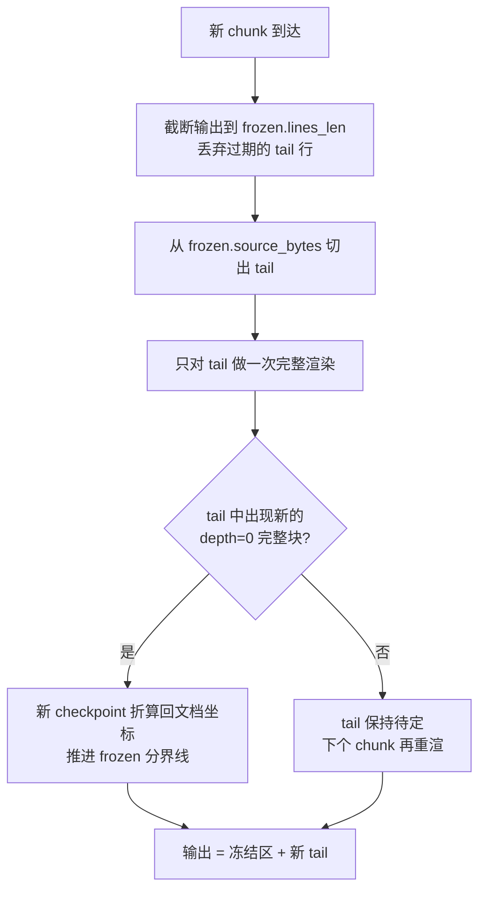

# 第 15 章：流式 Markdown——为 LLM 输出而生的增量渲染器

> **定位**：本章分析 Grok Build 如何在终端里实时渲染一个"正在生成中"的 markdown 文档——
> checkpoint 冻结机制如何把渲染成本从 O(N²) 压到 O(N)，以及 mermaid 图表在
> `panic=abort` 约束下的进程级崩溃隔离。前置依赖：第 13 章（TUI 事件循环与双渲染模式）。
> 适用场景：你要为流式 LLM 输出构建任何形式的富文本 UI，或想理解"不可信输入 + 必须实时响应"
> 这对矛盾在生产系统里的标准解法。

## 15.1 为什么这很重要

LLM 的输出是一个字一个字"长"出来的。用户看到的不是一份完成的文档，而是一条正在被书写的
流。要在终端里把这条流渲染成排版良好的 markdown，最朴素的方案只有一行伪代码：

```text
每收到一个 chunk：full_render(全部已收到的文本)
```

这个方案是正确的——它永远输出与"整体重渲"一致的结果——但它的成本是灾难性的。设文档最终
长度为 N，token 逐个到达，那么第 k 个 token 到达时要重新解析并排版前 k 个字符，总成本是
1 + 2 + … + N = O(N²)。一条几千行的回答（agent 输出动辄如此），在 30fps 的渲染循环里，
每帧都全量重排一遍 syntect（Rust 生态的 Sublime 语法高亮引擎）高亮、表格对齐、链接
扫描——CPU 会先于用户的耐心耗尽。

Web 前端遇到同样的问题可以把渲染交给浏览器的增量 DOM diff。终端没有这个奢侈。相比浏览器，
终端场景还叠加了三个额外约束：

1. **输出是最终一致性敏感的**。scrollback 里的历史行一旦滚出可视区（甚至写入终端原生
   scrollback，见第 13 章 `--minimal` 模式），就再也改不了了。你冻结的每一行都必须与
   "整体重渲"的结果逐字节一致，否则用户往上翻页会看到排版突变。
2. **markdown 是上下文相关的**。后到达的文本可以改变先到达文本的语义：一个后续的
   `- Another item` 会把已经渲染好的列表从"松散"变成"紧凑"，一个迟到的 `` ``` `` 会把
   后面所有内容变成代码块。"已经渲染的部分不会再变"这个假设默认不成立。
3. **输入是不可信的**。模型可以输出任何东西：未闭合的代码块、病态嵌套的表格、能让图表
   引擎 panic 的 mermaid 源码。渲染器崩溃等于整个 TUI 崩溃。

Grok Build 的 `xai-grok-markdown` crate 对前两个约束的回答是 **checkpoint 冻结机制**；
对第三个约束的回答（以 mermaid 为最典型场景）是**进程级崩溃隔离**。这两个设计构成本章的
两条主线。

## 15.2 checkpoint 冻结：把重渲成本钉在 O(N)

### 15.2.1 核心思想：找到"永不回头"的分界线

增量渲染的本质问题是：**流的哪个前缀可以被安全冻结？** 冻结意味着这部分的渲染输出行不再
参与后续重渲——它们是最终结果。答案藏在 markdown 的语法结构里：一个 top-level 块（段落、
标题、闭合的代码块、列表、表格）一旦结束**且其后出现了空行**，后续任何输入都不可能再改变
它的渲染结果。

`Checkpoint` 数据结构记录的正是这条分界线（crates/codegen/xai-grok-markdown/src/checkpoint.rs:26）：

```rust
pub struct Checkpoint {
    /// Byte offset in source text (exclusive end of frozen region).
    pub source_bytes: usize,
    /// Number of output lines that correspond to this checkpoint.
    pub output_lines: usize,
    /// What kind of block ended at this checkpoint.
    pub kind: CheckpointKind,
}
```

三元组的含义是：源文本前 `source_bytes` 个字节已经"定稿"，它们渲染出的前 `output_lines`
行输出不会再变。流式渲染器维护对应的运行时状态 `FrozenState`
（crates/codegen/xai-grok-markdown/src/streaming.rs:39），每个 chunk 到达时执行
`rerender_tail`（crates/codegen/xai-grok-markdown/src/streaming.rs:310）：



关键在第三步：**每次只渲染 tail**。冻结分界线随着完整块的出现不断前移，tail 的长度被钉在
"最后一个未完成块"的量级上，与文档总长无关。总成本从 O(N²) 降到摊还 O(N)——注意
"摊还"的前提是块会周期性闭合；病态输入（比如整条流是一个永不闭合的代码围栏）下 tail
即全文，最坏情形仍会退化回 O(N²)，这正是冻结条件保守性的代价一侧。tail 渲染出的
行号、字节范围、超链接都要加上冻结区的偏移量 rebase 回文档坐标
（crates/codegen/xai-grok-markdown/src/streaming.rs:366）。

这个机制的正确性不是靠信念保证的。测试基础设施里有一条铁律：
`assert_streaming_matches_full`（crates/codegen/xai-grok-markdown/src/streaming.rs:899）
把同一份文档按任意 chunk 边界切分后流式渲染，断言结果与一次性整体渲染**逐字节相等**。
任何冻结时机的错误都会在这里现形。性能声明同样有对照实验：benches 里
`bench_streaming_full_rerender`（注释明确标注 "O(N²) baseline"，
crates/codegen/xai-grok-markdown/benches/bench.rs:132）与 `bench_streaming_incremental`
（"O(N) target"，crates/codegen/xai-grok-markdown/benches/bench.rs:254）共用同一生成器，
块数取 10/50/100 三档，增长曲线的差异直接可测。

### 15.2.2 为什么只在 depth=0 建 checkpoint

冻结的前提是"后续输入不可能改变这部分的渲染结果"。对嵌套在容器里的块，这个前提不成立。
模块文档把原因写得很直白（crates/codegen/xai-grok-markdown/src/checkpoint.rs:7）：

> Checkpoints are only created at **top-level** (depth=0) block boundaries. Blocks nested
> inside lists, blockquotes, or tables cannot be checkpoints because the outer container
> might continue.

一个列表项渲染完了，但列表本身可能还在继续——下一个 chunk 追加的 `- Another item` 会改变
整个列表的松散/紧凑判定，进而改变每一项的间距。如果冻结了前几项，输出就会与整体重渲不一致，
违反 15.1 的约束 1。实现上，解析器在容器块（引用、列表、表格）的 `on_start`/`on_end` 里
维护深度计数器（crates/codegen/xai-grok-markdown/src/parse.rs:852），只有深度回到 0 的
块结束事件才有资格落 checkpoint（crates/codegen/xai-grok-markdown/src/parse.rs:1324）：

```rust
if self.depth == 0 {
    // ... 段落/标题/代码块/列表/表格/HTML 才可能成为 checkpoint
    let has_blank = has_blank_line_after(self.text, range.end);
    let at_eof = range.end >= self.text.len();
    let code_block_properly_closed =
        matches!(kind, CheckpointKind::CodeBlock) && !at_eof;
    if has_blank || code_block_properly_closed {
        self.last_checkpoint = Some((kind, checkpoint_pos));
    }
}
```

注意两个额外闸门。其一，段落必须**其后已出现空行**才冻结——因为流式场景里段落末尾永远
可能续写；空行才是"这个段落真的结束了"的证据。其二，代码块必须**已闭合且不在 EOF 上**——
一个恰好停在 `` ``` `` 后面的流，下一个 chunk 完全可能又是这个代码块的延续（比如围栏内
恰好出现三反引号的情况由解析器区分）。专门的回归测试守护嵌套场景：
`test_streaming_nested_blockquote_with_list`
（crates/codegen/xai-grok-markdown/src/streaming.rs:1609）。

这里值得停下来提炼一层：**checkpoint 不是缓存，是承诺**。缓存失效了可以重算，承诺违背了
就是用户可见的排版跳变。所以所有判定都朝保守方向倾斜——宁可让 tail 长一点、多重渲几次，
也不冻结任何有歧义的前缀。

### 15.2.3 三层防线处理"不完整的 markdown"

流式输入意味着渲染器在绝大多数时刻面对的都是**语法不完整**的文档。xai-grok-markdown
用三层防线让不完整输入既可见、又不污染冻结区：

**第一层：checkpoint 闸门**。上一节的空行/闭合判定本身就是防线——未闭合的代码块、无尾随
空行的段落统统不冻结，整块留在 tail 里每个 chunk 重渲一遍。

**第二层：tail 永远渲染**。不冻结不等于不显示。不完整的段落照样渲染出可见行（测试
`test_streaming_incomplete_paragraph`，crates/codegen/xai-grok-markdown/src/streaming.rs:667），
用户看到的是"正在打字"的效果而不是空白。未闭合代码块的语法高亮由 `OpenCodeHighlighter`
增量完成，syntect 的逐行状态跨 `rerender_tail` 缓存
（crates/codegen/xai-grok-markdown/src/streaming.rs:289）——这是 tail 内部的第二级增量优化。

**第三层：歧义尾缀回退（hold back）**。有些字符序列在 chunk 边界上语义未定：尾随的 `\`
可能是 `\[` 数学定界符的开头，`\begin{` 片段可能是环境块的起点，一串反引号或波浪号
长度未定时既可能是行内代码也可能是围栏。LaTeX 定界符归一化器把这类歧义尾缀扣在
`pending` 缓冲里不吐给渲染器
（crates/codegen/xai-grok-markdown/src/latex_delimiters.rs:65），直到下一个 chunk 消除
歧义，或 `finish()` 强制定论。`finish()` 还会做最后一次无截断的完整重渲兜底
（crates/codegen/xai-grok-markdown/src/streaming.rs:513）。

一个容易被忽略的细节暴露了 API 设计上的现实主义：会话回放时代码路径直接构造消息块、
**从不调用 `finish()`**，所以裸 URL 的自动链接扫描必须在 `rerender_tail` 里就完成，
不能推迟到收尾（crates/codegen/xai-grok-markdown/src/streaming.rs:388）。"流式"与
"一次性"两种调用方式共享同一实现时,不能假设生命周期钩子总会被调用。类似的一致性语义
还体现在超链接编号上：URL 扫描分配的 link id 只有在所在行被冻结后才"落定"，tail 内的
id 每次重渲都会重算（crates/codegen/xai-grok-markdown/src/streaming.rs:46）——流式
一致性约束的不只是可见文本，还包括所有随行携带的元数据。

防线之外还有主动出击：这个 crate 带着模糊测试靶子（fuzz/fuzz_targets/render_all.rs），
用随机字节流轰炸整条渲染管线。对一个以"不可信 LLM 输出"为日常输入的组件，fuzz 不是
锦上添花，而是与等价性测试同级的正确性基础设施。

## 15.3 能力探测与降级：同一份输出适配所有终端

冻结机制解决"何时渲染"，还有一个正交问题是"渲染成什么"。终端的颜色能力横跨四个世代，
`ColorLevel` 枚举建模为 None/Basic/Ansi256/TrueColor
（crates/codegen/xai-grok-markdown/src/colors.rs:11）。检测逻辑有一处值得注意的工程判断：
tmux 和 SSH 会话经常剥掉 `COLORTERM` 环境变量，导致真彩终端被误判为 256 色。检测器于是
按 `TERM_PROGRAM` 与各终端的专属环境变量（`ITERM_SESSION_ID`、`KITTY_WINDOW_ID`、
`WEZTERM_VERSION`……）把已知真彩终端**上调**回 TrueColor
（crates/codegen/xai-grok-markdown/src/colors.rs:95）。降级则统一走 `adapt_color`
（crates/codegen/xai-grok-markdown/src/colors.rs:172）：RGB→256 色索引→ANSI 16 色逐级
有损映射，另有进程级的 `COLOR_LEVEL_CAP` 原子上限供宿主强制封顶
（crates/codegen/xai-grok-markdown/src/colors.rs:132）。syntect 高亮主题（内置
tokyo-night）产出的永远是 RGB，降级发生在输出边界——**渲染管线内部只有一种颜色表示，
能力适配推到最后一刻**。语法集用 two-face 扩展到 250+ 语言
（crates/codegen/xai-grok-markdown/src/syntax.rs:37），围栏 info 串还支持
`lineStart:lineEnd:path` 形式的引用式高亮——agent 引用源码片段时能标注真实行号，这是
专为"代码助手"这个宿主场景长出的特性（crates/codegen/xai-grok-markdown/src/syntax.rs:82）。这与第 14 章渲染管线的
diff-flush 设计是同一哲学：中间表示保持最高保真，边界处按设备能力折损。

## 15.4 mermaid 双路径：文本网格里的图，和图片里的图

LLM 很喜欢输出 mermaid。Grok Build 给了它两条渲染路径，取舍点是"在哪里显示"：

**路径一：Unicode 盒绘内联渲染**（crates/codegen/xai-grok-markdown/src/mermaid.rs:61）。
把 flowchart/sequence/state 图直接画进终端文本网格：布局阶段用 DFS 破环得到 DAG，按最长
路径给节点分层（crates/codegen/xai-grok-markdown/src/mermaid.rs:2945），同层排序减少交叉
后分配坐标；绘制阶段用 `┌┐└┘`（矩形）与 `╭╮╰╯`（圆角/菱形）画框
（crates/codegen/xai-grok-markdown/src/mermaid.rs:2715），边走垂直/水平总线，箭头用
`▼▲▶◄`。`graph TD; A[Start] --> B[End]` 渲染出来是：

```text
┌───────┐
│ Start │
└───┬───┘
    │
    ▼
┌───────┐
│  End  │
└───────┘
```

好处是零依赖、随文本滚动、任何终端一致；代价是复杂图会退化。一个省代码的巧思：`Dir::Up`
和 `Dir::Left` 方向不写独立布局器，而是复用 TD/LR 布局再整体翻转画布——翻转时箭头与
框角字符在 `flip_glyph_v`/`flip_glyph_h` 里成对互换（`▼↔▲`、`┌↔└`，
crates/codegen/xai-grok-markdown/src/mermaid.rs:1667），布局代码量直接省一半。

**路径二：纯 Rust PNG 引擎**（`xai-grok-mermaid` crate）。对盒绘画不动的复杂图，用
vendored 的 dagre 布局移植 + resvg/usvg/tiny-skia 光栅化出 PNG，交给系统图片查看器打开。
关键词是**确定性**：字体内嵌、无网络、无 Node、无浏览器——同一输入在任何机器上渲染出
逐像素相同的结果。这条路径的另一重身份，是下一节崩溃隔离的实验场。

## 15.5 崩溃隔离：当 catch_unwind 失灵

mermaid 源码来自模型输出，属于不可信输入。图表引擎（无论是布局算法还是 SVG 光栅化）
面对病态输入可能 panic。Rust 教科书的答案是 `std::panic::catch_unwind`——但这里有一个
被大多数人忽略的前提，engine.rs 的注释写得非常清楚
（crates/codegen/xai-grok-mermaid/src/engine.rs:88）：

```rust
/// `catch_unwind` only intercepts panics under `panic = "unwind"`. The shipped
/// Release CLI profiles build with `panic = "abort"`, under which a panicking
/// engine aborts the **whole process** and this guard is a no-op. True crash-
/// isolation over untrusted source therefore comes from running the engine
/// *out of process* ...
```

（注释节选，省略号后原文继续描述子进程方案的细节。）

发行版为了二进制体积与 unwinding 开销选择了 `panic = "abort"`，于是 `catch_unwind`
在生产构建里是一句空话——引擎 panic 直接带走整个 TUI 进程。代码里保留 catch_unwind
只为开发构建服务；**真正的安全边界被移到了进程外**。

实现方式是 pager 把自己 re-exec 成一个 `__mermaid-render` 子进程：父进程侧在
`render_via_subprocess` 里 spawn（crates/codegen/xai-grok-pager/src/app/mermaid_worker.rs:314），
子进程侧由 `maybe_run_render_subprocess` 拦截该入口参数接管进程
（crates/codegen/xai-grok-pager/src/app/mermaid_worker.rs:424），渲染预算 3 秒。父进程侧
的看门狗是 wall-clock 超时 + 进程组回收
（crates/codegen/xai-grok-mermaid/src/subprocess.rs:122）：子进程 spawn 时已 `setsid`
自立进程组，超时后 `killpg(SIGKILL)` 连带清掉可能存在的孙进程；stdin 用独立线程写入，
避免大 payload 塞满管道造成父子互等死锁（crates/codegen/xai-grok-mermaid/src/subprocess.rs:78）。

子进程侧还有三重自我了断的 backstop：预算 +3 秒的自杀看门狗线程
（crates/codegen/xai-grok-pager/src/app/mermaid_worker.rs:491）、Linux 上 2GiB 的
`RLIMIT_AS` 地址空间上限（防 dagre 布局在病态图上无限制造 dummy 节点吃光内存）、以及
`PR_SET_PDEATHSIG`（父进程死亡时子进程随之终止，防孤儿进程）。这一整套纵深防御回答的
是同一个问题：**当你无法信任一段计算，就不要和它共享任何东西——地址空间、时间预算、
生命周期，全部隔离**。

两个生产细节让这套机制从"能用"变成"可靠"。其一，Linux 上刚写完的可执行文件立刻 exec
可能撞上 `ETXTBSY`（文本段忙），spawn 带线性退避（20ms × 尝试序号）最多尝试 5 次
（crates/codegen/xai-grok-mermaid/src/subprocess.rs:101）——fork/exec 竞态里少有人讲的
一课。其二，jemalloc 默认按 CPU 核数预留 ~4×ncpus 个 arena 的虚拟地址空间，多核机器上
光是分配器的预留就能撞穿 2GiB 的 RLIMIT_AS，导致每次渲染必败；子进程于是被钉死在
`narenas:1`（crates/codegen/xai-grok-pager/src/app/mermaid_worker.rs:352）。资源上限
与分配器策略不是两个独立的旋钮——拧其中一个之前要理解另一个。

## 15.6 同一问题，codex 怎么做

openai/codex 的 Rust TUI（codex-rs/tui）面对同样的"流式 markdown 进终端"问题，
选择了一条更简单的路线，两者取舍差异集中在两点：

**其一，提交粒度：行 vs 块**。codex 的流式渲染以"已完成的行"为提交单位——新生成的文本
先进入活动区，完成的行随流推进逐批提交进历史（其 `insert_history` 机制与 Grok Build
`--minimal` 模式的 `insert_before` 同源，均来自 ratatui 生态的惯用法）。这个方案实现
简单，但一行一旦提交就不再参与 markdown 结构重排，跨行结构（迟到的列表项改变列表紧凑性、
段落续写）在流式过程中的排版一致性弱于 checkpoint 方案；Grok Build 以"完整的 top-level
块 + 空行证据"为冻结单位，正确性口径是与整体重渲逐字节一致（15.2.1 的
`assert_streaming_matches_full`），代价是维护 FrozenState/坐标 rebase 这一整套机制。

**其二，图表：不渲染 vs 双路径**。codex 不内置 mermaid 渲染，图表源码作为普通代码块
高亮显示，用户自行复制到外部工具——于是也就不存在"不可信图源崩溃隔离"这个问题域。
Grok Build 选择在终端内消化图表，随之而来的就是 15.5 的整套进程隔离设施。这是一条
清晰的复杂度守恒曲线：功能边界每外扩一步，安全边界就要跟着重新划一次。

（本节对 codex 的描述基于 openai/codex 仓库 2026 年年中的 main 分支状态；codex 迭代
很快，核对时以其 `codex-rs/tui` 目录为准。）

## 15.7 模式提炼

本章的实现细节可以提炼为四个可复用模式：

**模式一：冻结线增量渲染（checkpoint freeze）**。适用于任何"追加式输入 + 上下文相关
语法"的流式渲染问题（markdown、日志高亮、流式 JSON 美化）。要点：冻结条件必须是语法上
"未来不可能改变此前缀"的充分条件，宁可保守；用"任意切分 ≡ 整体渲染"的等价性测试守护
正确性；用 O(N²) 基线对照 bench 守护性能。

**模式二：歧义尾缀回退（hold-back normalization）**。流式转换器遇到 chunk 边界上语义
未定的尾缀时，扣住不发、待定即吐。比"先猜后改"简单，也不产生用户可见的闪变。

**模式三：进程外崩溃隔离（out-of-process isolation）**。当 `panic=abort`、FFI、或内存
安全之外的资源失控（时间、内存）在威胁模型内时，catch_unwind 不是安全边界，进程才是。
配齐四件套：进程组 SIGKILL 回收、子进程自杀看门狗、RLIMIT 资源上限、PDEATHSIG 防孤儿。

**模式四：边界降级（capability degradation at the edge）**。管线内部维持单一最高保真
表示，设备能力适配（色阶、字符集）推迟到输出边界一次性完成；能力探测要同时处理"漏报"
（tmux 剥 COLORTERM 后按终端指纹上调）与用户显式覆盖（NO_COLOR 最高优先级）。

## 设计要点回顾

速查索引（详述见对应小节）：

- 朴素流式渲染为何 O(N²)、终端三约束 → 15.1
- checkpoint 三元组与 rerender_tail 流程、摊还 O(N) 及其"块会闭合"前提 → 15.2.1
- 只在 depth=0 + 空行/闭合证据处冻结；checkpoint 是承诺不是缓存 → 15.2.2
- 等价性测试（任意切分 ≡ 整体重渲）与 O(N²) 基线对照 bench → 15.2.1
- 不完整 markdown 三层防线（冻结闸门 / tail 可见 / hold-back）与 fuzz → 15.2.3
- 色阶探测的漏报上调与输出边界降级 → 15.3
- mermaid 盒绘 vs 纯 Rust PNG 的取舍轴 → 15.4
- `panic=abort` 下的进程外纵深防御四件套与两个生产细节 → 15.5
- codex 的两条取舍轴：提交粒度（行 vs 块）、功能边界（不渲染图 vs 双路径）→ 15.6
- 四个可迁移模式：冻结线增量、hold-back、进程外隔离、边界降级 → 15.7

---

### 版本演化说明

> 本章核心分析基于本书快照仓库（同步自 xAI monorepo，commit 8adf901，SOURCE_REV 2ec0f0c，2026-07）。
> 涉及的 crate：xai-grok-markdown、xai-grok-mermaid、xai-grok-pager（mermaid_worker 部分）。
> codex 对比基于 openai/codex 2026 年年中 main 分支。上游同步后请以
> `book/tools/check_chapter.py` 校验本章引用有效性，失效引用见修订队列。
