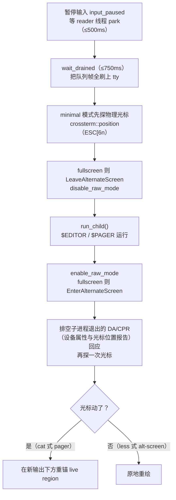

# 第 16 章：终端工程学

> **定位**：本章收束 TUI 部分"与真实终端打交道"的硬核细节——图像内联协议
> （Kitty/iTerm2）、终端能力探测的碎片化、TTY 卫生（子进程 detach 防喷转义码）、
> ProcessScope 的 PID-reuse 安全进程管理、$EDITOR/$PAGER 的控制权交接。前置
> 依赖：第 13 章（事件循环调度 suspend）、第 14 章（渲染让出的 tty 细节）。适用
> 场景：你要做任何需要与终端协议、多路复用器、子进程 TTY 深度共处的程序。

## 16.1 为什么这很重要

前面几章的渲染、事件循环都假设了一个"标准终端"，但真实世界没有标准终端——
有的是一片**碎片化的能力荒野**：Kitty 能画图、iTerm2 用另一套协议、Windows
Terminal 剥离某些序列、tmux 拦截查询、SSH 转发丢失环境变量、JetBrains 的
内嵌终端连自己是谁都报不清。终端工程的第一类硬问题是**能力碎片化**：同一个
功能（画图、写剪贴板、真彩色）在不同终端要用不同协议、不同探测方式，还要为
探测失败准备降级。

第二类硬问题更隐蔽——**进程与 TTY 卫生**。TUI 独占着终端屏幕，但它 spawn 的
子进程（跑 shell 命令、调 git、开 `$EDITOR`）可能有自己的想法：一个 `ssh` 的
孙进程会**绕过管道直接打开 `/dev/tty`**，往你精心渲染的屏幕上喷鼠标转义码或
凭证提示；一个被取消的后台任务如果只按 PID 杀，可能在 PID 被系统复用后误杀
无关进程。这些不是功能 bug，是"多个程序共享一个终端与一棵进程树"时的**卫生**
问题，处理不好就是花屏、残留进程、误杀。

本章讲这两类问题的工程答案。它是全书最"贴地"的一章——没有优雅的架构抽象，
只有一条条与具体终端、具体系统调用死磕的经验。而正是这些不起眼的细节，决定
了一个 TUI 在真实用户的五花八门环境里是"能用"还是"花屏"。

这里值得先立一个心态：终端工程的正确姿势不是"追求在所有终端上都完美"，而是
"在能力充足的终端上用足、在不确定的终端上安全降级、绝不因为某个终端的怪癖
就崩坏"。碎片化不可能被消灭，只能被**分档管理**——探到什么能力用什么，探不到
就退回最朴素但保证能工作的形态。本章的每一个设计，本质上都是在回答"这个终端
到底能不能做 X，做不到我退到什么"这个问题的不同实例。理解了这条主线，那些
琐碎的 quirk 处理就有了统一的骨架。

## 16.2 图像协议：品牌探测而非能力查询

终端里显示图片有两套主流协议：Kitty graphics protocol 与 iTerm2 的 OSC 1337。
第一个反直觉的设计是：**协议选择靠环境变量的品牌探测，而不是发查询转义码等
回应**（crates/codegen/xai-grok-pager-render/src/terminal/image.rs:87）。品牌
来自 `KITTY_WINDOW_ID`、`WEZTERM_VERSION`、`ITERM_SESSION_ID` 这类环境变量链。
为什么不发标准的能力查询？因为查询要等回应、回应要读 stdin、读 stdin 要和
事件循环抢——探测的复杂度和风险都高，而环境变量是**同步、无 stdin 争用、够用**的信号（它有自己的坑——SSH 不转发、
mux 下残留可能误判品牌，见 16.5，但不用抢那条脆弱的输入流）。能不查就不查，是终端探测的第一原则。

映射结果里有一个耐人寻味的决定：**iTerm2 被故意禁用图像、降级为文本**
（image.rs:180）。注释解释：iTerm2 的 OSC 1337 缺少 image-id、z-index、裁剪、
清除等原语，做不到让图像**跟随文本网格滚动**——图会固定在屏幕某处、和滚动
的文字脱节。宁可显示 `[Open …]` 文本占位，也不要一个滚动时错位的图。这是
"功能可用" 与 "体验正确" 的取舍：能画≠该画，一个跟不上滚动的图比没有图更糟。

真正支持的 Kitty 系（Kitty/Ghostty/WezTerm）用 base64 编码的 PNG、4096 字节
分块传输（image.rs:378）。为什么要分块？因为单个转义序列过长会被某些终端或
中间层截断，4096 字节是一个跨终端稳妥的分片大小，用 `m=1`（后续还有块）/
`m=0`（末块）标记续传。非 PNG 格式（JPEG/WebP）会先在非绘制路径转成 PNG——
macOS 用 `sips` 以保留 ICC 色彩配置，其他平台用 `image` crate。让图**随文本
滚动**的关键手法值得一看：不是每帧重传
整张图（那会让 GPU surface 计数爆炸，注释直言 `a=T` 每帧上传在长会话里
"balloons native GPU surface counts"），而是**传一次、之后只发放置命令**——
约 50 字节的 `a=p`，配合 z 层级（放到文字下方）、image-id、以及按滚动偏移做的
**源裁剪**（只显示图的可见部分，image.rs:416）。"重的数据传一次，轻的位置每帧
更新"是所有"大资源 + 频繁重定位"场景的通用优化，这里是它在终端图形上的
具体形态。降级链层层兜底：tmux、无协议、minimal 模式一律退回文本占位。

## 16.3 TTY 卫生：子进程为什么喷码，detach 怎么治

TUI 独占屏幕，但它 spawn 的命令可能有孙进程直接往 `/dev/tty` 写东西。根因
在 `xai-tty-utils` 的模块注释里说得很清楚
（crates/codegen/xai-tty-utils/src/lib.rs:1）：`Stdio::null()` 只改了 fd 0/1/2，
但 `ssh`、`ssh-add`、`zsh -i`、`gpg-agent`/pinentry 这些程序会**主动 open
`/dev/tty`** 拿到控制终端，绕过你重定向的管道，直接往活屏喷鼠标转义码、能力
探测回应、或密码提示框。你以为把子进程的标准流接到 null 就干净了，其实
`/dev/tty` 是一条你没堵住的暗道。

治法是让子进程**脱离控制终端**——`detach` 的核心是新建一个 session
（lib.rs:65，节选）：

```rust
match setsid() {
    Ok(_) => Ok(()),
    Err(Errno::EPERM) =>  // 已是进程组长，退而求其次
        setpgid(Pid::from_raw(0), Pid::from_raw(0)).map(|_| ()),
    Err(e) => Err(e),
}
```

`setsid` 让子进程成为新会话的首进程，从此**没有控制终端**——它再 open
`/dev/tty` 也拿不到你的屏幕。必须在 `pre_exec`（fork 之后、exec 之前）调用，
且 `setsid`/`setpgid` 都是 async-signal-safe 的（pre_exec 里只能调这类函数）。
配套还有 `pager_env()` 把 `PAGER=cat`、`GIT_EDITOR=true`、`GPG_TTY=""` 全部
中和——让需要交互的程序**干净地失败**而非弹出污染屏幕的界面。多一道纵深：
`redirect_native_stderr()` 把 fd 2 重定向到 null，专治 macOS 的 libmalloc
从 C 代码绕过 Rust 的 stderr 锁直写 fd 2 的调试噪声。堵 `/dev/tty` 这条暗道
需要在**多个层次**同时设防：会话隔离、环境中和、fd 重定向——因为喷码的来源
本身是多样的。

## 16.4 ProcessScope：PID 复用安全的进程管理

后台任务被取消时要杀掉它 spawn 的整棵进程树。天真的做法是记下 PID、需要时
`kill(pid)`——但这里藏着一个经典的**PID 复用**陷阱：子进程正常退出、被回收后，
它的 PID 会被操作系统分配给**无关的新进程**，此时你若还拿着旧 PID 去 kill，
杀的是别人。

`ProcessScope` 的解法是 **Weak-keyed registry**
（crates/codegen/xai-tty-utils/src/process_scope.rs:35）：scope 只持进程组的
`Weak` 引用，强 `Arc` 留在 spawn 点由 owner 持有。

```rust
struct ScopeInner {
    groups: Mutex<Vec<Weak<ProcessGroup>>>,
    closed: AtomicBool,  // kill_all 后锁存，防 close/spawn 竞态漏杀
}
```

安全性来自 Rust 的所有权：owner 正常回收子进程 = drop 掉它的 `Arc`，对应的
`Weak::upgrade()` 就返回 `None`，`kill_all` 遍历时**直接跳过死 Weak**
（process_scope.rs:137）——从根上不可能对一个已回收（因而 PID 可能已被复用）
的进程组发信号。要精确一点：安全性依赖 owner 在**回收（reap，即 wait 掉僵尸）
的同时 drop 掉 Arc** 这个绑定——`wait()` 与 `drop(Arc)` 若被拆成两步、中间留窗口，
理论上仍有隙（不过僵尸进程的 PID 不会被复用，真正的窗口在 reap 之后、Arc 落地
之前，实务上极窄）。只要"reap 与 drop 绑定"这个前提成立，PID 复用陷阱就被 Rust
的生命周期语义从结构上消除：Weak 的存活与进程的存活绑定，进程没了 Weak 也就
upgrade 失败。这是"用类型系统
把一类 bug 变得不可表达"的又一个例子（呼应第 3 章的 `&mut self`、第 8 章的
闭合枚举）。

进程管理的另外两处 safe-by-construction 值得记：其一，`kill` 走
`killpg(SIGKILL)` 杀**整个进程组**（含孙进程），配合 16.3 的 setsid——detach
既隔离了 tty，又让"按组杀"能连根拔起。其二，`ProcessGroupId::new` 在入册时
一次性拒绝危险的 gid：pid 0（自己组）、1（init）、以及调用者自身的 pgid
（process_scope 相关校验）——把"kill 一个进程组"这个最高爆炸半径的原语做成
**构造即安全**，错误的 gid 根本传不进来。危险操作的防护最好放在类型构造处，
而不是每个调用点自觉检查。

`closed` 这个原子标志也不是摆设，它堵的是一个真实的竞态：`kill_all` 与并发的
`register`（新 spawn 子进程注册进 scope）之间存在窗口——如果 kill_all 已经
遍历完、清空了列表，此后一瞬注册的子进程就会漏杀。解法是 kill_all 结束时把
`closed` 锁存为真，之后任何 `register` 一看到 closed 就**当场杀掉**刚注册的
进程（process_scope.rs:83）。全局的 `global_process_scope()` 进一步保证：
setsid-detach 出去的后台命令不能比主进程活得久。"取消一个任务"在有孙进程、
有并发注册、有 PID 复用的现实里，要正确到这个程度才不留僵尸或误伤——这一节
的每一处防护都对应一种真实发生过的失败。

## 16.5 能力探测：以环境为主，DCS 查询为辅

终端能力探测的总框架是一个单一真相源 `TerminalContext`
（crates/codegen/xai-grok-pager-render/src/terminal/mod.rs:262，OnceLock 缓存
在 mod.rs:631），字段涵盖品牌、多路复用器、是否 SSH、tmux 版本、VTE 版本等。能力查询
分散成一组方法：`supports_osc52_clipboard()`（品牌白名单）、`kitty_skip_reason()`
（Kitty 键盘协议）、`graphics_protocol_skip_reason()`、`hyperlink_skip_reason()`
（OSC 8，带 VTE（GNOME 终端库）版本门）……**绝大多数判定基于环境变量**，因为它们零成本、
无需读 stdin。

唯一的运行时 DCS（设备控制串）探测是 XTVERSION
（crates/codegen/xai-grok-pager-render/src/terminal/xtversion.rs:1）：发
`\x1b[>0q` 查询终端版本，且是 **fire-and-forget**——发出去不阻塞等回应，回应
由事件循环的一个专用过滤器吞掉（第 13 章那个专用 reader 线程正是为此类场景
存在）。只在品牌未知（或已充分验证的白名单品牌）、且当前不在会拦截 CSI 查询的多路
复用器里时才发。需要
读回应的探测（如 OSC 11 背景色）走带超时的 `read_tty_reply`：poll + 单字节
读循环，有 256 字节上限和 deadline，deadline 后留 100ms 静默窗只消费 ESC
打头的在途回应——**避免把用户的键击当成探测回应吃掉**（probe.rs:44）。这个
细节暴露了终端探测最难的部分：stdin 是探测回应和用户输入共用的一条流，分不清
就会丢键或花屏。

碎片化的现实在"意外发现"里最触目：JetBrains 的内嵌终端 XTVERSION 回乱码、
DA1（主设备属性查询）返回裸 VT102，几乎无法探测，只能保守降级；VS Code over SSH 不转发
`TERM_PROGRAM`，品牌回落 Unknown，于是 Shift+Enter 探测不到就改为向用户
advertise Alt+Enter（mod.rs:453）；tmux/screen/zellij 这类多路复用器会拦截 XTVERSION，
必须跳过探测让最内层自答。**每一个 quirk 都对应一个真实终端的真实行为**——
这类代码没有优雅可言，它的价值恰在穷举了荒野里的每一个坑。

## 16.6 控制权交接：把终端干净交出去再收回

第 13/14 章反复提到"挂起进 `$EDITOR` 的 tty 舞蹈"，这里补完整
（crates/codegen/xai-grok-pager/src/app/event_loop.rs:223）：



三个环节缺一不可。**交出前**：暂停输入、等 reader 线程确实 park（保证主线程是
唯一读 stdin 的，否则和子进程抢输入）、刷空帧队列（否则残帧落进子进程的备用
屏幕造成撕裂）。**交接时**：离开备用屏幕、关 raw mode，让子进程拿到一个正常
的终端。**收回后**：排空子进程退出时缓冲的查询回应（DA=设备属性、CPR=光标位置报告），再探一次光标。
还有一层与它同源的正确性保障：程序 panic 时若不恢复终端状态，用户会留下一个
raw mode 未关、备用屏幕未退的坏终端。一个安装在启动期的 panic hook
（crates/codegen/xai-grok-pager/src/app/mod.rs:1313）负责在崩溃路径上
把终端还原——"交出去要能收回来"不只适用于 `$EDITOR`，也适用于程序自己异常
退出的那一刻。

光标位置探测（`ESC[6n`）的用途很精巧：在子进程前后各探一次物理光标位置，
若光标移动了，说明是 **cat 式** pager（在输出末尾留下光标，需要在新输出下方
重新锚定活动区）；若光标回到原位，说明是 **less 式** alt-screen pager（`rmcup`
把光标还原，原地重绘即可）。用光标位移这一个可观测信号，区分两类行为迥异的
子程序——这是终端编程里少有的"不靠猜、靠测"的判定。`$PAGER` 若是 less 且
要传 ANSI 转录，还会自动补 `-R` 让它别转义颜色码。

## 16.7 OSC 52 剪贴板：多腿并行与 tmux 信封

把文本写进系统剪贴板，终端侧的标准手段是 OSC 52（base64 编码写剪贴板）。
但可靠性极不均衡，于是用**多路冗余**（三条腿逐个施用而非并发线程）（crates/codegen/xai-grok-pager-render/src/clipboard/mod.rs:119）：
原生剪贴板 API + tmux load-buffer + OSC 52 三条腿都试，哪条通哪条生效。
OSC 52 在 Linux 总是发（安全网），macOS/Windows 只在 tmux/SSH/容器场景发
（本地有更可靠的原生 API）。要标注一个隐患：OSC 52 的转义序列本身没有长度
检查，而多数终端对它有约 74994 或 100000 字节的上限，超限会被**静默丢弃**——
复制超大文本时 OSC 52 这条腿可能悄悄失效，这也是多腿并行（尤其保留原生 API 腿）
的又一个理由。

tmux 下有个必须处理的信封问题：tmux 里发 OSC 52 要套一层 DCS passthrough
信封（`\x1bPtmux;...\x1b\\`）才能穿透到外层终端；但如果是在编辑器的内嵌终端
（`:terminal`）里，那其实是 libvterm（编辑器内嵌的终端模拟库）而非 tmux，套信封反而会显示成可见垃圾。
所以判定条件是"是 tmux **且** 不在内嵌编辑器里"（clipboard/mod.rs:134）。
tmux load-buffer 这条腿还有一处防阻塞的细节：用**落盘的临时文件**当 stdin
而非管道，配 2 秒超时——防止一个卡住的 tmux 阻塞整个 UI。剪贴板这种"看起来
一行 base64 就完事"的功能，真实实现要处理三种传输腿、tmux 信封、内嵌终端
例外、SSH 检测、防阻塞——**终端功能的复杂度不在协议本身，在协议要穿越的
环境层数**。

## 16.8 同一问题，codex 怎么做

codex 与 Grok Build 都要面对同一片终端荒野，差异在覆盖广度与激进度：

**其一，图像支持**。两家都受限于终端图像协议的碎片化。Grok Build 明确支持
Kitty 系内联图像（并对 iTerm2 做了"能画但不该画"的降级判断，16.2）；codex
的终端图像支持范围更保守。这类"支持哪些终端的图像"的决定高度依赖产品的
目标用户群，两家按各自的用户分布划了不同的线。

**其二，进程/TTY 卫生的抽象化程度**。Grok Build 把 TTY 卫生抽成独立 crate
（`xai-tty-utils`）、把进程管理抽成 `ProcessScope` 的 Weak-keyed registry——
这层抽象的存在本身说明它在企业环境里踩过足够多的坑（SSH agent 喷码、
PID 复用误杀）才值得单独封装成带测试的独立 crate。抽象的厚度往往是踩坑深度
的化石——一个功能被单独抽成 crate、配上专门的 PID-reuse/孙进程回收测试，
通常意味着它曾经反复出过问题。（两家对 TTY 卫生的具体抽象组织方式差异，
需以各自源码为准；此处的对照是基于 Grok Build 侧可见的抽象厚度做的观察。）

（本节对 codex 的描述基于 openai/codex 2026 年年中 main 分支；终端处理在
`codex-rs/tui`。）

## 16.9 模式提炼

**模式一：能不查就不查（env over query）**。终端能力探测优先用环境变量等
同步零风险信号，只在环境不够时才发运行时查询，且查询 fire-and-forget、
带超时、防止吞掉用户输入。stdin 是探测回应与用户输入共用的一条流，是探测
最大的风险源。

**模式二：能力可用不等于该用（capability vs experience）**。一个协议"能做"
某功能（iTerm2 能画图）不代表"该做"——若它做不到与整体体验一致（跟随
滚动），宁可降级到更朴素但正确的形态。

**模式三：暗道要多层设防（defense in depth for TTY）**。子进程污染屏幕的
来源是多样的（`/dev/tty` 直写、环境变量触发的交互、绕过 Rust 锁的 C 代码），
防护要在会话隔离、环境中和、fd 重定向多个层次同时布防。

**模式四：把危险操作做成构造即安全（safe-by-construction）**。PID 复用误杀
用 Weak 引用让"进程没了信号也发不出"从结构上不可能；危险 gid 在构造 id 时
就拒绝。防护放在类型的构造处，而非每个调用点的自觉。

**模式五：不靠猜、靠测（observe, don't guess）**。区分两类行为迥异的子程序
（cat 式 vs less 式 pager）用一个可观测信号（光标是否位移），而非硬编码
程序名单。可观测的行为差异比脆弱的名单可靠——前提是那个信号本身可靠；对
连 CPR 都回乱码的终端（16.5 的 JetBrains），这条也会失效，退回保守默认。

## 设计要点回顾

速查索引（详述见对应小节）：

- 终端工程两类硬问题：能力碎片化、进程/TTY 卫生 → 16.1
- 图像协议品牌探测而非查询；iTerm2 能画不该画的降级；传一次+每帧只放置随
  滚动 → 16.2
- `/dev/tty` 暗道绕过管道；setsid detach + pager_env 中和 + stderr 重定向多层
  设防 → 16.3
- ProcessScope Weak-keyed registry 让 PID 复用误杀结构上不可能；killpg 整组 +
  危险 gid 构造即拒 → 16.4
- 能力探测以 env 为主、XTVERSION fire-and-forget；read_tty_reply 防吞用户键；
  JetBrains/VSCode-SSH/tmux 的 quirk → 16.5
- 控制权交接三环节（交出/交接/收回）；ESC[6n 光标位移区分 cat/less 式 pager → 16.6
- OSC 52 三腿并行；tmux DCS 信封与内嵌终端例外；落盘 stdin 防阻塞 → 16.7
- codex 对照：图像支持广度、TTY 卫生抽象厚度是踩坑深度的化石 → 16.8
- 五个可迁移模式：env 优先探测、能力≠体验、暗道多层设防、构造即安全、
  观测而非猜测 → 16.9

---

### 版本演化说明

> 本章核心分析基于本书快照仓库（同步自 xAI monorepo，commit c68e39f，2026-07）。
> 涉及 crate：xai-tty-utils、xai-grok-pager-render（terminal/image、mod、probe、
> xtversion、clipboard）、xai-grok-pager（app/event_loop 的 suspend）。codex 对比
> 基于 openai/codex 2026 年年中 main 分支。上游同步后请以
> `book/tools/check_chapter.py` 校验本章引用。
