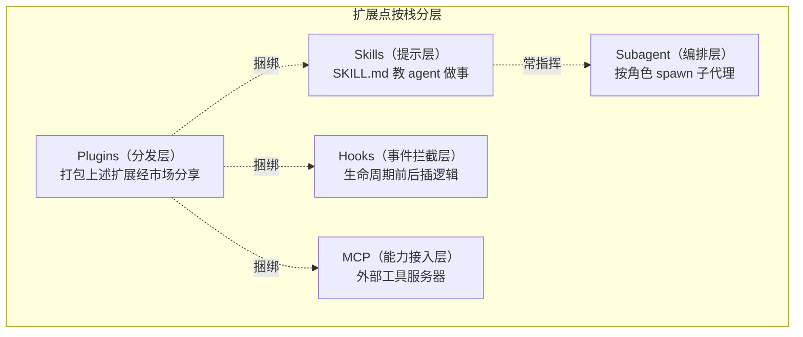

# 第 17 章：MCP、Hooks 与插件生态

> **定位**：本章分析 agent 的可扩展性设计——MCP 接入外部工具（含依赖版本冲突的
> 隔离墙）、Hooks 拦截生命周期、插件市场分发（防路径穿越）、子代理解析的纯逻辑
> 层、Skills 提示包，以及五种扩展机制如何按信任边界分层组合。前置依赖：第 8 章
> （工具抽象，MCP 工具经此接入）、第 4 章（审批，Hooks 与之协作）、第 11 章
> （沙箱，扩展的安全兜底）。适用场景：你要给一个平台设计可扩展点，且要在开放性
> 与安全性之间划清边界。

## 17.1 为什么这很重要

一个 agent 平台的价值，很大程度上取决于它能被**多深地扩展**。但"可扩展"不是
一个单一能力，而是一组不同层次的扩展点，各自解决不同的问题：

- **接入外部工具**（MCP）：让 agent 用上平台没内置的能力——查数据库、调内部
  API、连第三方服务。
- **拦截生命周期**（Hooks）：在 agent 做某件事的前后插入自定义逻辑——工具调用
  前审查、会话结束时归档、prompt 提交时触发（当前实现的 hook 只能放行/否决与
  旁路观察，不改写 prompt 上下文；若未来加此通道，hook 输出进 prompt 即是一条
  注入面）。
- **分发扩展**（Plugins）：把上述扩展打包、经市场分享安装。
- **编排子代理**（Subagent resolution）：让 agent 按角色/人格 spawn 出专门化
  的子代理。
- **注入提示**（Skills）：用可复用的提示包教 agent 做特定任务。

这五个扩展点覆盖了从"提示层"到"编排层"的完整栈。而每一个扩展点都是一道
**信任边界**——外部工具的服务器、用户写的 hook 脚本、市场下载的插件，都是
平台不完全控制的代码或数据。本章的核心张力，就是**开放性与安全的平衡**：
既要让扩展足够强大有用，又要防住恶意或出错的扩展搞垮平台。你会看到这条张力
在每个机制里以不同形态出现——MCP 的依赖隔离、Hooks 的 fail-open 取舍、插件的
路径穿越防护、凭证的存储隔离。



## 17.2 MCP：一堵依赖隔离墙

MCP（Model Context Protocol）让 agent 接入外部工具服务器。集成基于 `rmcp`（MCP 的 Rust SDK）库
（crates/codegen/xai-grok-mcp），但这里更要写的不是协议本身，而是一个纯粹的
**Rust 工程难题**：`rmcp` 2.1 要求 `reqwest >= 0.13`，而工作区其余部分（OTel、
oauth2、mixpanel、工具 crate）全锁在 reqwest 0.12。同一个 cargo 工作区里出现
一个依赖的两个不兼容大版本，是大型 Rust 项目的经典麻烦。

解法很干净：**把整个 MCP 集成隔离成一个独立 crate，且 reqwest 0.13 是它的私有
实现细节、绝不 re-export**（crates/codegen/xai-grok-mcp/src/lib.rs:5）。消费者
只经 `xai_grok_mcp::rmcp::*` 触达协议模型类型，碰不到里面那个 0.13 的 reqwest。
注释解释了为什么不全量升级：会触发级联破坏（OTel 的 HTTP 适配器、同 crate
里两个重命名 reqwest 并存的测试）。这是比 cargo 的 `package =` 重命名更彻底的
隔离——**用 crate 边界当版本墙，让冲突的依赖各自活在墙的一侧**。当两个依赖
版本无法调和时，最干净的做法往往不是硬升级，而是把其中一个圈进一个不泄漏其
类型的 crate。

MCP 还有两处"给不完美的外部世界打补丁"的工程值得看。其一，**为上游 bug 造
包装层**：rmcp 的 SSE（Server-Sent Events，服务端单向推流）流建立后若报错，会立即重发请求且把重试计数清零、从不
查退避策略，导致亚毫秒级的重连风暴。项目包了一层 `McpHttpClient` 拦截
（crates/codegen/xai-grok-mcp/src/mcp_http_client.rs:98，节选）：

```rust
fn plan_on_get_stream(&mut self, now: Instant) -> Option<BackoffPlan> {
    let rapid = self.last_established
        .is_some_and(|t| now.duration_since(t) < STABLE_STREAM_THRESHOLD); // <2s 算"秒死"
    if rapid { self.consecutive_rapid = self.consecutive_rapid.saturating_add(1); }
    else { self.consecutive_rapid = 0; }
    if self.consecutive_rapid < 2 { return None; } // 前两次"秒死"不退避，第三次起才退避
    // …指数退避 500ms 起、封顶 30s，配每小时一次的 warn 预算
}
```

流活过 2 秒即视为健康、重置退避；只有连续"秒死"才逐级退避。**依赖第三方库
时，你继承的不只是它的功能，还有它的 bug**——成熟的做法是在自己可控的边界上
打补丁，而不是等上游修。其二，**为 rmcp 的一个 Drop-panic 造替身**：rmcp 的
子进程传输在析构时 `tokio::spawn` 会 panic，项目用自研的 `SafeTokioChildProcess`
替代（crates/codegen/xai-grok-mcp/src/servers.rs:2005）。这些都是"接入外部依赖的真实税"。

凭证存储也体现了安全用心：MCP 的 OAuth 令牌存在
`$GROK_HOME/mcp_credentials.json`，**与用户的 xAI 主凭证隔离**在不同文件
（crates/codegen/xai-grok-mcp/src/credentials.rs:61）——两者同属主、同为 0600，
隔离防的不是"同用户读取"（那道门 0600 已管），而是**最小暴露面**：一处凭证
泄露不牵连另一处，爆炸半径被限制在单个服务。写入时 Unix 下临时文件**开局即 0600**（无"先创建世界可读、再 chmod"的 TOCTOU（检查与使用之间的时间差）窗口，crates/codegen/xai-grok-mcp/src/credentials.rs:208），temp+rename 原子替换，
并发写用 flock 加锁后 reload-merge。

OAuth 浏览器流本身也值得看它的完整设计（crates/codegen/xai-grok-mcp/src/oauth.rs:256）：
先尝试用 refresh token 无浏览器续期；需要用户授权时，绑定一个 loopback 回调
端口、用 DCR（动态客户端注册，RFC 7591，client name 填 "Grok" 会显示在授权页
上）配置 client、打开浏览器同意页，然后用 `tokio::select!` **同时**等两件事——
回调 HTTP server 收到授权码，以及每 2 秒轮询一次磁盘凭证。为什么要轮询磁盘？
因为可能是**另一个进程**（比如被驱逐的旧 leader，见第 7 章）完成了同一个登录——
轮询让任意一个进程的成功都能被其他进程捕获，不必每个都弹一次浏览器。跨进程
的 flock 锁 + 进程内的 watch channel 双层去重，保证一次登录只弹一个浏览器 tab。
一个看似简单的"点浏览器登录"，在多进程 leader 架构下要处理这么多并发协调——
外部集成的复杂度从来不在协议的 happy path，在它与本地架构其余部分的交叉点。
外部凭证的每一处存储都按"可能被偷窥、可能被并发写、可能被另一个进程抢先"
来设防。

## 17.3 Hooks：生命周期拦截与 fail-open 的坦白

Hooks 让用户在 agent 生命周期的各个节点插入自己的脚本
（crates/codegen/xai-grok-hooks）。JSON 定义格式刻意兼容 Claude 的
`settings.json` 结构（降低迁移成本），从 `~/.grok/hooks/`（全局）与
`<worktree>/.grok/hooks/`（项目）两处发现，全局先加载、按内容去重——同一个
命令即使在多个配置目录（`.grok`/`.claude`/`.cursor`）里都写了，也只跑一次
（crates/codegen/xai-grok-hooks/src/discovery.rs:184）。生命周期事件覆盖 14 类（枚举有 15 个变体，其中一个是兼容别名）：会话开始/
结束、工具调用前后、权限拒绝、prompt 提交、子代理起停、压缩前后（crates/codegen/xai-grok-hooks/src/event.rs:13）。

其中**只有 `PreToolUse` 是阻断型**——它能在工具真正执行前否决。判定优先看
hook 的 stdout JSON（`{"decision":"deny"|"allow"}`），回退到退出码（deny=2，
crates/codegen/xai-grok-hooks/src/runner/command.rs:437）。这构成了第 4 章审批之外的**第二道可编程闸门**：审批问用户，
hook 问脚本——企业可以用 hook 强制"所有 `rm` 必须过合规检查"，不依赖用户
每次点同意。

更要看的是 **fail-open 的坦白**。超时、崩溃、命令未找到、输出畸形——所有
这些异常一律 **fail-open**（放行），只有脚本明确回 `deny` 才阻断。代码注释罕见
地白纸黑字写清了威胁模型（crates/codegen/xai-grok-hooks/src/dispatcher.rs:20）：

> Grok 运行在受保护环境，诱导失败绕过安全 hook 不在威胁模型内；此前 fail-closed
> 会在 hook 超时或无关配置错误时过度阻断无辜工具调用。

要忠实地转述这个理由，不加戏：源码的论证是"运行在**受控环境**（诱导 hook
失败来绕过它不在威胁模型内）+ 此前的 fail-closed 在 hook 超时或无关配置错误
时过度阻断了无辜的工具调用"。也就是说，fail-open 的正当性建立在**"环境本身
已受信任"**这个前提上，而不是"总有更硬的一层接住它"。这个区分很重要，因为
它划出了 fail-open 的**适用边界**：对本例举的"所有 `rm` 过合规检查"这类
**语义型**闸门，一旦 hook 因超时 fail-open，合规检查就被静默绕过了——沙箱
只管文件与网络，`rm` 在工作区内本就被沙箱放行，它兜不住合规这类语义策略。
所以结论是：hook 的 fail-open 是在"环境可信、可用性优先"前提下的
**权衡**，它换来了不被脚本 bug 误伤，代价是安全型 hook 在异常时会失守——
把这层 hook 当作硬安全边界的部署，需要自己评估这个代价。

与第 11 章沙箱的 fail-closed 并读，能看出一条更一般的观察：**fail 语义取决于
"失败时谁来承担后果、后果有多严重"**。内核沙箱失败即用户资产裸奔、后果不可
接受，故 fail-closed；用户可编程的 hook 失败时，产品判断"多数是配置 bug、
且环境已受控"，故选可用性。这不是"处处 fail-closed"的教条，但也**不是**
"中间层总有兜底"的乐观——每一处 fail 语义都是一次具体的、可辩护也可质疑的
权衡。

Hooks 执行还有一处安全关键的细节：**环境变量注入顺序**。hook 子进程先注入
用户/插件提供的 `extra_env`，**再**注入 runner 的身份变量（`GROK_SESSION_ID`、
`GROK_WORKSPACE_ROOT` 等，crates/codegen/xai-grok-hooks/src/runner/command.rs:164）——顺序保证 runner 的注入在 hook 进程的初始环境里**恒胜**，插件无法伪造
`GROK_SESSION_ID` 这类审计身份变量（这保证的是 hook 进程读到的身份可信；
hook 自己再 spawn 孙进程时能改什么，是它自己的责任，不在此边界内）。"谁最后写谁赢"的注入顺序
本身就是一条安全边界，有专门的回归测试守护。

## 17.4 插件市场：把不可信数据当不可信数据

插件把 Skills/Hooks/MCP/命令打包分发，官方源是
`github.com/xai-org/plugin-marketplace`（crates/codegen/xai-grok-plugin-marketplace）。
git 拉取有持久缓存（TTL 5 分钟）、`--depth 1` 浅克隆、所有 git 命令注入
`GIT_TERMINAL_PROMPT=0`/`BatchMode` 抑制交互提示（crates/codegen/xai-grok-plugin-marketplace/src/git.rs:244）——防止一个
需要输密码的 git 操作卡住整个安装。

最核心的安全设计是 **`MarketplaceRelativePath` 的双重防路径穿越**
（crates/codegen/xai-grok-plugin-marketplace/src/types.rs:40）。插件包里的路径来自不可信来源，如果不校验，一个恶意插件可以
用 `../../../etc/...` 写到工作区之外。第一道防线在**解析阶段**（节选）：

```rust
pub fn parse(input: &str) -> Result<Self, MarketplacePathError> {
    let stripped = input.strip_prefix("./").unwrap_or(input);
    if Path::new(stripped).is_absolute() { return Err(Absolute); }
    for segment in stripped.split(['/', '\\']) {  // 同时切 / 和 \
        match segment {
            ".." => return Err(ParentComponent),   // 拒绝 ../
            v if v.contains(':') => return Err(Prefix), // Windows 盘符
            _ => {}
        }
    }
    // …再逐 Component 复核
}
```

第二道防线在**运行阶段**（`join_under`）：canonicalize 根目录与"已存在的最深
祖先"，若结果不以根目录开头就拒绝——**即使攻击者用符号链接逃逸也拦得住**
（symlink 的目标在 canonicalize 后会暴露）。为什么要两道？解析阶段拦的是字面
的 `../`，运行阶段拦的是解析看不出、但文件系统会解开的符号链接逃逸。路径穿越
是老生常谈的漏洞，但正确防护需要**字面校验 + 规范化校验**双管齐下，缺一个就
有绕过；即便如此，校验与写入之间仍有一个极窄的 TOCTOU 残留窗口（校验后、
落盘前被植入符号链接），那属于安装器的责任范畴——安全防护是收窄窗口，很少能
宣称"绝对无绕过"。此外插件的 catalog 元数据（会显示在终端里）会剥离控制字符与 Unicode
欺骗字符，防止终端转义注入——**任何要显示在终端的不可信字符串都是潜在的
转义注入源**。

## 17.5 子代理解析：一个零依赖的纯逻辑层

子代理解析（crates/codegen/xai-grok-subagent-resolution）是本章最"架构"的
一块。它把"决定一个子代理的有效配置"这件事抽成一个**纯逻辑层**——无 session、
无 coordinator、无 transport 依赖（lib.rs:1）。核心是按优先级逐字段级联的
`resolve_effective_overrides`：**显式 override > role > persona > parent**
（crates/codegen/xai-grok-subagent-resolution/src/overrides.rs:49）。每个字段（模型、能力模式、推理强度、隔离级别）独立地
从高到低取第一个有值的来源，都没有就交给 parent 继承。

为什么做成零依赖纯函数？注释给了答案：让它能被**本地 host 与任何未来的远程
spawn 路径复用**。子代理的配置解析逻辑不该和"在哪跑、怎么传输"耦合——把纯
决策抽出来，本地起子代理和远程起子代理就能共享同一套优先级规则。这是第 3 章
compaction-core、第 8 章 tool runtime 那个"把纯逻辑从 IO 里剥出来"原则的又一次
应用：**纯逻辑层是可复用的最大公约数**。

解析里也有 fail-closed/fail-open 的分寸：persona 的 instructions 文件读取失败是
**fail-closed**（中止 spawn，因为 persona 定义了子代理的核心行为，读不到就不该
带着残缺定义启动），而 role prompt 文件读失败是**软降级只警告**
（crates/codegen/xai-grok-subagent-resolution/src/overrides.rs:84）。又一次印证 17.3 的观察——fail 语义按"这个东西缺了会不会
让结果错得危险"逐项决定，而非一刀切。

## 17.6 Skills：提示层的扩展

Skills 是最轻的扩展——一个 `SKILL.md`（YAML frontmatter + Markdown 正文），
description 里嵌触发短语。它按优先级从多个位置发现（本地 cwd → repo → 用户
目录 → 配置路径 → 内置，crates/codegen/xai-grok-agent/src/prompt/skills.rs:49），
同名高优先级覆盖低优先级，被发现后注入系统提示供模型按需调用。Skills 与其他
扩展的关系是**分层协作**：它是提示层，插件可以捆绑 skill，而 skill 的正文常常
指挥模型去调 `task` 工具 spawn 子代理——一个 skill 教会 agent "遇到这类任务，
按这个步骤、用这些工具"。五种扩展机制在此闭环：Skill 是知识，Hooks 是拦截，
MCP 是能力，Plugin 是分发，Subagent 是编排，它们在一个插件里可以同时存在
（六类组件由统一的 `PluginComponents` 建模，新增类别编译期强制处理）。

要补两个本章其余部分没展开、但对"扩展的信任"至关重要的点。其一，**外部 MCP
工具的调用走第 4 章的审批**——MCP 服务器提供的工具和内置工具一样进第 8 章的
统一 taxonomy、受同一套权限门约束，令牌隔离（17.2）保的是凭证不泄，而"这个
外部工具能不能执行"由审批把关；外部工具最大的信任面是它的**调用**而非它的
凭证，这道门在审批层。其二，**插件安装即引入可执行代码**——插件捆绑的 hook
脚本与 MCP 子进程都是任意代码，17.4 的路径穿越防护管的是"安装过程别写到
工作区外"，但**安装之后这些代码会以用户身份执行**。市场的信任模型因此不是
"沙箱住插件"，而是"官方源 + 用户显式安装 + hooks 的启停信任门"——用户装一个
插件，等于信任它的作者，这一点产品必须让用户清楚，不能用"有路径校验"制造
"插件是安全的"错觉。

信任边界在这个组合里分层清晰：MCP 令牌隔离于主凭证、外部工具调用受审批、
hooks 有信任门与启停开关、插件数据视为不可信要 sanitize、市场路径防穿越、
子代理解析层零副作用。**开放的扩展点越多，越需要每个扩展点自带与它的能力匹配的
信任边界**——能执行代码的（hooks/MCP 子进程）边界最严，只提供文本的
（skills）边界最松。扩展性的代价不是功能复杂度，是把每一道新开的门都配上
一把与门后风险匹配的锁。

## 17.7 同一问题，codex 怎么做

codex 与 Grok Build 都支持 MCP，也都有 hooks（codex 的 hooks 分 user/project/
session/managed 四层，还带 `allow_managed_hooks_only` 这类企业管控开关）——
所以"谁有 hooks"不是差异点。两家的分岔在别处：

**其一，分发与市场**。Grok Build 有一个官方插件市场（`xai-org/plugin-marketplace`）
和把 Skills/Hooks/MCP/命令打包分发的插件机制（17.4）；这套"打包 + 市场分发"
的生态层是 Grok Build 侧较突出的投入。分发层的存在意味着扩展不只是"用户
自己写配置"，而是"社区共享、一键安装"——这带来生态潜力，也带来"安装的
插件即任意代码执行"的信任问题（见下）。

**其二，Hooks 的配置格式取向**。Grok Build 的 Hooks 刻意兼容 Claude 的
`settings.json` 格式、并把第三方事件名映射到通用事件——务实地接住从其他 agent
工具迁移的用户；codex 的 hooks 用自己的配置体系。这是"兼容既有生态格式 vs
自成一套"的取向差异，没有绝对优劣，反映各自对用户来源的判断。

（本节对 codex 的描述基于 openai/codex 2026 年年中 main 分支的 `docs/config.md`；
codex 的扩展体系在快速演进，核对时以该时点为准。）

## 17.8 模式提炼

**模式一：crate 边界当版本墙（crate as version wall）**。同一依赖的两个不兼容
大版本无法调和时，把其中一个圈进独立 crate 且不 re-export 其类型，让冲突各活
一侧。比 `package =` 重命名更彻底。

**模式二：为上游 bug 打用户态补丁（wrap the upstream bug）**。依赖第三方库继承
其 bug，在自己可控的边界包一层拦截（如退避包装），而非等上游修复；补丁要
自带可观测性（warn 预算、状态机）以便日后移除。

**模式三：fail 语义按防线位置定（tier the failure mode）**。最外层内核防线
fail-closed（失败即裸奔不可接受），中间策略防线 fail-open（有更硬的层兜底、
失败多是 bug 而非攻击）；同一个"该开该关"没有统一答案，按纵深位置逐层决定。

**模式四：双重路径穿越防护（literal + canonical）**。校验不可信路径要字面拒
`../`/盘符**加上**运行期 canonicalize 比对根目录，前者拦字面穿越、后者拦
符号链接逃逸，缺一有绕过。

**模式五：注入顺序即边界（order as boundary）**。环境变量、配置合并等"后写
覆盖先写"的场景，把可信来源放在最后注入以恒胜，用顺序而非运行时检查保证
不可信来源无法伪造关键字段。

**模式六：能力越强边界越严（trust matches capability）**。多扩展点系统里，
按每个扩展点能造成的最大破坏配信任边界——能执行代码的边界最严，只提供文本
的最松。开放性的代价是逐门配锁。

## 设计要点回顾

速查索引（详述见对应小节）：

- 五个扩展点覆盖提示层到编排层；每个都是信任边界；核心张力是开放 vs 安全 → 17.1
- MCP crate 边界隔离 reqwest 0.13/0.12 冲突；退避包装补 rmcp 重连 bug；OAuth
  令牌隔离存储 + 0600 无 TOCTOU + flock 去重 → 17.2
- Hooks 15 事件、仅 PreToolUse 阻断；fail-open 的威胁模型坦白 vs 沙箱 fail-closed
  的对比；env 注入顺序防伪造身份 → 17.3
- 插件市场 git 浅克隆 + BatchMode；MarketplaceRelativePath 双重防穿越（字面
  + canonical 拦 symlink）；catalog sanitize 防转义注入 → 17.4
- 子代理解析零依赖纯逻辑层（override>role>persona>parent）；可复用于远程 spawn；
  persona fail-closed / role fail-open → 17.5
- Skills 提示层扩展；五机制在插件里分层协作闭环；外部工具调用受审批、插件
  安装即引入可执行代码；能力越强边界越严 → 17.6
- codex 对照：两家都有 MCP 与 hooks；真实差异在插件市场/分发层与 hooks 配置
  格式取向（兼容 Claude vs 自成一套）→ 17.7
- 六个可迁移模式：crate 版本墙、上游 bug 补丁、fail 语义分层、双重穿越防护、
  注入顺序即边界、能力匹配信任 → 17.8

---

### 版本演化说明

> 本章核心分析基于本书快照仓库（同步自 xAI monorepo，commit 8adf901，SOURCE_REV 2ec0f0c，2026-07）。
> 涉及 crate：xai-grok-mcp、xai-grok-hooks、xai-grok-plugin-marketplace、
> xai-grok-subagent-resolution、xai-grok-agent（skills）、xai-hooks-plugins-types。
> codex 对比基于 openai/codex 2026 年年中 main 分支。上游同步后请以
> `book/tools/check_chapter.py` 校验本章引用。
