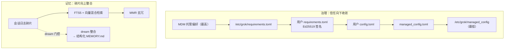

# 第 18 章：企业级治理与记忆系统

> **定位**：本章分析两个"面向长期与规模"的高级子系统——企业治理（六层签名配置
> 合并、Ed25519 requirements、出站数据脱敏）与记忆系统（跨会话持久记忆、混合检索、
> dream 自动整合）。前置依赖：第 11 章（沙箱，治理的安全兜底之一）、第 17 章
> （Hooks，可编程闸门与治理协作）。适用场景：你要把一个 agent 部署进受管企业环境
> （策略不可被用户绕过、敏感数据不能外泄），或要给 agent 加一层能跨会话积累的长期
> 记忆。本章是全书正文的收尾，也是"能力越强、边界越严"这一主题的最终落点；末节
> （18.8）另以 `codebase-graph` 的一处"文档-实现漂移"作为**全书方法论的收束**——
> 重申本书自始至终的纪律：以实现为准、注释仅为线索。

## 18.1 为什么这很重要

前面 16 章讲的都是"一次会话之内"的事——如何跑循环、调工具、渲染界面。但一个要
被企业采用、要长期陪伴用户的 agent，还面临两个**跨越单次会话**的问题：

**第一个是治理（governance）**。当 agent 被部署进一家公司，管理员需要的能力和
个人用户完全不同：他们要能强制"这个团队禁用联网抓取"，且**这条策略不能被用户在
本地改回来**；他们要确保 agent 发往 Sentry、Mixpanel 的诊断数据里**不夹带 API
密钥**。这不是"加个配置项"能解决的——它要求一套**信任分层的配置体系**，让企业
下发的策略在优先级上压过用户设置，还要能抵御本地攻击者的篡改。

**第二个是记忆（memory）**。默认的 agent 是"金鱼记忆"——会话一关，什么都不记得。
但真正的助手应当能跨会话积累：记住你项目的约定、你上次做的决定、踩过的坑。这要求
一套**持久化 + 检索 + 整合**的记忆系统，还要解决一连串工程难题：怎么存才不污染
用户仓库、怎么检索才能兼顾关键词精确与语义相关、怎么把碎片记忆整合成结构化知识
而不越攒越乱。

这两个子系统看似无关，却共享同一条主题——**它们都是 agent"能力越强、边界越严"
的极致体现**。治理是给强大的 agent 套上企业可控的缰绳；记忆是给它长出跨时间的
认知，同时必须谨慎处理随之而来的隐私面。本章把两者放在一起收尾，正因为它们共同
回答了一个问题：一个足够强大的 agent，如何在企业环境里**既可信任、又可管控、还能
成长**。讲完这两个子系统后，本章会以一个简短的方法论尾声（18.8，借 `codebase-graph`
的一处文档-实现漂移）为全书正文收束——它不属于治理或记忆，而是回到本书的读源码
纪律本身。



## 18.2 六层配置合并：一条精确的信任梯度

治理的地基，是一套把配置按**信任来源**分成六层、再自下而上合并的机制。这套逻辑
的文档直接写在 `xai-grok-config`（配置实现 crate，与第 2 章 2.5 提到的纯类型
`xai-grok-config-types` 相对）的 `lib.rs` 顶注里，而实现的核心在 `loader.rs`。

**六层的精确顺序**（低→高优先级，后者覆盖前者，
crates/codegen/xai-grok-config/src/loader.rs:237-250）：

1. `/etc/grok/managed_config.toml`（root 拥有，OS 保护）
2. `$GROK_HOME/managed_config.toml`
3. `$GROK_HOME/config.toml`（**用户自己的配置**）
4. `$GROK_HOME/requirements.toml`（云缓存，可 Ed25519 签名）
5. `/etc/grok/requirements.toml`（系统 requirements）
6. macOS MDM 托管偏好（`ai.x.grok` 域，管理员强制，仅 macOS）

注意这条梯度的设计意图：**用户配置（第 3 层）夹在中间**。它能覆盖下面两层的
managed 默认值，但被上面三层的 requirements 覆盖。换句话说，企业下发的
requirements 永远压过用户——这正是"策略不可被用户绕过"的结构基础。

**合并语义是 deep merge，不是整体替换。** 这是一个容易搞错的细节。看
`deep_merge_toml`（crates/codegen/xai-grok-config/src/loader.rs:419-433）：

```rust
pub fn deep_merge_toml(base: &mut toml::Value, overrides: &toml::Value) {
    if let toml::Value::Table(overrides_table) = overrides
        && let toml::Value::Table(base_table) = base {
        for (key, value) in overrides_table {
            if let Some(existing) = base_table.get_mut(key) {
                deep_merge_toml(existing, value);   // 表：递归合并
            } else { base_table.insert(key.clone(), value.clone()); }
        }
    } else { *base = overrides.clone(); }            // 数组/标量：整体替换
}
```

规则很清晰：**表递归合并、数组与标量整体替换、缺键插入**。这意味着企业只需在
requirements 里写它关心的那几个键，就能精确覆盖，而不必重述整份配置——但一旦覆盖
数组（如 `allowed_sandbox_modes`），是整体替换而非追加，语义明确无歧义。

还有一处防御值得点出：用户层路径来自 `user_grok_home()`，而当系统**无 home 目录**
时，它返回**空表**，而不是回退到当前工作目录下的 `.grok`
（crates/codegen/xai-grok-config/src/loader.rs:98-106）。为什么重要？因为 agent 常
在用户克隆的、**不可信的项目目录**里运行。若无 home 时回退到 cwd 相对路径，一个
恶意仓库就能塞一个 `.grok/config.toml` 把自己提升到用户信任层。宁可空表，不可
误信——这是治理系统里反复出现的谨慎。

## 18.3 signed requirements：把信任焊死在编译进制里

第 4、5 层的 requirements 能压过用户，前提是它**本身可信**——否则本地攻击者随手
写一份 `requirements.toml` 放进用户目录就能冒充企业策略。Grok 的答案是 **Ed25519
签名 + 落盘再校验**。

签名的**确切字节**由 `SignedPayload` 定义
（prod/mc/cli-chat-proxy-types/src/deployment_config_types.rs:22-32）：9 个字段——
`typ`（载荷类型）、`version`、`deployment_id`、`team_id`、`managed_config`、
`requirements`、`fail_closed`、`expires_at`、`key_id`。外层 `SignatureEnvelope`
（prod/mc/cli-chat-proxy-types/src/deployment_config_types.rs:73-77）携带
`signed_payload` JSON、base64 Ed25519 签名，以及一个**不可信的** `key_id` 提示。

验证流程有三处关键设计：

**其一，可信公钥编译进二进制，不走环境变量。** 可信公钥是一个编译期常量
`EMBEDDED_DEPLOYMENT_CONFIG_PUBKEYS`
（crates/codegen/xai-grok-config/src/signed_policy.rs:20）。在开源快照里它是**空数组**
——即"暗构建"，签名验证处于 inert（惰性）状态，xAI 在自己的发布构建里才注入真实
公钥。为什么选编译期常量而非 env？因为**本地攻击者控制自己的环境变量**——信任锚
焊进二进制才篡改不了。

**其二，用签名内的 key_id 选验证密钥，不用信封的提示。** 验证时选取哪把公钥，
依据的是**已签名 payload 内部**的 `key_id`，而非外层信封那个可被篡改的提示字段
（crates/codegen/xai-grok-config/src/signed_policy.rs:108-126）。这堵住了一个经典
漏洞：攻击者改信封提示指向一把它控制的弱密钥。

**其三，落盘再校验。** 光验证签名还不够。攻击者可以拿一份
**过去合法签名**的 requirements，篡改磁盘上的明文 TOML。于是有了
`check_on_disk_matches`（crates/codegen/xai-grok-config/src/signed_policy.rs:243-277）：
它把磁盘上 `managed_config.toml`/`requirements.toml` 的字节，与**签名内容**逐字节
比对。就地篡改（不止删除）也能抓到；而被签名标记为"缺席"的槽位，则要求磁盘对应
文件必须为空——因为本地植入一份 requirements.toml（它是最高优先层之一）本身就是
篡改。签名验证证明"内容出自可信源"，落盘校验证明"磁盘上的就是那份内容"，两者
缺一不可。

**fail-closed 启动**是治理的最后一道闸。在**签名激活的构建**里，签名缓存的
`fail_closed` 判定从**已签名字节**读取
（crates/codegen/xai-grok-config/src/signed_policy.rs:507-522），本地无法翻转——
这是它最硬的形态。（有一个边界要交代：`validate_requirements` 的 version 校验路径
另有一条从**明文 requirements 文件**读 `fail_closed` 的分支，在没有嵌入公钥的开源
inert 构建里，那个文件用户可写；所以"本地无法翻转"严格成立于签名激活的发布构建，
inert 构建下并不完全成立。）`validate_requirements()`
（crates/codegen/xai-grok-config/src/validation.rs:220-230）在二进制启动时被调用，
若 `fail_closed=true` 且此时策略无法满足（如 version_overrides 非法），直接返回
Err 让进程退出——**宁可不启动，也不在策略失效的状态下运行**。而环境变量
`GROK_MANAGED_CONFIG_FAIL_CLOSED` 只能**收紧不能放松**
（crates/codegen/xai-grok-config/src/validation.rs:242-244）：用户能把自己的部署
调得更严，但绝无法把企业设定的 fail-closed 放松成 fail-open。

离线场景也有一道 fail-closed gate：`managed_cache.rs` 里当一个 marker 记录了"此部署
fail_closed 且曾服务过策略"，就要求本地存在可验证的签名 sidecar，否则拒绝启动会话
（crates/codegen/xai-grok-config/src/managed_cache.rs:463-515），意在防止攻击者靠
"拔网线"让 agent 退回无策略的裸奔状态。**但这道门的牙齿同样取决于构建**：那个
marker 本身是 unsigned、user-writable 的（源码 managed_cache.rs:5 自陈它"是刷新提示，
不是防篡改屏障"）。在没有嵌入公钥的开源 inert 构建里，判定退化为 best-effort——
攻击者删掉 marker 即可绕过；只有注入了真实公钥的发布构建，配合可验证的签名 sidecar，
这道离线门才真正咬合。这不是设计缺陷，而是"信任锚是编译期公钥"这一前提的必然
推论：**公钥为空 = 整条信任链 inert，下游的每一道门都随之退化为尽力而为**。把它
写出来，才对得起前文"暗构建"的坦白。

这一整套的哲学是：**信任必须有一条从编译期公钥、到签名字节、到磁盘内容的完整链条，
任何一环断裂都 fail-closed。** 与第 11 章沙箱的 fail-closed 遥相呼应——凡是"失败即
用户资产/企业策略裸奔"的地方，一律选择拒绝运行。

## 18.4 MDM：只信管理员强制的那一份

第 6 层 MDM（移动设备管理）是 macOS 特有的最高优先层。企业通过 MDM 向受管 Mac
推送配置，Grok 从 `ai.x.grok` 域读取一个 `requirements_toml_base64` 键
（crates/codegen/xai-grok-config/src/macos_managed.rs:9-11）。

这里有一个必须做对的安全判断。macOS 的偏好域里，同一个键可能有两个来源：**管理员
通过 MDM 强制下发的值**，和**普通用户用 `defaults write ai.x.grok` 写的值**。如果
不加区分地读，一个被企业策略排除的用户，就能用一条 `defaults write` 命令伪造出
最高优先层的 requirements。所以代码在读值前**先调 `CFPreferencesAppValueIsForced`
判定该键是否为管理员强制**（crates/codegen/xai-grok-config/src/macos_managed.rs:93-98），
只信强制值，否则忽略。

载荷是 base64 编码的 TOML，而且**故意不做 `$VAR` 环境变量展开**
（crates/codegen/xai-grok-config/src/macos_managed.rs:38-40）——同样是为了防止被
排除的用户通过本地 env 影响这层可信的 admin 配置。一个反复出现的模式：**凡是高
信任层的数据，绝不让它接触任何低信任来源能控制的东西**（env、cwd、信封提示）。

## 18.5 secrets 脱敏：把不可信数据当不可信数据送出门

治理的另一半是**出站数据的隐私**。agent 会把崩溃栈、遥测事件发往 Sentry 和
Mixpanel，而这些数据里可能夹带用户的 API 密钥、路径、token。`xai-grok-secrets`
的 `sanitizer.rs` 是最后一道过滤网。

它维护一份**正则规则清单**，覆盖主流密钥格式：厂商 key（`sk-`/`sk_`/`xai-`）、
AWS（`AKIA`/`ASIA`）、GitHub（`ghp_`/`github_pat_`）、GitLab/Slack
（`glpat-`/`xox[abp]-`）、Google（`AIza`）、PEM 私钥块、`Bearer` 头、裸 JWT
（`eyJ…`）、赋值式 `api_key/token/secret/password=…`、以及 URL 里的敏感 query
参数（crates/codegen/xai-grok-secrets/src/sanitizer.rs 中各常量）。

两个工程细节值得学：

**性能——RegexSet 先短路。** 逐条跑十几个正则很慢。这里先用一个 `RegexSet` 做
一次 `is_match` 批量判定（crates/codegen/xai-grok-secrets/src/sanitizer.rs:78-97），
若整段文本一个模式都不命中，直接返回 `Cow::Borrowed`（零拷贝，原样返回），只有
命中时才逐条替换。绝大多数遥测字符串不含密钥，这个短路让常见路径几乎零开销。

**正确性——防误脱敏。** 过度脱敏会把正常数据打成马赛克，一样是 bug。`sk-` 规则
用 `\b` 词边界锚定，防止把 `task-`、`disk-`、`risk-` 里的 `sk-` 误当密钥
（crates/codegen/xai-grok-secrets/src/sanitizer.rs:8-9）；用户名路径段用整段边界
匹配，防止 `/Users/bob` 的规则误伤 `/Users/bobby`；当环境已知时甚至**关闭**
`/Users|/home` 的兜底正则，以免误伤 `/Users/Shared` 这类公共路径。

还有一条**提醒式 tripwire**值得一提，但别把它拔高：有一个单元测试断言
`MATCH_ANY.patterns().len()` 恰为 **10**（一个硬编码常量），并在注释里提醒"改了模式
数记得同步替换趟数"（crates/codegen/xai-grok-secrets/src/sanitizer.rs:329）。它能抓住
"加了一条正则、模式数变 11、却没改常量"这一类疏漏；但它**并非**动态比对"模式数
== 替换趟数"，所以抓不住"把常量也改成 11、却忘了在 `redact_secrets` 里加对应替换趟"
的反向遗漏。换句话说，它是一道靠人肉纪律维系的护栏，不是机械等式——脱敏系统最怕
"以为在脱敏、其实漏了一类"，这条 tripwire 缩小了这个风险，但没有根除它。

脱敏在多个出站点统一应用：Mixpanel 的 `redact_json_string_values`
（crates/codegen/xai-mixpanel/src/lib.rs）、Sentry 的 `redact_secrets`
（crates/codegen/xai-grok-telemetry/src/sentry.rs:94），以及 OTLP 管道。**一份规则、
多处复用**，避免了"这个出口脱敏了、那个忘了"的不一致。

顺带一提，配置系统里还有一条呼应的隐私设计：TOML 解析出错时，错误信息**绝不回显
出错的源行**，只取行列号与消息（crates/codegen/xai-grok-config/src/loader.rs:39-55）
——因为出错的那行 config 可能正含着一个密钥，而默认的 `Display` 会把整行 echo 进
日志。连报错都要防泄漏。

## 18.6 记忆系统：分区、混合检索与去冗

治理讲完，转向记忆。记忆系统默认是关的，需 `--experimental-memory` 或
`GROK_MEMORY=1` 开启，`GROK_MEMORY=0` 可强制关闭并覆盖 TOML 与远端设置
（crates/codegen/xai-grok-memory/src/lib.rs:21-22、
crates/codegen/xai-grok-shell/src/config/mod.rs:14-15）。开启后，它要解决三个问题：
存哪、怎么查、怎么不越攒越乱。

**存哪——blake3(cwd) 分区。** workspace 级记忆存在
`~/.grok/memory/{slug}-{hash8}/`，其中 hash 是对当前工作目录（优先用 git 仓库
身份，否则用规范化路径）取 blake3 的前 8 位
（crates/codegen/xai-grok-memory/src/storage.rs:44-64、611-631）。两个目的：一是
**不污染用户仓库**（记忆存在 `~/.grok` 下，而非项目里），二是**每个项目独立目录**
（不同项目的记忆互不串味）。用 git identity 而非纯路径做 key，还能让同一个仓库
在不同 clone 路径下共享记忆。

**怎么查——FTS5 + 向量混合检索。** SQLite schema
（crates/codegen/xai-grok-memory/src/schema.rs:23-64）包含一张 `chunks` 主表、一张
**contentless** 的 `chunks_fts`（FTS5 全文索引），以及可选的 `chunks_vec`（sqlite-vec
的 vec0 虚表，存 embedding 向量）。检索时两路并发：FTS5 出关键词匹配的 BM25 分，
向量表出语义相似的 KNN 结果，然后融合。

融合算法**不是**常见的 RRF（倒数排名融合），而是**加权 + 去惩罚**的自定义打分
（crates/codegen/xai-grok-memory/src/search.rs:274-345）。两个关键设计：

- 向量相似度用**绝对尺度** `1 - d/2.0` 而非相对归一化。注释解释了原因
  （crates/codegen/xai-grok-memory/src/search.rs:250-252）：高维空间存在"测度集中"
  ——相对归一化 `1 - d/max_d` 会把所有分数压到近零、丧失区分度。绝对尺度保住了
  语义分的真实梯度。
- 双命中的 chunk 打分取 `max(text_w·fts + vec_w·vec, fts)`。这个 `max` 是防御性的：
  它保证一个 FTS 命中很强的 chunk，**不会因为恰好有一个无关的向量分**而被拉低到
  `text_weight` 以下。关键词精确匹配的结果，语义分只能给它加分、不能减分。

最终分还会乘上时间衰减、来源权重，以及一个 `ln(1+access_count)·0.05` 的**访问频次
boost**（crates/codegen/xai-grok-memory/src/search.rs:337）——越常被用到的记忆越
容易再被检索到。时间衰减对 global/workspace 这类"常青"记忆豁免，只对 session 级
记忆按指数半衰期衰减（crates/codegen/xai-grok-memory/src/search.rs:112-134）。还有
一个精细处：**排序用未 clamp 的 raw_score，展示分才 clamp 到 [0,1]**
（crates/codegen/xai-grok-memory/src/search.rs:344-345）——这样常青记忆的 access
boost 即便让内部分超过 1.0，仍能在排序里体现出细微的优先级差，而给用户看的分数
不至于溢出成怪值。

**怎么不越攒越乱——MMR 去冗。** 检索出的 top 结果里常有大量重复（同一件事被记了
好几遍）。MMR（最大边际相关，Maximal Marginal Relevance）用
`MMR(d)=λ·rel(d)-(1-λ)·max_sim(d,已选)` 贪心地在"相关"与"不重复"间权衡
（crates/codegen/xai-grok-memory/src/mmr.rs）。这里的相似度用**分词后的 Jaccard**
而非 embedding——因为结果集很小（约 6-18 条），Jaccard 的 O(n²) 完全够用，还省掉
了额外的 embedding 计算。MMR 默认关，opt-in 开启。

**embedding 从哪来？** 是**API 调用**（OpenAI 兼容的 `/embeddings` 端点），不是本地
模型（crates/codegen/xai-grok-memory/src/embedding.rs:36）。批大小 32、3 次
指数退避重试（重试常量在 crates/codegen/xai-grok-memory/src/embedding.rs:11-14，
重试逻辑在 :117-123），复用 session 的 proxy 与鉴权。**chunker 是 markdown 感知**的：先按 `##` 标题分节，超长再按段落、
按行拆，续块会加上祖先标题前缀与字符级重叠，保住语义连续性
（crates/codegen/xai-grok-memory/src/chunker.rs:27-57）。

## 18.7 dream：把碎片睡成结构化知识

记忆若只是把会话日志堆着，很快会变成一团乱麻。**dream** 是记忆系统的整合环节——
它像睡眠里的记忆固化一样，周期性地把零散的会话碎片，合并成结构化的持久记忆。

**触发门控**是三重的，按"最便宜先判"的顺序短路
（crates/codegen/xai-grok-memory/src/dream.rs:40-78）：① dream 功能已启用；② 距上次
整合的小时数 ≥ `min_hours`；③ 自上次以来的新 session 数 ≥ `min_sessions`。上次
整合的时间取自 **dream-lock 文件的 mtime**，session 计数则扫 `.md` 文件的 mtime
并排除当前会话（crates/codegen/xai-grok-memory/src/dream_lock.rs）。默认只在会话
结束或用户 `/dream` 时检查，不做高频轮询。

**整合做什么？** `DREAM_SYSTEM_PROMPT`
（crates/codegen/xai-grok-memory/src/dream.rs:88-112）指示模型把碎片会话日志合并成
结构化记忆：按主题用 `##` 归并、**解决矛盾**（新事实覆盖旧事实）、把"昨天""上周"
这类相对日期转成绝对日期、丢弃寒暄与统计噪声、保留决策与"问题-解决"对；若没有
值得留存的内容，就回 `NO_REPLY`。输入有 32K 字符上限，超出的 session **不读也不删**
——留待下次 dream 处理，绝不因为一次装不下就丢数据。成功后覆写 workspace 的
MEMORY.md，并且**只删除本次实际读入的** session 文件。

**锁的生命周期**是这里最见工程分寸的部分。dream 是重操作，绝不能两个进程同时跑。
`DreamLock` 是一个含 PID 与 mtime 的锁文件，`try_acquire`
（crates/codegen/xai-grok-memory/src/dream_lock.rs:86-120）先写自己的 PID、再回读
校验，谁的 PID 留在文件里谁赢得竞争；若持锁进程还活着且未超时，则拒绝；若 PID 已
死、文件损坏或超龄，则可回收。但注释坦白说明：这是 **best-effort 而非严格互斥，
因为 dream 是幂等的、可容忍偶尔重复**。成功后留下新 mtime 作为"上次整合"的记录；
失败则 rollback 恢复旧 mtime 并清空 PID——**让一次失败的 dream 不会把门控时钟拨快，
下次仍会重试**。这是一种务实的并发设计：不为一个可容忍重复的操作，付出严格分布式
锁的复杂度。

配套的命令有 `/flush`（按需把当前对话刷进记忆）和 `/dream`（手动触发整合），
它们经 ACP 扩展方法暴露（`x.ai/memory/*`）。

## 18.8 codebase-graph：一个"文档-实现漂移"样本

作为第五部与全书正文的收尾，看一个更"工具性"的子系统：`xai-codebase-graph`。它用
tree-sitter 为代码库建符号图，支撑 go-to-definition/references，支持
Rust/Go/JS/TS/Python。每种语言用一组 S-表达式查询捕获类/函数/方法的定义。

它的**增量索引**设计干净：每个文件记 `FileMeta{size, mtime_secs, mtime_nanos}`
（定义在 crates/codegen/xai-codebase-graph/src/types/mod.rs:74），判断是否需要重建
时只比对 size 与 mtime、**不读文件内容**。后台用 rayon 并行 stat 所有文件、快速
分出"脏"与"已删"（crates/codegen/xai-codebase-graph/src/index_manager.rs:1309）。此外还有一层 query-version 失效：若升级了 grammar
或查询定义，缓存的 query 版本对不上，就整体重建。

但这个 crate 要写进书里的，不是它做对了什么，而是一处**文档与实现的漂移**——
一个真实工程里再常见不过、却少有人愿意在书里点破的现象。builder 的文档注释宣称
它"直接从 mmap 解析、无中间缓冲拷贝"
（crates/codegen/xai-codebase-graph/src/manager/builder.rs:273）：

```rust
/// - Direct parsing from mmap (no intermediate buffer copy)
```

而**实际实现**用的是普通的 `fs::read`
（crates/codegen/xai-codebase-graph/src/manager/builder.rs:391）：

```rust
let content = fs::read(path).ok()?;
```

Cargo.toml 里根本没有 memmap 依赖。也就是说，"mmap 零拷贝"这句注释是**过时或
未兑现的宣称**。那么它真正的内存效率来自哪里？来自另外两处扎实的实现：一个全局的
`StringInterner` 做字符串去重（同一个符号名在整张图里只存一份），以及一套自定义
二进制缓存格式——用魔数 "SGIX" 标识
（crates/codegen/xai-codebase-graph/src/manager/cache.rs:3），能自动识别并拒绝旧版
bincode 格式触发重建。

为什么要在书里点破这个漂移？因为它是**读源码相较读文档的价值本身**。文档会撒谎——
不是恶意，而是代码演化了、注释没跟上。一本教你"读架构"的书，如果只誊抄注释里的
漂亮说法（"零拷贝 mmap"），就辜负了源码。真实的工程里，`builder.rs:273` 的注释与
`builder.rs:391` 的 `fs::read` 就这么并存着——**以实现为准，以注释为线索但不为
证据**，是本书从头到尾贯彻的纪律，在这里得到最直白的一个注脚。

## 18.9 同一问题，codex 怎么做

治理与记忆这两个主题，codex（openai/codex，2026 年中 main 分支）与 Grok Build 的
取向差异很能说明两个项目的定位。

**治理层面**，codex 有企业管控的抓手——它的 hooks 系统含 managed 层与
`allow_managed_hooks_only` 开关（详见第 17 章），能让管理员强制某些 hook。但就
公开可见的实现而言，codex **没有 Grok 这套 Ed25519 签名 + 落盘再校验 + 六层
配置合并**的完整治理栈。差异的根源在部署形态：Grok 面向的是"发进受管企业设备、
策略必须抗本地篡改"的场景，才需要把信任焊进编译进制、逐字节校验磁盘；codex 的
管控更多停留在配置层的 managed 覆盖。**治理的深度，与目标部署环境的对抗性成正比**
——Grok 假设了一个"本地用户可能是对手"的威胁模型，codex 的公开实现没走这么远。

**记忆层面**，需要先纠正一个容易想当然的框定：codex **并非只有** `AGENTS.md` 这类
用户显式维护的记忆文件——它当前 main 分支里有专门的 `ext/memories`、`memories/read`、
`memories/write` 等 crate，是一套**程序化的记忆子系统**，而不止一个静态约定文件。
所以两家都做了"超越显式文件的自动记忆"。真正可比的差异在于取向：Grok 的 memory
把重心放在**自动召回 + 无人值守的 dream 整合**（会话日志经混合检索召回、经 dream
固化成 MEMORY.md），并为此配了一整套 FTS5+向量检索、MMR 去冗、dream 门控的机制；
而无论哪家，自动记忆都要付一份共同的代价——**谨慎处理"自动记下了不该记的东西"
的隐私面**，这也是 Grok 把 memory **默认关闭**、需显式 opt-in 的原因。就公开可见
的实现细节而言，本书对 codex 记忆子系统的内部机制未做逐行核对，故此处只做取向
层面的对比，不对其检索/整合实现下断言。

一句话概括：**Grok 在治理上假设了更强的对手、在记忆上选择了更自动的路线，两者都
换来更大的能力，也都因此背上更重的安全与隐私责任。** 这恰是本章主题的收束——
能力与边界，永远成对出现。（codex 相关事实基于 openai/codex 2026 年年中 main
分支。）

## 18.10 模式提炼

**模式一：信任锚焊进编译进制（Compiled-In Trust Anchor）。**
- 解决的问题：本地攻击者控制 env、文件、命令行，任何"可配置的信任锚"都能被篡改。
- 模板：把验证用的公钥/根信任做成编译期常量，不提供任何 env/文件覆盖通道；用
  签名内的字段（而非外层可篡改的提示）选取验证密钥。
- 前提条件：你能控制构建与分发（否则攻击者可重编二进制）。

**模式二：签名 + 落盘再校验（Sign-and-Verify-on-Disk）。**
- 解决的问题：只验签名挡不住"拿旧的合法签名、篡改磁盘明文"的攻击。
- 模板：验证签名证明"内容出自可信源"后，再把磁盘上的实际字节与签名内容**逐字节
  比对**；被签名标记为缺席的文件，要求磁盘上必须为空。
- 前提条件：签名覆盖的是最终落盘的确切字节表示。

**模式三：单向收紧的策略旋钮（Tighten-Only Override）。**
- 解决的问题：既想让用户能把自己的部署调得更严，又不能让他们放松企业策略。
- 模板：env/用户配置对安全开关只允许"更严"方向生效（如 fail-closed 只能开不能
  关），放松方向的输入被忽略。
- 前提条件：策略的每个维度都有明确的"更严/更松"偏序。

**模式四：加权去惩罚的混合检索（Max-Guarded Hybrid Scoring）。**
- 解决的问题：关键词检索与语义检索融合时，无关的一路会拉低另一路的强命中。
- 模板：双命中取 `max(加权和, 单路强命中分)`，保证强命中不被弱的另一路惩罚；
  高维向量相似度用绝对尺度而非相对归一化，避免测度集中丧失区分度。
- 前提条件：两路分数各自归一到可比区间。

## 18.11 设计要点回顾

- 六层配置合并：deep merge（表递归/数组替换）+ 精确信任梯度（用户配置夹在 managed
  与 requirements 之间）；无 home 时空表不回退 cwd → 18.2（loader.rs:237-250、
  419-433、98-106）
- signed requirements：Ed25519 公钥编译进二进制（暗构建空数组）、用签名内 key_id
  选密钥、落盘逐字节再校验、fail-closed 从签名字节读取 → 18.3
  （signed_policy.rs:15/97-115/186-220、validation.rs:218-228/240-242、
  deployment_config_types.rs:16-38）
- MDM：只信 `CFPreferencesAppValueIsForced` 的管理员强制值、载荷不做 $VAR 展开
  → 18.4（macos_managed.rs:9-11/93-98/38-40）
- secrets 脱敏：十余类密钥正则、RegexSet 短路 + Cow 零拷贝、`\b` 防误脱敏、
  硬编码模式数的提醒式 tripwire（非机械等式）、多出站点共用一份规则 → 18.5
  （sanitizer.rs:8-9/78-97/329、mixpanel/lib.rs、sentry.rs:94）
- 记忆分区：blake3(cwd/git identity) 分目录，不污染仓库、项目间隔离 → 18.6
  （storage.rs:44-64/611-631）
- 混合检索：FTS5+vec 加权融合、双命中 `max` 去惩罚、向量绝对尺度防测度集中、
  访问频次 boost、raw/display 双分 → 18.6（search.rs:250-252/274-345、schema.rs:23-64）
- MMR 去冗用分词 Jaccard（小结果集免 embedding）；embedding 走 API 非本地；
  chunker markdown 感知 → 18.6（mmr.rs、embedding.rs:11-14/117-123、chunker.rs:27-57）
- dream 整合：三重门控短路、结构化 system prompt 解矛盾/转绝对日期、32K 上限不丢
  超额、只删已读、best-effort 锁 + 失败 rollback 不拨快时钟 → 18.7
  （dream.rs:40-78/88-112、dream_lock.rs:86-120）
- codebase-graph（全书方法论尾声）：mtime 增量判脏不读内容、query-version 失效、
  StringInterner + "SGIX" 缓存；"mmap 零拷贝"注释与 `fs::read` 实现漂移——以实现为准
  → 18.8（types/mod.rs:74、index_manager.rs:1309、builder.rs:273/391、cache.rs:3）
- codex 对照：治理深度随对抗性威胁模型加深（Grok 假设本地用户可能是对手，codex 有
  hooks/guardian 等设施但无签名策略栈）；记忆两家都有程序化子系统（codex 有
  ext/memories），差异在取向——Grok 重自动召回 + dream 整合 → 18.9

---

### 版本演化说明

> 本章分析基于快照 SOURCE_REV 2ec0f0c（同步 commit 8adf901，2026 年 7 月）。
> `EMBEDDED_DEPLOYMENT_CONFIG_PUBKEYS` 在开源快照里是空数组（暗构建），xAI 发布
> 构建注入真实公钥后签名验证才生效，开源版观察不到完整的签名拒绝。记忆系统默认
> 关闭（`--experimental-memory`），检索权重、dream 阈值等默认值可能随版本调整；
> `codebase-graph` 的 "mmap" 文档漂移是此快照的真实状态。核对时以你检出版本的
> 源码为准——**以实现为准，注释仅为线索。**
