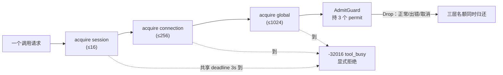

# 第 19 章：韧性工程——准入、熔断与取消泄漏

> **定位**：本章分析 Grok Build 如何用 Rust 把过载、级联失败与异步取消变成可验证的
> 约束——三层信号量准入、完整的熔断器状态机、以及"取消泄漏"这条最隐蔽的并发缺陷的
> 防线。前置依赖：第 3 章（SessionActor 与并发拓扑）、第 4 章（取消的穿透）。适用场景：
> 你要让一个长活、并发、会被随时打断的 agent 在高压下不雪崩。**重要前提**：本章解剖的
> 机制存在于 Computer Hub SDK 与独立 crate 里，**目前尚未接入主 agent 循环**——它们是
> 同一仓库里"已经写好、但还没接上"的成熟答案（见 19.5）。

## 19.1 为什么这很重要

一个终端 agent 是一个长活的并发系统：它同时服务多个会话、每个会话可能扇出子代理、
每个工具调用都是一个可能被用户 Esc 打断的 future。这种系统有三类生产杀手，都不在
"功能正确"的范畴里：

1. **过载**：请求来得比处理得快，无界队列越堆越长，内存与延迟一起爆炸；
2. **级联失败**：一个下游（工具服务器、LLM API）挂了，上游还在傻傻重试，把故障放大成雪崩；
3. **取消泄漏**：一个被取消的 future 在死之前占用的资源（信号量名额、锁、探针槽）没能
   归还，慢慢把系统绞死。

这三样都不是"写对逻辑"能解决的——它们是**并发系统的结构性风险**，要用结构性的机制
来兜。Grok Build 在两个地方给出了教科书级的答案：Computer Hub SDK 的准入控制，和一个
独立的 `xai-circuit-breaker` crate。本章解剖它们，也如实交代一件事：**它们还没接进主
agent 循环**——这本身是一个值得讲的故事（19.5）。

## 19.2 三层准入：session → connection → global，一次 deadline

Computer Hub SDK 的准入控制把"同时在跑的调用数"限制在三个层次上（crates/common/xai-computer-hub-sdk/src/admission.rs:1）：
per-session（默认 16）、per-connection（默认 256）、process-global（默认 1024）。三个
信号量按**固定的"最局部→最全局"顺序**获取（session→connection→global）。这个顺序不是
随手定的，是并发正确性的两个刚需：

- **无死锁**：所有调用方按同一顺序获取多把锁，就不会出现"A 持 global 等 session、
  B 持 session 等 global"的循环等待；
- **不浪费稀缺资源**：先拿最局部（最便宜）的，绝不"攥着一个稀缺的 global 名额去阻塞
  等一个 local 名额"。

更精细的是**一个共享 deadline 覆盖全部三次获取**（`timeout_at(deadline,
sem.acquire_owned())`，crates/common/xai-computer-hub-sdk/src/admission.rs:199）——所以最长准入延迟是**一次** `wait_timeout`
（默认 3s），不是 `3 × wait_timeout`。压力适中时 `admit` 等待；压力极高、deadline 到了，
调用方发出一个共享的过载错误 `-32016 "tool_busy"`（crates/common/xai-computer-hub-sdk/src/admission.rs:1），**明确拒绝而不是
静默丢弃**——过载语义是产品契约的一部分，客户端能据此退避重试。

容量的归还绑定到**任务生命周期**：`admit` 返回一个 `AdmitGuard`（crates/common/xai-computer-hub-sdk/src/admission.rs:108），
它持有三个 `OwnedSemaphorePermit`；guard 一 drop（任务正常结束、出错、或被取消），三层
名额同时归还。**这就是对"取消泄漏"的第一道结构性防御**：把资源释放挂在 RAII guard 的
Drop 上，取消路径和成功路径共用同一条归还逻辑——你不可能"忘了归还"，因为归还不是一句
要记得写的代码，是类型系统保证会跑的析构。

## 19.3 熔断器：三态状态机 + 无锁快路径 + 可注入时钟

`xai-circuit-breaker` 是一个完整的熔断器（crates/common/xai-circuit-breaker/src/breaker.rs:1）：`Closed`（正常放行）、`Open`
（熔断，直接拒绝）、`HalfOpen`（冷却期后放一个探针试水）三态，判定用"滑动窗口 + 最小
样本数"算法——窗口内失败率超阈值才熔断，但**样本数不足 `min_samples` 时不下判断**
（crates/common/xai-circuit-breaker/src/breaker.rs:123），避免"头三个请求恰好失败"就误熔断。

两个工程细节值得抄进任何熔断器实现：

- **无锁快路径**：`is_open()` 是每个请求都要过的热路径，它读的不是那把权威的状态锁，
  而是一个用 `Release`/`Relaxed` 维护的**原子镜像**（crates/common/xai-circuit-breaker/src/breaker.rs:155）——`state == Open`
  的判断被压成一次 relaxed 原子读，不碰锁。权威状态与镜像的写入顺序（先权威、后镜像、
  Release）保证读到 open 镜像时权威状态一定已经是 open。
- **可注入时钟**：冷却窗口的计时用一个 `Clock` trait（`opened_at_millis` 存的是相对
  构造时刻的毫秒偏移，避免 NTP 回拨），生产用 `SystemClock`、测试用 `MockClock` 直接
  驱动时间。这一个抽象让"冷却 30 秒后进半开"这种时序逻辑可以**在虚拟时间里瞬间测完**
  （详见附录《如何测试异步状态机》）。

## 19.4 取消泄漏：半开探针的"过期租约"

最精彩的一处防御藏在半开态里，它是"取消泄漏"这个抽象风险的一个具体标本。

半开态只允许**一个**探针请求通过，去试探下游是否恢复。探针结束时调 `record()`
（crates/common/xai-circuit-breaker/src/breaker.rs:109）汇报成败，据此决定回 `Closed` 还是退回 `Open`。但——**如果这个探针的
future 在 `record()` 之前被取消了呢**？（调用方 Esc、上游 timeout、select 分支落败……）
源码注释把这个洞说得一清二楚（crates/common/xai-circuit-breaker/src/breaker.rs:37）：

> 一个 owner 从没走到 `record()` 的探针——比如它的 future 因调用方取消被 drop——会永远
> 占着那个探针名额，把熔断器**永久卡在 HalfOpen**，甩掉所有流量、再也回不到 Closed。

这正是取消泄漏的教科书形态：一个资源的归还依赖"某个后续动作一定会执行"，而取消恰好让
那个动作不执行。解法是**过期租约**：`try_half_open_probe`（crates/common/xai-circuit-breaker/src/breaker.rs:277）把探针槽当成
一个有租期的租约——一个 claim 时间超过 `open_duration`（一个冷却期）的探针被视为
**已废弃**，允许另一个调用方 reclaim。于是一个丢失的探针最多把恢复推迟一个冷却期，
而不是永久卡死。

把 19.2 与 19.4 并读，能看出同一个原则的两种落地：**资源的归还不能依赖"乐观地假设某个
动作会发生"**。`AdmitGuard` 用 RAII 把归还挂在必然执行的 Drop 上；熔断器探针用不了 RAII
（它的"占用"是一个跨异步边界的逻辑租约，不是一个 Rust 对象的生命周期），于是退而求其次
用**超时租约**兜底。取消安全不是一个开关，是每一处"跨越 await 持有资源"的地方都要单独
回答的问题（呼应第 4 章的 tokio 取消安全）。

## 19.5 一个诚实的空白：这些机制还没接进主循环

这是本章最该讲清楚的一点。上面这套准入 + 熔断，存在于 **Computer Hub SDK** 和独立的
**`xai-circuit-breaker` crate** 里。但如果你去 grep 主 agent 的 shell 与 sampler，会发现
它们**没有依赖 `xai-circuit-breaker`，SamplerActor 也没有接入三层准入**。

而这不是本书的猜测——第 3 章剖析 SamplerActor 时，书里（和源码）自己就标了
（ch03-session-actor.md:199 一带）：

> 并发没有上限。JoinSet 无界，命令通道无界，没有 semaphore……如果未来出现风扇形子代理
> 爆发，这里会是第一个需要补 admission control 的位置。

所以真实的图景是：**同一个仓库里，答案已经写好、测好、成熟了，却还没接到最需要它的那条
主路径上**。这种"已解未采"的状态在快速演进的生产代码里极常见，而把它如实写出来，比假装
"Grok 的 agent 循环有完善的熔断"要有价值得多——它告诉读者两件事：(1) 这套机制长什么样、
该怎么设计；(2) 一个真实系统里，基础设施的成熟度与它的接入度可以是两条不同步的曲线。
读源码时，分清"仓库里有什么"和"主路径上接了什么"，是不被 README 骗到的基本功。

## 19.6 虚拟时钟：让这一切可测（引子）

熔断的冷却窗口、准入的 deadline、退避的指数增长——这些都是**时序逻辑**，而时序逻辑最难
测：睡真实时间会让测试又慢又 flaky。Grok Build 的答案是 tokio 的虚拟时钟（`start_paused`），
它让"冷却 30 秒"在测试里瞬间发生、且完全确定。这套方法论（全仓 100+ 处 `start_paused`）
本身值得单独一篇——见附录《如何测试异步状态机》。可注入的 `Clock`（19.3）正是为这套
测试留的接缝：生产 `SystemClock`、测试 `MockClock`，同一段冷却逻辑两种时间源。

## 19.7 同一问题，codex 怎么做

codex 作为单用户、单会话的 CLI，并发模型远比 Grok Build 简单：它没有多会话、多租户的
准入需求，也就不需要 session/connection/global 这样的分层信号量。它的韧性更多体现在
**单个请求内部**的重试与超时，而非**跨会话**的准入与熔断。差异的根因是部署形态：
Grok Build 的 Computer Hub 面向多租户的工具服务器，准入与熔断是多租户的刚需；codex 的
单用户单会话场景不产生同等的过载与级联压力，于是也不必背这套机制的复杂度。**机制的
必要性由部署形态决定，不由"谁更先进"决定**——这也是为什么这套准入/熔断长在面向服务端
的 Computer Hub SDK 里，而不是长在终端 CLI 的主循环里。

## 19.8 模式提炼

**模式一：分层准入，最局部优先。** 多层并发上限按"最局部→最全局"固定顺序获取，一个
共享 deadline 覆盖全部，过载显式拒绝（`tool_busy`）而非静默丢弃。前提：各层容量有意义
地递增。

**模式二：热路径用原子镜像绕开锁。** 每请求都过的判断（`is_open`）读一个 Release/Relaxed
维护的原子镜像，把锁留给低频的状态转换。

**模式三：归还挂在必然执行的路径上。** 能用 RAII 就用 RAII（Drop 必跑）；跨异步的逻辑
租约用不了 RAII，就用超时租约兜底——绝不假设"某个后续动作一定会发生"。

**模式四：时序逻辑注入时钟。** 把时间做成一个可注入的 trait，生产用系统时钟、测试用
mock，让冷却/退避/超时可在虚拟时间里确定性地测。

## 设计要点回顾

速查索引（详述见对应小节）：

- 三层准入 session→conn→global 固定序、共享 deadline（最长=一次 timeout 非 3×）、
  过载回 `tool_busy -32016` 显式拒绝 → 19.2
- `AdmitGuard` 持三个 `OwnedSemaphorePermit`，Drop 归还三层名额：取消泄漏的 RAII 防御 → 19.2
- 熔断三态 + 滑窗最小样本 + `is_open` 原子镜像无锁快路径 + 可注入 `Clock` → 19.3
- 半开探针取消泄漏 → 永占名额永卡 HalfOpen；过期租约让丢失探针最多延迟一个冷却期 → 19.4
- 诚实空白：准入/熔断未接入 SamplerActor；ch03:199 自标"第一个要补 admission 的位置" → 19.5
- 四个可迁移模式：分层准入、原子镜像热路径、归还挂必然路径、时序注入时钟 → 19.8

---

### 版本演化说明

> 本章核心分析基于本书快照仓库（同步自 xAI monorepo，commit 8adf901，SOURCE_REV
> 2ec0f0c，2026-07）。涉及 crate：xai-computer-hub-sdk（admission）、xai-circuit-breaker，
> 以及作为"未接入"对照的 xai-grok-shell / xai-grok-sampler（二者未依赖前两者）。
> **"未接入主循环"是撰写时的事实**——若上游后续把准入/熔断接进 SamplerActor，本章 19.5
> 需相应更新；请以 grep `xai-circuit-breaker` 在 shell/sampler 的依赖为准。codex 对比
> 基于 openai/codex 2026 年年中 main 分支。上游同步后请以 `book/tools/check_chapter.py`
> 校验本章引用。
