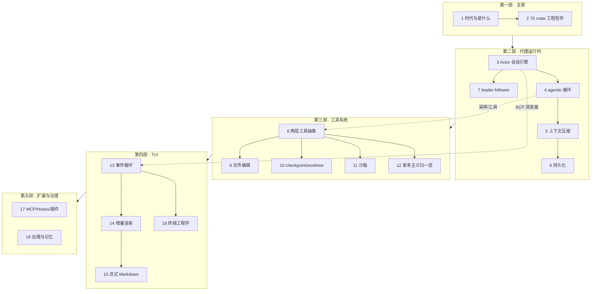

# 前言

本书以 xAI 开源的终端 AI 编程代理 **Grok Build**（Rust，75 个 crate）为主轴，
以 openai/codex 与 sst/opencode 为参照系，剖析构建一个生产级 AI 编程代理的完整设计空间：
从 agentic 循环、上下文压缩、工具系统、沙箱隔离，到终端增量渲染与扩展生态。

主线是"一个 agent 的一生"：键入 prompt → 采样 → 工具执行 → 渲染 → 持久化。
每章末附"同一问题，codex 怎么做"参照小节。

## 阅读准备

### 前置知识

- Rust：能读懂 trait、async/await、所有权相关代码即可，不要求写过大型项目
- 终端基础：知道 ANSI 转义码、TTY 的概念
- 不需要：LLM 训练/推理知识、ratatui 使用经验

### 事实纪律

本书所有架构性陈述均带 `file:line` 引用，基于书末"版本演化说明"标注的仓库快照。
引用有效性由自动化工具持续校验；上游代码更新后失效的引用会在修订版中更新。

一条更重要的纪律：**以实现为准，注释仅为线索**。源码里的文档注释会因代码演化而
过时甚至失真（第 18 章有一个"注释宣称 mmap 零拷贝、实为 `fs::read`"的真实样本）。
每一处 `file:line` 引用，都意味着作者去那一行读了**实际的代码**，而非誊抄注释。

## 推荐阅读路径

全书按依赖顺序编排，但你不必线性读完。先读第一部（第 1-2 章）建立全局观与工程
地图，再按角色选一条主线：

**路径 A · agent 内核（想搞懂"大脑与心跳"）**
> 第 1-2 章 → 第 3 章 Actor 会话引擎 → 第 4 章 agentic 循环 → 第 5 章上下文压缩
> → 第 6 章持久化 → 第 7 章 leader-follower → 第 8 章工具抽象

**路径 B · 工具与安全（想搞懂"手与边界"）**
> 第 1-2 章 → 第 8 章工具抽象 → 第 9 章文件编辑 → 第 10 章 checkpoint/worktree
> → 第 11 章沙箱 → 第 12 章拿来主义归一层 → 第 18 章企业治理与记忆

**路径 C · 终端 UI 工程（想搞懂"脸"）**
> 第 1-2 章 → 第 13 章事件循环 → 第 14 章增量渲染 → 第 15 章流式 Markdown
> → 第 16 章终端工程学

**路径 D · 扩展平台（想给 agent 加能力）**
> 第 1-2 章 → 第 8 章工具抽象 → 第 17 章 MCP/Hooks/插件 → 第 18 章治理与记忆

**快速通览**：只读每章开头的 `> **定位**` blockquote 与结尾的"设计要点回顾"清单，
一天可通览全书骨架，再回头精读感兴趣的章节。

## 全书知识地图

> 锚点章：**第 3 章（Actor 会话引擎）**是全书的结构枢纽——运行时、工具、TUI 三条
> 线都从它辐射。若时间有限只读一章，读它。

## 阅读标记说明

- `> **定位**`（每章开头）：一句话核心主题 + 前置依赖 + 适用场景，帮你 30 秒判断
  这章此刻是否与你相关。
- **设计要点回顾**（每章结尾）：把该章所有关键结论连同 `file:line` 索引成一页，
  便于回查与速览。
- **版本演化说明**（每章结尾）：声明该章分析所据的版本基准（`SOURCE_REV`
  `2ec0f0c…`，由同步 commit `8adf901` 携带），供你判断内容是否仍然适用。
- **同一问题，codex 怎么做**（多数章内）：把 Grok Build 的决策与 openai/codex 的
  对应实现并置，照出"品类共性 vs 团队选择"的分野。
- `crates/...:行号` 形式的引用：指向仓库里的真实代码，鼓励你亲自核对。
